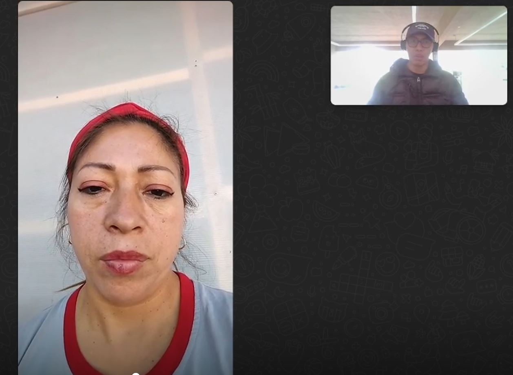

# Capítulo II: Requirements Elicitation & Analysis
## 2.1. Competidores.

En esta sección se realiza la identificación y descripción de los principales 
competidores directos e indirectos que ofrecen productos digitales similares 
a los de EduSpace.

* **Facilio**: Es una plataforma de gestión de instalaciones que centraliza la
  operación y mantenimiento de edificios en una única interfaz. Ofrece soluciones
  para la gestión de activos, mantenimiento preventivo, monitoreo de energía y
  análisis de datos en tiempo real. Facilio se distingue por su enfoque en la
  eficiencia operativa y la sostenibilidad, lo que lo convierte en un
  competidor directo en la gestión integral de infraestructuras educativas.
  https://facilio.com/
  
* **FMX (Facilities Management eXpress)**: Es un software de gestión de instalaciones que proporciona herramientas
  para la programación de espacios, gestión de mantenimiento, inventarios, y órdenes
  de trabajo. Su interfaz intuitiva y su enfoque en la facilidad de uso lo hacen
  atractivo para instituciones educativas que buscan optimizar la administración de
  sus recursos y mejorar la coordinación del personal.https://www.gofmx.com/
  
* **Archibus**: es una plataforma completa de gestión de instalaciones que abarca desde 
  la gestión de espacios y activos hasta el mantenimiento y la planificación de recursos. 
  Es utilizada por grandes instituciones para mejorar la eficiencia en la gestión de 
  infraestructuras, optimizando tanto el uso de espacios como la administración de inventarios 
  y servicios. https://archibus.com/

  
  
### 2.1.1. Análisis competitivo.

<table border="1" cellpadding="10" cellspacing="0" style="margin-left: auto; margin-right: auto;">
  <tr>
    <th colspan="6">Competitive Analysis Landscape</th>
  </tr>
  <tr>
    <td colspan="2" rowspan="2">¿Por qué llevar a cabo este análisis?</td>
    <td colspan="4">Escriba en el recuadro la pregunta que busca responder o el objetivo de este análisis.</td>
  </tr>
  <tr>
    <td colspan="4">Texto</td>
  </tr>
  <tr>
   <td colspan="2">(En la cabecera colocar por cada competidor nombre y logo)</td>
    <td>EduSpace   </td>
    <td>Facilio  </td>
    <td>FMX  </td>
    <td>Archibus  </td> 
  </tr>
  <tr>
    <td rowspan="2">Perfil</td>
    <td>Overview</td>
    <td>EduSpace es una plataforma enfocada en la gestión integral de espacios educativos, 
      mejorando la coordinación del personal, la comunicación interna y el control de 
      inventarios y recursos.</td>
    <td>Facilio es una solución para la operación y mantenimiento centralizado de edificios, 
      optimizando la eficiencia y la sostenibilidad en la gestión de instalaciones.</td>
    <td>FMX proporciona herramientas para la gestión de instalaciones educativas, facilitando 
      la programación de espacios, mantenimiento, y la gestión de inventarios.</td>
    <td>Archibus es una plataforma completa para la gestión de instalaciones, enfocada en la 
      optimización del uso de espacios, activos y recursos.</td>
  </tr>
  <tr>
    <td>Ventaja competitiva ¿Qué valor ofrece a los clientes?</td>
    <td>Ofrece una solución integral específica para instituciones educativas, incluyendo 
      la automatización de cálculos salariales y un control detallado de inventarios.</td>
    <td>Enfoque en la sostenibilidad y eficiencia operativa, con capacidades avanzadas de 
      análisis de datos en tiempo real.</td>
    <td>Interfaz intuitiva y facilidad de uso, con un fuerte enfoque en la programación y 
      mantenimiento de espacios educativos.</td>
    <td>Capacidad de integrar múltiples aspectos de la gestión de instalaciones en una 
      única plataforma, ampliamente utilizada por grandes instituciones.</td>
  </tr>
  <tr>
    <td rowspan="2">Perfil de Marketing</td>
    <td>Mercado objetivo</td>
    <td>Instituciones educativas con grandes y pequeñas infraestructuras que buscan optimizar la 
      gestión de sus espacios y recursos.</td>
    <td>Grandes empresas e instituciones que buscan centralizar la gestión de sus 
      instalaciones con un enfoque en sostenibilidad.</td>
    <td>Instituciones educativas y organizaciones que requieren soluciones fáciles de 
      usar para la gestión de instalaciones.</td>
    <td>Grandes instituciones y empresas que necesitan una solución completa para la 
      gestión de sus instalaciones y recursos.</td>
  </tr>
  <tr>
    <td>Estrategias de marketing</td>
    <td>Marketing dirigido a administradores de grandes y de pequeñas instituciones educativas, destacando 
      la eficiencia y el control exhaustivo de recursos.</td>
    <td>Enfoque en la sostenibilidad y la eficiencia, con campañas dirigidas a administradores 
      de instalaciones y responsables de sostenibilidad.</td>
    <td>Enfoque en la simplicidad y efectividad, con marketing dirigido a usuarios que buscan 
      facilidad de uso en la gestión de instalaciones.</td>
    <td>Campañas dirigidas a grandes organizaciones que necesitan una solución robusta y completa 
      para la gestión de sus instalaciones.</td>
  </tr>
  <tr>
    <td rowspan="3">Perfil de Producto</td>
    <td>Productos & Servicios</td>
    <td>Gestión de espacios educativos, automatización de cálculos salariales, control de 
      inventarios, y comunicación interna.</td>
    <td>Gestión de instalaciones, análisis de datos en tiempo real, monitoreo de energía, y 
      mantenimiento preventivo.</td>
    <td>Gestión de espacios, mantenimiento preventivo, seguimiento de órdenes de trabajo, y 
      gestión de inventarios.</td>
    <td>Gestión de espacios y activos, planificación de recursos, mantenimiento, y 
      administración de servicios.</td>
  </tr>
  <tr>
    <td>Precios & Costos</td>
    <td>Planes de suscripción, basados en la escala de la institución educativa y el 
      número de funcionalidades utilizadas. </td>
    <td>Precios basados en suscripciones, ajustados según la cantidad de instalaciones y 
      funcionalidades requeridas.</td>
    <td>Planes de suscripción con diferentes niveles de servicio, ajustados según el tamaño 
      de la institución y sus necesidades.</td>
    <td>Precios personalizados basados en la escala y complejidad de la implementación para 
      grandes organizaciones.</td>
  </tr>
  <tr>
    <td>Canales de distribución (Web y/o Móvil)</td>
    <td>Plataforma web</td>
    <td>Plataforma web con soporte para aplicaciones móviles y monitoreo en tiempo real.</td>
    <td>Plataforma web con una interfaz accesible desde dispositivos móviles.</td>
    <td>Plataforma web con soluciones móviles para acceso y gestión remota.</td>
  </tr>
  <tr>
    <td rowspan="5">Analisis SWOT</td>
    <td colspan="5">Realice esto para su startup y sus competidores. Sus fortalezas deberían apoyar sus
    oportunidades y contribuir a lo que ustedes definen como su posible ventaja
    competitiva. </td>
  </tr>
 <tr>
    <td>Fortalezas</td>
    <td>Especialización en la gestión de espacios educativos, con características adaptadas a 
      las necesidades del sector.</td>
    <td>Fuerte enfoque en sostenibilidad y eficiencia operativa, con capacidades avanzadas de 
      monitoreo y análisis.</td>
    <td>Facilidad de uso y enfoque claro en la gestión de instalaciones educativas, con una 
      interfaz intuitiva.</td>
    <td>Plataforma robusta y ampliamente reconocida, con una amplia gama de funcionalidades 
      para grandes instituciones.</td>
  </tr>
  <tr>
    <td>Debilidades</td>
    <td>Foco limitado en el sector educativo, lo que podría restringir la expansión a otros mercados.</td>
    <td>Puede ser percibido como complejo para pequeñas instituciones debido a su enfoque en 
      grandes infraestructuras.</td>
    <td>Limitaciones en la personalización avanzada para usuarios con necesidades muy específicas.</td>
    <td>Costos elevados y complejidad de implementación, lo que puede ser una barrera para 
      pequeñas y medianas instituciones.</td>
  </tr>
  <tr>
    <td>Oportunidades</td>
    <td>Expansión a otras áreas dentro del sector educativo, como la gestión de recursos 
      tecnológicos y de TI.</td>
    <td>Crecer en mercados emergentes que buscan soluciones sostenibles y eficientes para 
      la gestión de instalaciones.</td>
    <td>Expandir la oferta a otras industrias que valoran la simplicidad y la eficiencia 
      en la gestión de instalaciones.</td>
    <td>Integración con nuevas tecnologías emergentes para mejorar aún más la eficiencia 
      y la sostenibilidad en la gestión de instalaciones.</td>
  </tr>
  <tr>
    <td>Amenazas</td>
    <td>Competencia de plataformas más generales que podrían agregar funcionalidades educativas.</td>
    <td>Riesgo de que otras soluciones más económicas capten el interés de pequeñas instituciones.</td>
    <td>Competencia con plataformas que ofrecen soluciones más completas a precios competitivos.</td>
    <td>Rápido avance tecnológico que podría hacer obsoleta parte de su oferta actual si no se actualiza con regularidad.</td>
  </tr>
</table>

### 2.1.2. Estrategias y tácticas frente a competidores.

1. Estrategias para Aprovechar las Fortalezas de EduSpace

* **Especialización en el Sector Educativo**: Desarrollar contenido 
  de marketing y estudios de caso específicos para instituciones 
  educativas. Organizar webinars y eventos educativos que demuestren 
  cómo EduSpace aborda los desafíos particulares del sector.

* **Automatización de Cálculos Salariales y Control de Inventarios**:
  Promocionar estas características en campañas de marketing y 
  presentaciones a clientes potenciales. Crear tutoriales y 
  demostraciones que muestren cómo estas funciones simplifican la 
  gestión y ahorran tiempo.

2. Estrategias para Enfrentar las Debilidades de EduSpace

* **Foco Limitado en el Sector Educativo**: Explorar oportunidades para 
  adaptar y expandir la plataforma a otros sectores que también 
  requieran gestión de espacios y recursos, como el sector de 
  servicios o el corporativo.

* **Competencia con Soluciones Generales**: Resaltar la especialización de 
  EduSpace en la gestión de espacios educativos en comparación con 
  plataformas más generales. Enfatizar cómo las características 
  específicas de EduSpace están diseñadas para resolver 
  problemas únicos en instituciones educativas.

3. Estrategias para Aprovechar las Oportunidades

* **Expansión a Otras Áreas del Sector Educativo**: Investigar y desarrollar nuevas 
  funcionalidades que puedan ser útiles para la gestión de recursos tecnológicos 
  y de TI dentro de las instituciones educativas. Mantenerse actualizado con las 
  tendencias en tecnología educativa para integrar nuevas características relevantes.

* **Crecer en Mercados Emergentes**: Adaptar la plataforma a múltiples idiomas y
  ajustarla a las necesidades locales de los mercados emergentes. Crear
  estrategias de entrada específicas para estos mercados, incluyendo
  asociaciones con proveedores locales y campañas de concienciación.

4. Estrategias para Mitigar las Amenazas

* **Competencia de Plataformas Generales y Económicas**: Diferenciarse mediante
  una propuesta de valor clara que destaque la especialización y las
  funcionalidades avanzadas de EduSpace. Ofrecer demostraciones personalizadas
  para mostrar el valor añadido frente a nuestro plan premium.
  
* **Rápido Avance Tecnológico**: Crear un ciclo de feedback continuo con los
  usuarios para identificar áreas de mejora y priorizar actualizaciones
  basadas en sus necesidades y en las últimas innovaciones tecnológicas. 

## 2.2. Entrevistas
### 2.2.1. Diseño de la entrevista

#### Segmento Objetivo Administradores
#### Preguntas Objetivas:

**Características Demográficas:**

- ¿Cuál es tu género?
- ¿Cuántos años tienes?
- ¿En qué distrito o localidad resides?
- ¿Cuál es tu estado civil?
- ¿Cuál es tu ocupación específica dentro de la institución educativa?

**Ocupación y Responsabilidades:**

- ¿Cuáles son tus principales responsabilidades en la institución?
- ¿Cuántas personas forman parte de tu equipo y qué roles desempeñan?
- ¿Con qué frecuencia necesitas gestionar el inventario de equipos y recursos?

**Uso de Tecnología:**

- ¿Qué dispositivos utilizas principalmente para realizar tu trabajo (ordenador, tablet, móvil)?
- ¿Qué navegador web usas?
- ¿Qué sistemas de gestión o software utilizas actualmente en tu rol?

#### Preguntas Subjetivas:

**Personalidad y Habilidades:**

- ¿Cuáles consideras que son tus principales habilidades en la administración de recursos y personal?

**Objetivos y Frustraciones:**

- ¿Qué objetivos tienes al gestionar los recursos y personal en la institución?
- ¿Cuáles son los mayores desafíos que enfrentas en tu rol actual?
- ¿Qué aspectos de la gestión de equipos y recursos encuentras más frustrantes?

**Preferencias y Canales Digitales:**
- ¿Qué características ademas de las mencionadas buscas en una herramienta de gestión para hacer tu trabajo más eficiente?

**Visión del Futuro:**

- ¿Cómo te gustaría que evolucionara el sistema actual de gestión de ambientes deportivos y personal?
- ¿Qué cambios o mejoras te gustaría ver en la gestión administrativa?

#### Segmento Objetivo Docentes:
#### Preguntas Objetivas:

**Características Demográficas:**

- ¿Cuál es tu género?
- ¿Cuántos años tienes?
- ¿En qué distrito o localidad resides?
- ¿Cuál es tu nivel educativo y experiencia profesional?

**Ocupación y Responsabilidades:**

- ¿Qué materias o cursos enseñas?
- ¿Con qué frecuencia necesitas registrar reportes de averías o gestionar cambios de aula?
- ¿Qué tipo de recursos utilizas más frecuentemente en tu aula?

**Uso de Tecnología:**

- ¿Qué dispositivos utilizas principalmente para realizar tu trabajo (ordenador, tablet, móvil)?
- ¿Qué navegador web usas?
- ¿Qué aplicaciones o sistemas usas para gestionar tu trabajo diario y comunicación con la administración?

#### Preguntas Subjetivas:

**Personalidad y Habilidades:**

- ¿Cómo describirías tu estilo de enseñanza y gestión en el aula?
- ¿Qué habilidades consideras cruciales para tu rol como docente en relación con la gestión de recursos y espacios?

**Objetivos y Frustraciones:**

- ¿Qué objetivos tienes en tu rol como docente en relación con la gestión de equipos y recursos?
- ¿Cuáles son los mayores desafíos que enfrentas en la gestión de equipos y recursos en el aula?
- ¿Qué aspectos de la administración y registro de recursos encuentras más frustrantes?

**Preferencias y Canales Digitales:**

- ¿Qué características te gustaría tener en una herramienta para gestionar cambios de aula y reportar averías?
- ¿Qué canales digitales prefieres para recibir notificaciones y comunicarte con los administradores?

**Visión del Futuro:**
- ¿Cómo te gustaría que evolucionara el sistema actual para facilitar tu trabajo?
- ¿Qué cambios o mejoras crees que serían más beneficiosos para ti en la gestión de recursos y espacios?

# 2.2.2. Registro de entrevistas

##### Segmento 1: Administradores de Instituciones Educativas

*Inicio de las entrevistas :* 00:00

*Duración de las entrevistas :* 9:06

*Link de las entrevistas:* https://upcedupe-my.sharepoint.com/:v:/g/personal/u202215285_upc_edu_pe/Eb3Aq-vjceFPuSs90_FGy-8BzsN8Sn2LiTuuBo9-XN1lDA?e=iIlmXl&nav=eyJyZWZlcnJhbEluZm8iOnsicmVmZXJyYWxBcHAiOiJTdHJlYW1XZWJBcHAiLCJyZWZlcnJhbFZpZXciOiJTaGFyZURpYWxvZy1MaW5rIiwicmVmZXJyYWxBcHBQbGF0Zm9ybSI6IldlYiIsInJlZmVycmFsTW9kZSI6InZpZXcifX0%3D

### *Entrevista 01*

*Nombres:* Segunda Yolanda

*Apellidos:* Navarro Pinedo

*Edad:* 55 años

*Distrito:* Villa Maria del Triunfo

*Segmento objetivo:* Administradores

*Minuto de inicio de la entrevista:* 0:00

*Minuto de fin de la entrevista:* 4:43

*Duración de la entrevista:* 04:43

*Link de la entrevista:* https://upcedupe-my.sharepoint.com/:v:/g/personal/u202215285_upc_edu_pe/Eb3Aq-vjceFPuSs90_FGy-8BzsN8Sn2LiTuuBo9-XN1lDA?e=iIlmXl&nav=eyJyZWZlcnJhbEluZm8iOnsicmVmZXJyYWxBcHAiOiJTdHJlYW1XZWJBcHAiLCJyZWZlcnJhbFZpZXciOiJTaGFyZURpYWxvZy1MaW5rIiwicmVmZXJyYWxBcHBQbGF0Zm9ybSI6IldlYiIsInJlZmVycmFsTW9kZSI6InZpZXcifX0%3D

#### Resumen de la entrevista:

Yolanda Navarro Pinedo, de 55 años, es una mujer que reside en Villa María del Triunfo y está casada. Es la directora del Centro Educativo Particular Santa María del Camino, rol que ha desempeñado durante los últimos 5 años. Yolanda lidera un equipo de cinco personas, compuesto por dos asistentes administrativos, un coordinador de personal, un especialista en pagos y un auxiliar de contabilidad. Sus responsabilidades incluyen la gestión de horarios y pagos de los profesores, la supervisión del personal administrativo, y la comunicación con los docentes, asegurando una operación eficiente y de calidad en la institución.
En cuanto a su uso de tecnología, Yolanda utiliza principalmente un ordenador y un móvil para su trabajo diario, y su navegador preferido es Google Chrome. También emplea varios sistemas de gestión, incluyendo software de contabilidad y facturación, así como herramientas de comunicación y colaboración en línea, que son esenciales para sus funciones.
Yolanda destaca por sus habilidades en administración de recursos, planificación, liderazgo, y comunicación efectiva. Además, tiene competencias en resolución de problemas y toma de decisiones, lo que es crucial para mantener la calidad educativa y la satisfacción de profesores y padres de familia. Sus objetivos incluyen mejorar la eficiencia en la gestión de recursos, incrementar la satisfacción de las partes involucradas, y mantener la precisión en los procesos administrativos.
Entre los desafíos que enfrenta se encuentran la adaptación a los cambios en políticas educativas , que a menudo retrasa la toma de decisiones. Además, experimenta frustraciones relacionadas con la falta de recursos y apoyo. Yolanda busca en un software de administración características como facilidad de uso, integración con otros sistemas, análisis detallados y acceso móvil en las herramientas de gestión. Propone que el sistema actual evolucione para implementar tecnologías emergentes, fomentar la colaboración y desarrollar un sistema más ágil y flexible.

### *Entrevista 02*

*Nombres:* Esau Juan

*Apellidos:* Huanca Cabrera

*Edad:* 55 años

*Distrito:* Villa Maria del Triunfo

*Minuto de inicio de la entrevista:* 4:43

*Minuto de fin de la entrevista:* 9:06

*Duración de la entrevista:* 04:23

*Link de la entrevista:* https://upcedupe-my.sharepoint.com/:v:/g/personal/u202215285_upc_edu_pe/Eb3Aq-vjceFPuSs90_FGy-8BzsN8Sn2LiTuuBo9-XN1lDA?e=iIlmXl&nav=eyJyZWZlcnJhbEluZm8iOnsicmVmZXJyYWxBcHAiOiJTdHJlYW1XZWJBcHAiLCJyZWZlcnJhbFZpZXciOiJTaGFyZURpYWxvZy1MaW5rIiwicmVmZXJyYWxBcHBQbGF0Zm9ybSI6IldlYiIsInJlZmVycmFsTW9kZSI6InZpZXcifX0%3D

#### Resumen de la entrevista:

Esaú Huanca Cabrera, de 55 años, es un hombre que también reside en Villa María del Triunfo y está casado. Es el promotor de la Institución Educativa Santa María del Camino, donde ha ocupado este rol durante casi 20 años. Su principal responsabilidad es asegurar la calidad y eficiencia en la gestión de recursos y personal, apoyando el aprendizaje y crecimiento de los estudiantes. Supervisa tanto los recursos financieros como materiales y humanos de la institución, liderando un equipo de cinco personas que incluye dos coordinadores de recursos y un especialista en tecnología educativa.

Esaú utiliza una variedad de dispositivos para llevar a cabo su trabajo, incluyendo laptops, computadoras, tablets y celulares, y prefiere Google Chrome como navegador. Aunque no menciona un sistema de gestión específico, subraya la importancia de integrar tecnologías emergentes y herramientas que apoyen en la gestión educativa.

En cuanto a habilidades, Esaú se destaca en liderazgo, planificación, organización, comunicación efectiva y resolución de problemas. Sus objetivos incluyen mejorar la calidad de la educación, incrementar la eficiencia en el uso de recursos, y fomentar un ambiente de aprendizaje innovador. Los desafíos que enfrenta incluyen la adaptación a los cambios en la educación y la gestión de recursos, especialmente en la adquisición de equipos y la dependencia de los pagos de pensiones.

Esaú busca en las herramientas de gestión características adicionales como integración con otros sistemas, análisis detallados y reportes. También sugiere que la gestión de ambientes deportivos y personal podría beneficiarse de la implementación de tecnologías emergentes y un sistema más ágil y flexible. Finalmente, Esaú destaca la necesidad de mejorar la gestión administrativa con un software que apoye eficient

### Entrevista 03

*Nombres:* Norma Elvira

*Apellidos:* Navarro Pinedo

*Edad:* 54 años

*Distrito:* Villa María del Triunfo

*Segmento objetivo:* Administradores

#### Resumen de la entrevista:
Norma Elvira Navarro Pinedo, de 54 años, es la promotora de la Institución Educativa Santa María del Camino en Villa María del Triunfo, donde ha trabajado durante 10 años. Norma desempeña múltiples roles dentro de la institución, incluyendo la gestión de infraestructura, el apoyo a los aprendizajes de los estudiantes y la supervisión del personal docente. Su equipo está compuesto por 10 personas, que incluyen personal administrativo, de mantenimiento, y coordinadores de los tres niveles de educación.

En cuanto a la gestión de recursos, Norma menciona que la revisión del inventario, especialmente de recursos tecnológicos, se realiza cada 3 a 6 meses. Además, utiliza dispositivos como PCs, tablets y celulares para sus tareas diarias, con Google Chrome como su navegador preferido. Aunque actualmente no cuenta con un software específico para la gestión, planea implementar uno en el próximo año.

Norma destaca sus habilidades en manejo de conflictos, prevención de violencia, y creación de un clima laboral positivo. Su principal objetivo es mejorar los aprendizajes de los estudiantes, promoviendo un enfoque lúdico y basado en la investigación científica. También se enfoca en la capacitación constante del personal docente para asegurar un alto nivel de calidad educativa.

Entre los desafíos que enfrenta, Norma menciona la gestión del comportamiento de los estudiantes, especialmente en primaria y secundaria, debido a la falta de tiempo de calidad por parte de los padres. Además, encuentra frustrante la falta de preparación de algunos profesores en el uso de herramientas tecnológicas, lo que complica la implementación de nuevas metodologías de enseñanza.

Norma busca en una herramienta de gestión características como facilidad de uso, buenas instrucciones, y capacidad para integrarse en el entorno educativo, permitiendo una mayor eficiencia en su trabajo. También expresa interés en evolucionar el sistema actual para mejorar la infraestructura deportiva, viendo en el deporte un medio crucial para el desarrollo integral de los estudiantes.

*Minuto de inicio de la entrevista:* 9:06

*Minuto de fin de la entrevista:* 9:06

*Duración de la entrevista:* 21:00

*Link de la entrevista:* https://upcedupe-my.sharepoint.com/:v:/g/personal/u202215285_upc_edu_pe/Eb3Aq-vjceFPuSs90_FGy-8BzsN8Sn2LiTuuBo9-XN1lDA?e=iIlmXl&nav=eyJyZWZlcnJhbEluZm8iOnsicmVmZXJyYWxBcHAiOiJTdHJlYW1XZWJBcHAiLCJyZWZlcnJhbFZpZXciOiJTaGFyZURpYWxvZy1MaW5rIiwicmVmZXJyYWxBcHBQbGF0Zm9ybSI6IldlYiIsInJlZmVycmFsTW9kZSI6InZpZXcifX0%3D

##### Segmento 2: Docentes de instituciones educativas

*Inicio de las entrevistas :* 00:00

*Duración de las entrevistas :* 26:51

*Link de las entrevistas:* https://upcedupe-my.sharepoint.com/:v:/g/personal/u201912668_upc_edu_pe/EaOeO0exZXVHq2Ch6i5ylvoBY115MGuowJeCiB1mkpjfKA?e=OhwFOR&nav=eyJyZWZlcnJhbEluZm8iOnsicmVmZXJyYWxBcHAiOiJTdHJlYW1XZWJBcHAiLCJyZWZlcnJhbFZpZXciOiJTaGFyZURpYWxvZy1MaW5rIiwicmVmZXJyYWxBcHBQbGF0Zm9ybSI6IldlYiIsInJlZmVycmFsTW9kZSI6InZpZXcifX0%3D
### *Entrevista 01*

*Nombres:* Maria Soledad

*Apellidos:* Baygorrea Paquiyauri

*Edad:* 45 años

*Distrito:* Huamanga

*Minuto de inicio de la entrevista:* 00:00

*Minuto de fin de la entrevista:* 12:30

*Duración de la entrevista:* 12:30

#### Resumen de la entrevista:

xxxxxxxxxxxxxxxxxxxxxxxxxxxx

*Link de la entrevista:* 

### *Entrevista 02*

*Nombres:* Karina

*Apellidos:* Baygorrea Paquiyauri

*Edad:* 35 años

*Distrito:* Huamanga

#### Resumen de la entrevista:

XXXXXXXXXXXXXXXXXXXXXXXX

*Minuto de inicio de la entrevista:* 12:44

*Minuto de fin de la entrevista:* 19:40

*Duración de la entrevista:* 7:04

## 2.3.NEEDFINDING

### 2.3.1.USER PERSONAS
- User Persona Docente
!
- User Persona Administrador
  

### 2.3.2 USER TASK MATRIX

Este matriz organiza y visualiza las tareas que ambos User Personas realizan para cumplir con sus objetivos dentro de la institución. La matriz está diseñada para resaltar la frecuencia e importancia de cada tarea, proporcionando una visión clara de las responsabilidades y desafíos que enfrentan en su día a día. La identificación de estas tareas permite entender mejor las necesidades y expectativas de cada persona, lo cual es fundamental para el diseño de soluciones efectivas.

|                                                             | Ana Ruiz (Docente) |                 | Michael Sanchez (Administrador) |                 |
|-------------------------------------------------------------|:------------------:|:---------------:|:-------------------------------:|:---------------:|
| **TAREAS**                                                  |   **FRECUENCIA**   | **IMPORTANCIA** |         **FRECUENCIA**          | **IMPORTANCIA** |
| Planificacion de Clases                                     |        Alta        |      Alta       |              Baja               |      Baja       | 
| Solicitud de Recursos Adicionales                           |       Media        |      Alta       |              Baja               |      Media      | 
| Gestionar el personal a cargo de cada espacio               |        Baja        |      Baja       |              Alta               |      Alta       | 
| Registro de cambio de aula                                  |        Baja        |      Baja       |              Alta               |      Alta       | 
| Recepcion de Notificacion sobre cambios                     |        Alta        |      Alta       |              Alta               |      Alta       | 
| Administracion de Salarios                                  |        Baja        |      Baja       |              Alta               |      Alta       | 
| Gestion de Inventarios de Equipos                           |        Baja        |      Baja       |              Alta               |      Alta       | 
| Coordinacion de mantenimiento de equipos                    |        Baja        |      Baja       |              Alta               |      Alta       | 
| Registro de los ambientes deportivos, y docente responsable |        Baja        |      Baja       |              Alta               |      Alta       | 
| Datos de trabajadores(Docentes, personal de limpieza, etc)  |        Baja        |      Baja       |              Alta               |      Alta       | 
| Verificacion y solicitud de cambios de aula                 |        Alta        |      Alta       |              Media              |      Baja       | 

### Tareas con Mayor Frecuencia e Importancia

#### **Recepción de Notificaciones sobre Cambios:**
- Ana Ruiz: Alta frecuencia e importancia. Ana necesita estar constantemente al tanto de cualquier cambio en la asignación de aulas y recursos para poder ajustar sus planes y coordinar con otros docentes.
- Michael Sanchez: Alta frecuencia e importancia. Javier debe recibir notificaciones sobre problemas con los equipos y estado del inventario para gestionar la administración y mantenimiento eficientemente.
#### **Verificación y Solicitud de Cambios en Aulas:**
- Ana Ruiz: Alta frecuencia e importancia. Ana verifica la disponibilidad de aulas regularmente y solicita cambios según sea necesario para su planificación de clases.
- Michael Sanchez: Baja frecuencia y media importancia. Aunque no realiza estas tareas con frecuencia, debe estar informado para coordinar con otros departamentos.
### Tareas con Diferencias Significativas
#### **Gestión del Inventario de Equipos y Coordinación de Mantenimiento:**
- Michael Sanchez: Alta frecuencia e importancia. Javier supervisa el inventario y la coordinación del mantenimiento, asegurando que los recursos estén disponibles y funcionando correctamente.
- Ana Ruiz: Baja frecuencia e importancia. Ana no gestiona directamente el inventario ni coordina el mantenimiento, aunque se beneficia indirectamente de la disponibilidad de los equipos.
## Coincidencias
#### **Recepción de Notificaciones sobre Cambios:**
Ambos roles dependen de recibir notificaciones oportunas para poder realizar ajustes necesarios en sus respectivos ámbitos de trabajo.

En resumen, mientras que Ana Ruiz se enfoca más en la gestión de aulas, recursos y coordinación de actividades, Michael Sanchez maneja aspectos financieros y de inventario cruciales para la operación institucional. Las tareas y prioridades reflejan sus respectivas responsabilidades y cómo cada uno contribuye al funcionamiento eficiente de la institución.

### 2.3.3.USER JOURNEY MAPPING

- User journey mapping: Docente

- User journey mapping: Administrador

### 2.3.4 Empathy Mapping.

En esta sección se presenta el Empathy Mapping de nuestros 2 segmentos objetivos. Esta herramienta se utilizó porque permite identificar nuestro público objetivo, conocer su entorno y sus necesidades, lo cual nos permite ver el mundo a través de su perspectiva.

 **Segmento 1: Administrador**

**Segmento 2: Docente**

### 2.3.5 As-is Scenario Mapping
- **Segmento objetivo:** Administrador
  
- **Segmento objetivo:** Profesores y Auxiliares    
  

# Capítulo V: Product Implementation, Validation & Deployment
## 5.1 Software Configuration Management
A continuación, presentaremos el proceso por el cual organizamos, gestionamos y controlamos los cambios en el desarrollo de este proyecto.
### 5.1.1. Software Development Environment Configuration.
*Requirements Management*
1. Trello: Es una herramienta utilizada para gestionar el flujo de trabajo de proyectos principalmente basados en marcos de
   trabajos ágiles. Será empleado para visualizar y actualizar el estado actual de las tareas e historias de usuario
   pertenecientes al sprint a desarrollar.  
   Ruta de referencia: https://trello.com/es

*Product UX/UI Design*

1. Figma: Plataforma de elaboración de prototipos y edición gráfica, principalmente utilizado para el diseño digital. En el
   caso del proyecto, será utilizado para el prototipado de la aplicación y sus versiones de Desktop y Mobile Web Browser.

   Ruta de referencia: https://www.figma.com/login
2. Lucidchart: Aplicación para diagramar flujos. Será empleado para el diseño de wireflows, user-flows y el diagrama de
   clases asociado a la aplicación.

   Ruta de referencia: https://www.lucidchart.com/

*Software Development*
1. WebStorm: Entorno de desarrollo integrado elegido por su soporte completo para tecnologías web como JavaScript, HTML, CSS y frameworks como React y Angular. Ofrece refactorización avanzada, depuración, integración con Git y la posibilidad de agregar plugins. Es compatible con varios sistemas operativos, facilitando la colaboración en equipo.

   Ruta de referencia: https://www.jetbrains.com/webstorm/
    
2. HTML5: HyperText Markup Language, o por sus siglas HTML, es un lenguaje de etiquetado para páginas web. Será
   empleado en el desarrollo del proyecto para la presentación del contenido en la aplicación.

   Ruta de referencia: https://www.w3schools.com/html/html5_syntax.asp   
    
3. CSS: Cascading Style Sheets es un lenguaje que maneja el diseño y presentación de las páginas web, el cual va de la mano
   con HTML.

   Ruta de referencia: https://google.github.io/styleguide/htmlcssguide.html
    
    
4. JavaScript: Es un lenguaje de programación interpretado y orientado a objetos. Se utilizará para elaborar la interfaz de
   usuario dentro de la aplicación.

   Ruta de referencia: https://developer.mozilla.org/es/docs/Web/JavaScript

  

*Software Deployment*
1. Git: Una herramienta de control de versiones que facilita el registro y la gestión de las distintas versiones del programa. Su propósito es mantener un historial de cambios y simplificar la corrección de errores. Los integrantes del equipo
   accederán a través de la línea de comandos en sus sistemas locales.

   Ruta de referencia: https://git-scm.com/
    
    
   *Software Documentation and Project Management*
2. Github: Una plataforma en la nube que hospedará los repositorios de código del proyecto. Permitirá la colaboración en
   tiempo real y la revisión de contribuciones de cada miembro del equipo. Los integrantes del equipo podrán acceder a través de sus navegadores web.

   Ruta de referencia: https://github.com/

### 5.1.2. Source Code Management.
El proyecto seguirá las convenciones del flujo de trabajo establecido por el modelo GitFlow para el control de versiones, empleando GitHub como plataforma y sistema de control de versiones. A continuación, se describirá la implementación de GitFlow como un flujo de trabajo para el control de versiones, junto con el enlace del Landing Page.

*Repositorio de GitHub:*
- Enlace para acceder a la organización en GitHub: https://github.com/pro-devs-SI730
- Enlace para acceder al repositorio de la landing Page: https://github.com/pro-devs-SI730/landing-page
- Enlace para acceder al repositorio del reporte final: https://github.com/pro-devs-SI730/final-report

*Flujo de trabajo GitFlow*

El flujo de trabajo a ser implementado para el desarrollo del proyecto se basará en el modelo propuesto por Vincent Driessen en "A successful Git branching model".

*Estructura de branches (Ramas):*
1. *Master branch (Rama principal):* Esta rama servirá como la principal para la aplicación, alojando versiones estables y finales del desarrollo. Únicamente se aceptarán cambios que hayan sido previamente probados y verificados en los features y de ahí en Developer.
2. *Develop branch (Rama de desarrollo):* El propósito de esta rama es facilitar los avances del proyecto en equipo y mantener los archivos centrales del desarrollo continuo.
3. *Feature branch(Ramas de funcionalidad):* Cada capitulo desarrollado por el equipo, o separada del enfoque actual del desarrollo, tendrá su propia rama. Una vez que una funcionalidad esté completamente trabajada, se fusionará con la rama de desarrollo del proyecto. Las convenciones para nombrar las ramas de funcionalidad seguirán un patrón descriptivo y único, por ejemplo, "feature/chapter-#".
### 5.1.3. Source Code Style Guide & Conventions.
*HTML:* Algunas de las prácticas que deben de seguirse para alcanzar un código coherente, sostenible y ordenado son las
siguientes:
1. Cerrar todos los elementos HTML: Por ejemplo, 
Esto es un párrafo.

2. Siempre declarar el tipo de documento en la primera línea del documento, para
   HTML es "<!DOCTYPE html>”.
3. Escribir en una línea los comentarios cortos.
4. Utilizar comillas en caso de que los atributos contengan espacios entre sí.
5. Procurar especificar el texto alt y las dimensiones width y height de las imágenes, ya que de esta manera se facilitará la
   disponibilidad del contenido. Por ejemplo:   
6. Se nos recomienda no usar el espacio al momento de utilizar los signos porque
   es más fácil de leerlo de esta forma.  
    
   HTML: (https://www.w3schools.com/html/html5_syntax.asp)

*CSS:* Entre las prácticas empleadas se menciona:

1. Se nos recomienda tener una sangría por 2 espacios a la vez, no debemos
   utilizar tabulaciones ni mezclarlas tabulaciones con espacios para la sangría.
2. Todo el código debe estar en minúscula.
3. Eliminar los espacios en blanco.
4. Usar comentarios para explicar el código.
5. Utilizar nombres de clase significativos o genéricos, nombres que reflejen el
   propósito de su elemento.  
    

   CSS: (https://google.github.io/styleguide/htmlcssguide.html)

### 5.1.4. Software Deployment Configuration.
### Landing page deployment:
Para desplegar la landing page es necesario contar con una serie de requisitos, entre ellos, es necesario contar con
una cuenta personal, una organización y un repositorio al cual cargar los documentos. A partir de lo anterior, es posible
comenzar el despliegue de la landing page. A continuación se enuncian los pasos a seguir:

1. Crear una carpeta llamada "docs" para alojar el Landing Page.
2. Asegurarse de que los archivos sigan las nomenclaturas "index.html", para la landing page; "input.css" y "output.css" para poder utilizar Tailwind y
   una carpeta llamada "img" que contenga las imágenes.
3. Cargar los archivos al repositorio mediante un commit.
4. Dirigirse a Settings > Pages y seleccionar el branch correspondiente, en nuestro caso es el "main".
5. Especificar la carpeta "docs" como la fuente de la página.
6. Esperar a que GitHub realice las comprobaciones necesarias. Una vez culminado el proceso, se obtendrá un enlace que
   llevará al Landing Page desplegado

## GithubPages

Accedemos a la URL proporcionada por GitHub Pages para verificar que nuestra landing page se haya desplegado correctamente.
De tal modo, nuestra Landing Page estará inicializada utilizando Github Pages y podrá ser visible para cualquier usuario que tenga el enlace.
Enlace del Landing Page: https://pro-devs-si730.github.io/landing-page/

### 5.2. Landing Page, Services & Applications Implementation.

## 5.2. Landing Page, Services & Applications Implementation
En esta sección se explicará y evidenciará el proceso de implementación, pruebas,
documentación y despliegue del Landing Page.

### 5.2.1. Sprint 1

### 5.2.1.1. Sprint Planning 1

Para este primer sprint nos enfocaremos en los tasks para la
elaboración de la Landing Page. Nos dividiremos entre nosotros cada
una de las tareas identificadas para el sprint.

| Sprint #                        | Sprint 1                                                                                                                                                         |
|---------------------------------|------------------------------------------------------------------------------------------------------------------------------------------------------------------|
| Sprint Planning Background      |                                                                                                                                                                  |
| Date                            | 30/08/2024                                                                                                                                                       |
| Time                            | 06:00 PM                                                                                                                                                         |
| Location                        | Servidor de Discord del Equipo                                                                                                                                   |
| Prepared By                     | Franz Escalante                                                                                                                                                  |
| Attendees (to planning meeting) | Franz Escalante/ R andel Ventura / Gustavo Huanca / Camila Espinoza / Alheli Huapaya                                                                             |
| Sprint 1 Review Summary         | En esta primera seccion se planteo el desarrollo de la Landing Page para el proyecto                                                                             |
| Sprint 1 Retrospective Summary  | En esta seccion todos los integrantes mencionaron tener aciertos en partes del codigo y en otras partes poder mejorar sus habilidades realizando la Landing Page |
| Sprint Goal & User Stories      |
| Sprint 1 Goal                   | Finalizar con el desarrollo de la Landing Page.                                                                                                                  |
| Sprint 1 Velocity               | 4 Velocity                                                                                                                                                       |
| Sum of Story Points             | 4 Story Points.                                                                                                                                                  |

</table>

### 5.2.1.2. Sprint Backlog 1

<table>
<tr>
    <th colspan="3">Sprint #</th>
    <th colspan="10">Sprint 1</th>
  </tr>
      <tr>
    <td colspan="3">User Story</td>
    <td colspan="10">Work-Item/Task</td>
  </tr>
  <tr>
    <td colspan="1">Id</td>
    <td colspan="2">Title</td>
    <td colspan="1">Id</td>
    <td colspan="2">Title</td>
    <td colspan="3">Description</td>
    <td colspan="1"> Estimation</td>
    <td colspan="2">Assigned To</td>
    <td colspan="1">Status(To-do /InProcess /To-Review /Done)</td>
</tr>
  <tr>
    <td colspan="1">US02</td>
    <td colspan="2">Encontrar información del propósito de la aplicación</td>
    <td colspan="1">1</td>
    <td colspan="2">Añadir información relevante de la aplicación</td>
    <td colspan="3">Como visitante de la Landing Page, quiero encontrar fácilmente la información que explique el propósito de la aplicación para comprender cómo puede ser útil para mí.</td>
    <td colspan="1">2</td>
    <td colspan="2">Franz, Gustavo, Camila, Ariana,Randel </td>
    <td colspan="1">Done</td>
  </tr>
  <tr>
    <td colspan="1">US03</td>
    <td colspan="2">Visualización de imágenes y gráficos relevantes</td>
    <td colspan="1">2</td>
    <td colspan="2">Añadir imágenes y gráficos relevantes</td>
    <td colspan="3">Como visitante de la Landing Page, quiero que las imágenes y gráficos sean claros y visualmente atractivos para captar mi interés y comprender mejor el contenido.</td>
    <td colspan="1">1</td>
    <td colspan="2">Franz</td>
    <td colspan="1">Done</td>
<tr>
    <td colspan="1">US04</td>
    <td colspan="2">Tipografía cómoda y agradable estéticamente</td>
    <td colspan="1">3</td>
    <td colspan="2">Añadir una tipografía fácil de leer y con un tamaño adecuado</td>
    <td colspan="3">Como visitante de la Landing Page, quiero que la tipografía de la misma sea legible y estéticamente agradable para facilitar la lectura y la navegación.</td>
    <td colspan="1">1</td>
    <td colspan="2">Camila</td>
    <td colspan="1">Done</td>
</tr>
</table>

### 5.2.1.3. Development Evidence for Sprint Review

En esta sección se presentan los avances de implementación con relación a los productos desarrollados en el presente Sprint. La implementación que se desarrolló fue la primera version del Landing Page, se implementaron las distintas secciones para conocer más sobre nuestra plataforma. Con ello completamos el primer sprint de implementación.

| Repository                  | Branch | Commit Id | Commit Message | Commit message body | Committed on |
|-----------------------------|--------|-----------|----------------|---------------------|--------------|
| pro-devs-SI730/landing-page | master |           |                | -                   |              |
| pro-devs-SI730/landing-page | master |           |                | -                   |              |
| pro-devs-SI730/landing-page | master |           |                | -                   |              |
| pro-devs-SI730/landing-page | master |           |                | -                   |              |
| pro-devs-SI730/landing-page | master |           |                | -                   |              |
| pro-devs-SI730/landing-page | master |           |                | -                   |              |
| pro-devs-SI730/landing-page | master |           |                | -                   |              |
| pro-devs-SI730/landing-page | master |           |                | -                   |              |
| pro-devs-SI730/landing-page | master |           |                | -                   |              |
| pro-devs-SI730/landing-page | master |           |                | -                   |              |
| pro-devs-SI730/landing-page | master |           |                | -                   |              |
| pro-devs-SI730/landing-page | master |           |                | -                   |              |
| pro-devs-SI730/landing-page | master |           |                | -                   |              |
| pro-devs-SI730/landing-page | master | bea1a65   | Initial commit | -                   | Sep 7, 2024  |

### 5.2.1.4. Testing Suite Evidence for Sprint Review

Para la entrega de este primer Sprint se realizó el desarrollo de la Landing Page. Por ello, en esta sección se centro en la implementación de los archivos feature, basados en User Stories, que contiene nuestro landing page.

| Repository                          | Branch | Commit Id | Commit Message | Commit Message Body | Committed on (Date) |
|-------------------------------------|--------|-----------|----------------|---------------------|---------------------|
| pro-devs-SI730/landing-page         |        |           |                |                     |                     |
| pro-devs-SI730/landing-page         |        |           |                |                     |                     |
| pro-devs-SI730/landing-page         |        |           |                |                     |                     |
| pro-devs-SI730/landing-page         |        |           |                |                     |                     |
| pro-devs-SI730/landing-page         |        |           |                |                     |                     |
| pro-devs-SI730/landing-page         |        |           |                |                     |                     |
| pro-devs-SI730/landing-page         |        |           |                |                     |                     |
| pro-devs-SI730/landing-page         |        |           |                |                     |                     |
| pro-devs-SI730/landing-page         |        |           |                |                     |                     |
| pro-devs-SI730/landing-page         |        |           |                |                     |                     |
| pro-devs-SI730/landing-page         |        |           |                |                     |                     |
| pro-devs-SI730/landing-page         |        |           |                |                     |                     |
| pro-devs-SI730/landing-page         |        |           |                |                     |                     |
| pro-devs-SI730/landing-page         |        |           |                |                     |                     |

### 5.2.1.5. Execution Evidence for Sprint Review

Para este primer entregable, hemos elaborado la Landing Page del proyecto de "EduSpace". De tal modo, se podrá visualizar la información relevante sobre nuestra plataforma.

*Sección de Inicio*: Se implementó el Header y la página principal de nuestra Landing Page.

*Sección de Aplicación*: Se implementó la sección de la aplicación detallando el propósito de la misma.

*Sección de Servicios*: Se implementó la sección de los servicios ofrecidos.

*Sección de Planes*: Se implementó la sección de ver los tipos de suscripción.

*Sección de Creadores*: Se añadió la sección de información sobre los desarrolladores de la plataforma.

*Sección de About the Team*: Se implementó la sección del About the Team

*Sección de About the Product*: Se implementó la sección del About the Product

### 5.2.1.6. Services Documentation Evidence for Sprint Review

En el presente sprint solo se desarrollo la Landing Page.

### 5.2.1.7. Software Deployment Evidence for Sprint Review

Para el despliegue de la Landing Page, utilizamos la herramienta GitHub Pages para realizar el deployment. Creamos un repositorio en el cual almacenamos el código de nuestra Landing Page.

Después de crear el repositorio, accedemos a la configuración y seleccionamos la sección de Pages. Allí, ingresamos los datos requeridos, como la fuente del branch que se utilizará para el deployment. Finalmente, GitHub Pages nos proporciona un enlace y publica nuestra Landing Page en la web.

### 5.2.1.8. Team Collaboration Insights during Sprint

Para el desarrollo de este primer sprint, todos los miembros del equipo desarrollaron y colaboraron de manera activa y continua. De tal modo, se muestra como evidencia los insights de cada miembro del equipo.

Commits:

Analiticas de Colaboración:

# Conclusiones

En conclusión, EduSpace

# Bibliografia
- Conne, M(2024). The Markdown Guide. MarkdownGuide. Recuperado de: https://www.markdownguide.org/