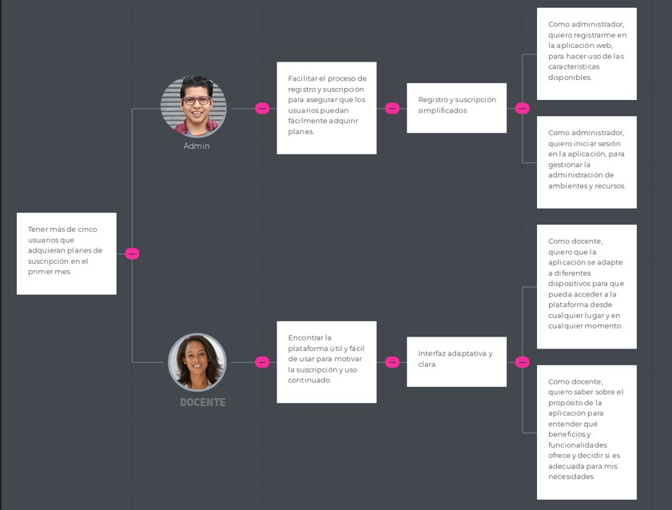
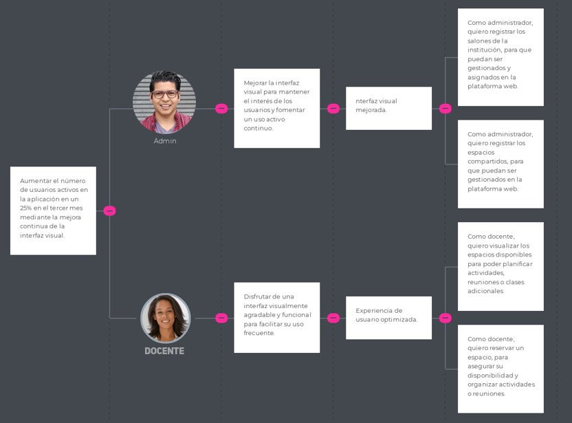

# Capítulo III: Requirements Specification
## 3.1. To-Be Scenario Mapping.
### Segmento: Administradores

### Segmento: Docentes

## 3.2. User Stories.

**Epics**

| EPIC ID | Título                              | Descripción                                                                                   |
|---------|-------------------------------------|-----------------------------------------------------------------------------------------------|
| EP01    | Accesibilidad de la Landing Page    | Como visitante de la landing page, quiero que la información sobre la aplicación sea fácil de entender para poder comprender rápidamente su propósito. |
| EP02    | Interfaz de la Landing Page         | Como visitante de la Landing Page, quiero la página sea visualmente agradable para que atraiga mi atención. |
| EP03    | Acceso a la aplicación              | Como usuario de la aplicación, quiero acceder con mi información para hacer uso de las características disponibles. |
| EP04    | Registro del docente                | Como administrador, quiero registrar información de los docentes de mi institución para que tengan acceso a la aplicación web. |
| EP05    | Registro de ambientes y sus recursos| Como administrador, quiero registrar aulas, espacios deportivos y ambientes compartidos para poder gestionarlos. |
| EP06    | Registro de reuniones               | Como administrador, quiero registrar reuniones para que los docentes estén enterados de cuándo y dónde es. |
| EP07    | Recepción de actualizaciones de los docentes | Como administrador, quiero recibir actualizaciones de los docentes, para mantenerme comunicado con ellos. |
| EP08    | Gestión de docentes encargados de un ambiente | Como administrador, quiero gestionar quién está a cargo de un ambiente, para contactarlo ante cualquier emergencia. |
| EP09    | Automatización del cálculo de salarios | Como administrador, quiero que el cálculo de salarios sea automático, para evitar perder tiempo realizando cálculos. |
| EP10    | Recepción de actualizaciones de los administradores | Como docente, quiero recibir actualizaciones por parte de administradores, para poder estar informado acerca de reuniones y otros eventos. |
| EP11    | Reserva de los espacios compartidos | Como docente, quiero reservar un espacio si está disponible, para poder hacer uso de la misma. |
| EP12    | Registro de reportes                | Como docente, quiero registrar reportes para que la administración esté informada sobre diversos asuntos. |

**Users Stories**

|**ID**|**Título**|**Descripción**|**Criterios de aceptación**|**EpicID**|
| :- | :- | :- | :- | :- |
|US01|Accesibilidad de la aplicación en diferentes dispositivos|
Como visitante, quiero que la aplicación se adapte a diferentes dispositivos para que pueda acceder a la plataforma desde cualquier lugar y en cualquier momento

|
**Escenario 1:** **Acceso desde un dispositivo** 

*Dado* que el usuario se encuentra en la Landing Page desde 

*Cuando* abre la aplicación.

*Entonces* la interfaz debe adaptarse correctamente al tamaño de la pantalla del dispositivo.

*Y* todas las características deben ser accesibles y utilizables.

|01|
|US02|Encontrar información del propósito de la aplicación|Como visitante, quiero saber sobre el propósito de la aplicación para entender qué beneficios y funcionalidades ofrece y decidir si es adecuada para mis necesidades.|
**Escenario 1: Encontrar información desde la página de inicio**

**Dado** que el visitante se encuentra en la Landing Page, **Cuando** busca información sobre el propósito de la aplicación, **Entonces** la interfaz debe mostrar una descripción clara y accesible del propósito en la página principal. **Además,** debe haber enlaces o secciones destacadas que dirijan a más detalles si es necesario.

|01|
|US03|Visualización de imágenes y gráficos relevantes|Como visitante, quiero que las imágenes y gráficos en la landing page sean de alta calidad y relevantes para captar mi interés.|
**Escenario 1: Relevancia de gráficos en la página principal**

**Dado que** el visitante ha accedido a la landing page

**Cuando** visualiza la página

**Entonces** el sistema debe mostrar gráficos que con información relevante y directamente relacionada con el contenido de la página

|02|
|US04|Tipografía cómoda y agradable estéticamente|Como visitante, quiero que la tipografía en la landing page sea legible y estéticamente agradable para facilitar la lectura y la navegación.|
**Escenario 1: Legibilidad de la tipografía**

**Dado que** el visitante se encuentra en el landing page

**Cuando** visualiza el contenido de la página

**Entonces** el sistema debe usar una tipografía que sea clara, legible y estéticamente agradable.

|02|
|US05|Registro como Administrador|Como administrador, quiero registrarme en la aplicación web, para hacer uso de las características disponibles.|
**Escenario 1: Registro exitoso del administrador**

**Dado que** el administrador ha completado el formulario de registro con un correo institucional válido

**Cuando** el administrador envía la solicitud de registro.

**Entonces** el sistema debe validar los datos ingresados

**Y** el sistema debe enviar un correo de confirmación al correo institucional del administrador

**Y** el sistema debe mostrar un mensaje de éxito indicando que el registro ha sido exitoso y que debe verificar su correo para activar la cuenta.

**Escenario 2: Falta de campos obligatorios en el registro**

**Dado que** el administrador ha dejado campos obligatorios del formulario sin completar

**Cuando** intenta enviar la solicitud de registro,

**Entonces** el sistema debe mostrar mensajes de error en los campos faltantes

**Y** el sistema no debe permitir finalizar el registro hasta que todos los campos obligatorios estén completos.

|03|
|US06|Inicio de sesión como profesor|Como profesor, quiero iniciar sesión en la aplicación, para acceder a las funcionalidades específicas para docentes|
**Escenario 1: Inicio de sesión exitoso**

 **Dado que** el docente ha ingresado sus credenciales correctamente

**Cuando** el docente envía la solicitud de inicio de sesión,

**Entonces** el sistema debe autenticar que las credenciales del docente sean las correctas

**Y** el sistema debe permitir al docente acceder a las características y recursos específicos para su rol educativo.

**Escenario 2: Manejo de errores de inicio de sesión**

 **Dado que** el docente ha ingresado credenciales incorrectas,

**Cuando** el docente intenta iniciar sesión,

**Entonces** el sistema debe mostrar un mensaje de error indicando que las credenciales son inválidas.

|03|
|US07|Inicio de sesión administrador|Como administrador, quiero iniciar sesión en la aplicación, para gestionar la administración de ambientes y recursos |
**Escenario 1: Inicio de sesión exitoso**

 **Dado que** el administrador ha ingresado sus credenciales

**Cuando** el administrador envía la solicitud de inicio de sesión,

**Entonces** el sistema debe autenticar al administrador correctamente

**Y** el sistema debe permitir al administrador acceder a las funcionalidades para gestionar la administración.

**Escenario 2: Manejo de errores de inicio de sesión**

 **Dado que** el administrador ha ingresado credenciales incorrectas

**Cuando** el administrador intenta iniciar sesión,

**Entonces** el sistema debe mostrar un mensaje de error indicando que las credenciales no son válidas.

|03|
|US08|Registro de información personal del docente|Como administrador, quiero registrar la información personal del docente, para tener una base de datos actualizada|
**Escenario 1:Registro de información**

**Dado** que el administrador ha ingresado datos con el formato correcto en el formulario de registro

**Cuando** el administrador envía el registro

**Entonces** el sistema almacenará los datos ingresados en la base de datos

**Escenario 2: Información incompleta**

**Dado** que el administrador ha ingresado la información de solo algunos campos **Cuando** el administrador envía el registro de información

**Entonces** el sistema muestra un mensaje de error

|04|
|US09|Registro de información de acceso del docente|Como administrador, quiero registrar las información de acceso del docente, para que puedan iniciar sesión en la plataforma web|
**Escenario 1: Información de acceso exitoso**

**Dado que** el formulario de registro del docente fue completado con datos de formato válido

**Cuando** el docente envía el registro de información 

**Entonces** el sistema almacenará las credenciales del docente en la base de datos

**Y** el docente podrá iniciar sesión correctamente

**Escenario 2: Información de acceso incorrecta**

**Dado que** el formulario de registro del docente fue completado con datos de formato inválido

**Cuando** el docente envía el registro de información 

**Entonces** el sistema mostrará un mensaje de error y no se guardará nada en la base de datos

**Escenario 3: Información insuficiente:**

**Dado que** el docente no ha completado todos los espacios obligatorios

**Cuando** el docente envía el registro de información 

**Entonces** el sistema mostrará un mensaje de error y no se guardará nada en la base de datos
|04|
|US10|Registro de salones|Como administrador, quiero registrar los salones de la institución, para que puedan ser gestionados y asignados en la plataforma web|
**Escenario 1: Registro exitoso de salones**

**Dado que** el administrador llenó todos los campos del formulario de registro con datos de formato válido

**Cuando** el administrador envía el registro de salones

**Entonces** todos los datos ingresados se almacenan correctamente 

**Y** se actualiza la lista de salones registrados

**Escenario 2: Información incorrecta de salones**

**Dado que** el administrador llenó solo algunos campos del formulario de registro

**Cuando** el administrador envía el registro de salones

**Entonces** el sistema muestra un mensaje de error

**Escenario 3: Información incorrecta de salones**

**Dado que** el administrador llenó solo ha rellenado algunos campos del registro

**Cuando** el administrador envía el registro de salones

**Entonces** el sistema muestra un mensaje de error
|05|
|US11|Registro de espacios compartidos|Como administrador, quiero registrar los espacios compartidos, para que puedan ser gestionados en la plataforma web|
**Escenario 1: Registro de espacios compartidos exitosos**

 **Dado** que** el administrador está en la vista “Registro de Espacios Compartidos”

**Cuando**  el administrador envía el registro con el formato correcto

**Entonces** los datos ingresados se almacenarán en la base de datos

**Y**  la vista de espacios registrados se actualizan 

**Escenario 2: Información de espacios compartidos incorrectos**

**Dado**  que** el administrador ha llenado el formulario de registro con datos de formato inválido

**Cuando** el administrador envía el registro

**Entonces** el sistema muestra un mensaje de error, no se guarda ningún dato y se regresa a la vista “Registro de espacios compartidos”** 

**Escenario 3: Información insuficiente:**

**Dado**  que** el administrador ha llenado solo algunos campos del formulario

**Cuando** el administrador envía el registro

**Entonces** el sistema muestra un mensaje de error, no se guarda ningún dato y se redirecciona al usuario a la vista “Registro de espacios compartidos”** 
|05|
|US12|Registro de horarios de espacios compartidos|
Como administrador, quiero registrar los horarios en los que un espacio compartido está disponible, para

que se puede gestionar su uso de manera eficiente
|
Escenario 1: Registro de horarios exitoso 

**Dado** que** el administrador ha llenado todos los campos del formulario de registro y con datos de formato válido

**Cuando** el administrador envía el registro 

**Entonces** los datos ingresados de los horarios del espacio compartido se almacenan en la base de datos.

Escenario 2: Información de horarios incorrecto  

**Dado** que el administrador ha llenado el campo de registro con datos de formato inválido

**Cuando** el administrador envía el registro

**Entonces** el sistema muestra un mensaje de error
|05|
|US13|Registro de recursos|Como administrador, quiero registrar los recursos de los ambientes, para mantener un inventario actualizado y optimizar la gestión de los recursos disponibles. |
**Escenario 1: Registro exitoso de un recurso**

**Dado que** el administrador está en la vista “Registro de Recursos” **Cuando** el administrador envía el registro con los datos en formato correcto

**Entonces** el sistema registra el recurso de ambiente.

**Escenario 2: Registro con datos incompletos**

**Dado que** el administrador está en la vista “Registro de Recursos”

**Cuando** el administrador envía el registro con datos de formato inválido

**Entonces** el sistema rechaza el registro y muestra un mensaje de error.
|05|
|US14|Registro de hora de la hora y lugar de la reunión|Como administrador, quiero registrar la hora y lugar de la reunión, para asegurar que todos los participantes tengan la información correcta sobre la reunión.|
**Escenario 1: Registro exitoso de hora y lugar**

**Dado que** el administrador está en la vista  “Registro de Reuniones”,

**Cuando** el administrador envía el registro con datos de formato válido

**Entonces** el sistema registra la reunión con la hora y el lugar indicados.

**Escenario 2: Registro con hora inválida**

**Dado que** el administrador está en la vista  “Registro de Reuniones”,

**Cuando** el administrador envía el registro con algún dato de formato inválido

**Entonces** el sistema rechaza el registro y muestra un mensaje de error. 
|06|
|US15|Registro de invitados de la reunión|Como administrador, quiero invitar a docentes a la reunión, para asegurarme de que los participantes necesarios estén presentes.|
**Escenario 1: Invitación exitosa a docentes**

Dado que el administrador está en la pantalla de invitación a reuniones.

Cuando los docentes han sido seleccionados para participar en la reunión.

Entonces los docentes seleccionados figuran como invitados confirmados en la reunión

|06|
|US16|Recibir notificación de reporte|Como administrador, quiero recibir una notificación cuando el docente haga un reporte, para estar al tanto de los problemas o incidencias reportados por el personal.|
**Escenario 1: Notificación de reporte enviada**

Dado que el docente está en la pantalla de reportes.

Cuando el reporte ha sido completado y está listo para ser enviado.

Entonces el sistema muestra una notificación al administrador con el contenido del reporte.

**Escenario 2: No recibir notificación si el reporte no es enviado**

Dado el sistema está en funcionamiento y no se ha enviado ningún reporte,

Cuando no se realiza ninguna acción,

Entonces el sistema no envía ninguna notificación al administrador.
|07|
|US17|Recibir notificación de de asistencia |Como administrador, quiero recibir notificaciones cuando el docente confirme su asistencia a la reunión, para tener un registro actualizado de los participantes.|
**Escenario 1: Notificación de confirmación de asistencia**

Dado que el docente está en la pantalla de confirmación de asistencia.

Cuando la asistencia del docente ha sido confirmada.

Entonces el sistema notifica al administrador sobre la confirmación de asistencia del docente.

**Escenario 2: No recibir notificación si no se confirma asistencia**

Dado que el docente se encuentra en la pantalla de confirmación de asistencia,

Cuando el docente no selecciona el checkbox de confirmar su asistencia

Entonces el sistema no envía ninguna notificación al administrador.
|07|
|US18|Registrar docente encargado de un ambiente|Como administrador, deseo registrar que docente está encargado de cada ambiente, para asignar responsabilidades y mejorar la gestión de los espacios.|
**Escenario 1: Registro exitoso de un docente encargado**

Dado que el administrador está en la pantalla de asignación de docentes a ambientes.

Cuando un docente está asignado a un ambiente.

Entonces el sistema refleja que el docente ha sido registrado como el encargado del ambiente seleccionado.

**Escenario 2: Registro sin seleccionar docente**

Dado que el administrador está en la pantalla de asignación de docentes a ambientes.

Cuando no hay ningún docente seleccionado para el ambiente.

Entonces el sistema muestra un mensaje indicando que es necesario seleccionar un docente para completar el registro.

|08|
|US19|Actualizar docente encargado de un ambiente|Como administrador, quiero actualizar que docente está encargado de cada ambiente, para reflejar cambios en la asignación de responsabilidades.|
**Escenario 1: Actualización exitosa del docente encargado**

Dado que el docente está en la pantalla de actualización de encargado de ambientes.

Cuando un nuevo encargado ha sido seleccionado.

Entonces el sistema refleja que la información del ambiente ha sido actualizada con el nuevo encargado.

**Escenario 2: Actualización sin seleccionar nuevo encargado**

Dado que el docente está en la pantalla de actualización de encargado de ambientes.

Cuando no hay un nuevo encargado seleccionado.

Entonces el sistema muestra un mensaje indicando que es necesario seleccionar un nuevo encargado para completar la actualización.

|08|
|US20|Ingreso de salarios del docente|Como administrador quiero ingresar el salario del docente, para que se calcule su salario neto después de las deducciones e impuestos|
**Escenario 1: Ingreso exitoso del salario del docente**

Dado que el administrador se encuentra en la pantalla de registro de salario,

Cuando ingresa la cantidad del salario bruto, deducciones y otros detalles necesarios,

Entonces el sistema calcula automáticamente el salario neto y lo muestra en la interfaz de administración.

**Escenario 2: Ingreso del salario sin datos completos** 

Dado que el administrador se encuentra en la pantalla de registro de salario,

Cuando no proporciona todos los datos requeridos,

Entonces el sistema rechaza el ingreso del salario y muestra un mensaje indicando que se deben completar todos los campos obligatorios.
|09|
|US21|Envío de salarios a docentes|Como administrador, quiero enviar el salario neto a los docentes, para asegurar que reciban su compensación de manera oportuna y precisa.|
**Escenario 1: Envío exitoso del salario neto**

Dado que el administrador está en la pantalla de envío de salarios.

Cuando el salario neto ha sido seleccionado y está listo para ser enviado.

Entonces el sistema confirma que el salario ha sido enviado al docente y muestra una notificación de éxito.

**Escenario 2: Envío de salario con información incompleta**

Dado que el administrador se encuentra en la pantalla de envío de salarios,

Cuando intenta enviar el salario sin completar los campos obligatorios,

Entonces el sistema rechaza el envío y muestra un mensaje solicitando que se completen todos los campos requeridos.

|09|
|US22|Notificación de reunión|Como docente, quiero recibir una notificación cuando haya una nueva reunión, para estar informado y poder asistir puntualmente.|
**Escenario 1: Recepción de notificación al crear una nueva reunión.**

*Dado que el administrador ha creado una nueva reunión,*

*Cuando el docente está registrado y asignado a la reunión,*

*Entonces el sistema envía una notificación al docente informándole sobre la nueva reunión.*
|10|
|US23|Notificación de actualización de reunión|Como docente, quiero recibir una notificación cuando haya un cambio en la reunión, para poder ajustar mi agenda y no perder información importante.|
<h3>**Escenario 1: Recibir una notificación de actualización de reunión**</h3>

*Dado que el docente está asignado a una reunión,*

*Cuando el administrador actualiza la fecha, hora o detalles de la reunión,*

*Entonces el sistema envía una notificación al docente informándole sobre los cambios.*
|10|
|US24|Notificación de envío de salario|Como docente, quiero recibir una notificación cuando el administrador haya enviado la información de mi salario, para poder confirmar verificar el monto recibido.|
<h3>**Escenario 1: Recibir una notificación de envío de salario**</h3>

*Dado que el administrador ha enviado la información de salario,*

*Cuando el docente está registrado en la aplicación,*

*Entonces el sistema envía una notificación informándole sobre el envío satisfactorio de su salario.*
|10|
|US25|Visualización de espacios compartidos|Como docente, quiero visualizar los espacios disponibles para poder planificar actividades, reuniones o clases adicionales..|
<h3>**Escenario 01: Acceder a la visualización de espacios compartidos**</h3>

*Dado que el docente está registrado en la aplicación,*

*Cuando accede a la sección de espacios compartidos,*

*Entonces el sistema muestra una lista con los espacios ocupados y disponibles*

<h3>**Escenario 02: Ver detalles de los espacios disponibles**</h3>

<h3>Dado que el docente ha accedido a la lista de espacios compartidos,</h3>

<h3>Cuando un espacio está seleccionado,</h3>

<h3>Entonces el sistema está en el estado de mostrar la ubicación, capacidad y disponibilidad de recursos adicionales del espacio.</h3>
|11|
|US26|Reserva de espacios compartidos|Como docente, quiero reservar un espacio, para asegurar su disponibilidad y organizar actividades o reuniones..|
<h3>**Escenario 01: Acceder a la función de reserva de espacios compartidos**</h3>

*Dado que el docente está registrado en la aplicación,*

*Cuando accede a la función de reserva de espacios,*

*Entonces el sistema le permite seleccionar un espacio disponible.*

<h3>**Escenario 02: Seleccionar un espacio para reserva**</h3>

*Dado que el docente ha accedido a la función de reserva,*

*Cuando selecciona un espacio disponible,*

*Entonces el sistema muestra los detalles del espacio, incluyendo ubicación y recursos.*

<h3>**Escenario 03: Realizar una reserva**</h3>

*Dado que el docente ha seleccionado un espacio disponible,*

*Cuando selecciona la fecha, hora y duración de la reserva,*

*Entonces el sistema confirma la reserva y envía una notificación de confirmación.*

<h3>**Escenario 04: Confirmación del proceso de reserva**</h3>

*Dado que el usuario docente ha seleccionado un espacio disponible, la fecha, la hora y la duración de la reserva,*

*Cuando la reserva está en estado de pendiente de confirmación,*

*Entonces el sistema está en el estado de visualización de un pop-up de confirmación de reserva,*

*Y al estar en el estado de confirmación exitosa, el sistema refleja la reserva finalizada, seguido de una notificación de confirmación para el docente.*

<h3>**Escenario 05: Cancelación el proceso de reserva**</h3>

*Dado que el docente ha iniciado el proceso de reserva,*

*Cuando decide cancelar la reserva,*

*Entonces el sistema muestra un pop-up para confirmar la cancelación y, si confirma, el proceso de reserva se cancela.*
|11|
|US27|Cancelación de reserva de espacios compartidos|
Como docente, deseo cancelar la reserva que hice de un espacio, para liberar el espacio y permitir que otros lo utilicen.

|
<h3>**Escenario 01: Cancelación aceptada de una reserva de espacio compartido**</h3>

*Dado que el docente ha realizado una reserva de un espacio compartido,*

*Cuando la reserva está en estado de cancelación,*

*Entonces el sistema está en estado de confirmación de cancelación,*

*Y tras la aceptación, el sistema queda en estado de reserva cancelada, con el docente notificado.*

**Escenario 02: Cancelación rechazada de una reserva de espacio compartido**

*Dado que el docente ha realizado una reserva de un espacio compartido,*

*Cuando la reserva está en estado de cancelación,*

*Entonces el sistema está en estado de confirmación de cancelación,*

*Y tras la negación, el sistema permanece en el estado original de la reserva, sin cambios, y retorna a la vista de espacios compartidos.*
|11|
|US28|Registro de reporte de avería|Como docente, deseo reportar una avería, para asegurar que sea informada y  próximamente reparada.|
<h3>**Escenario 01: Acceso correcto a la función de reporte de avería**</h3>

*Dado que el docente es un usuario registrado en la aplicación,*

*Cuando la aplicación se encuentra en estado de visualización de la sección de reporte de averías,*

*Entonces el sistema está en estado de mostrar todas las averías registradas y la opción de registrar una nueva avería.* 

<h3>**Escenario 02: Registro de Avería con verificación correcta de todas las áreas del formulario completadas.**</h3>

*Dado que el docente ha accedido a la función de registrar reporte de avería,*

*Cuando todas las secciones del formulario están completas* 

*Entonces el sistema se encuentra en estado de registro satisfactorio de la avería, y el docente queda en estado de notificado sobre el registro exitoso.*

<h3>**Escenario 03: Formulario de reporte de avería incompleto.**</h3>

*Dado que el docente ha accedido a la función de registrar reporte de avería,*

*Cuando el formulario de registro está incompleto* 

*Entonces el sistema está en estado de alerta mostrando un mensaje de advertencia indicando campos obligatorios sin completar.*

<h3>**Escenario 04: Adjuntar evidencia de la avería**</h3>

*Dado que el docente necesita proporcionar evidencia visual o documentos relacionados con la avería,*

*Cuando el sistema está en estado de permitir adjuntar archivos,*

*Entonces el sistema permite la adición de archivos para proporcionar información adicional sobre la avería.*

<h3>**Escenario 05: Ver el estado del reporte de avería**</h3>

*Dado que el docente ha reportado una avería,*

*Cuando accede a la sección de reportes de avería,*

*Entonces el sistema está en estado de mostrar el estado actual del reporte*

**Escenario 06: Actualizar o añadir información al reporte**

*Dado que el docente ha registrado una avería y necesita proporcionar información adicional,*

*Cuando accede al reporte en específico,*

*Entonces el sistema está en estado de permitir la actualización del reporte y queda en estado de confirmación de dicha actualización.*
|12|
|TS01|Añadir administrador a través de un RESTful API|Como desarrollador, quiero que se pueda añadir a un administrador a través de un API, para que el administrador registre a los docentes.|
**Scenario 1: Añadir administrador con DNI único**

**Given**: El endpoint “/api/v1/administradores” está disponible.

**When**: Se envía un POST request con los valores de nombre, apellido, correo, DNI, nombre de usuario y contraseña.

**Then**: Se recibe un response con un status 201.

**And**: El recurso del administrador es incluido en el body del response con un nuevo id y los valores registrados de su nombre, apellido y correo.

**Scenario 2: Añadir administrador con DNI repetido**

**Given**: El endpoint “/api/v1/administrators” está disponible.

**When**: Se envía un POST request con los valores de nombre, apellido, correo, DNI, nombre de usuario y contraseña

**And**: Un recurso de administrador tiene el mismo valor de DNI que el que viene en el request.

**Then**: Se recibe un response con un status 400.

**And**: Un mensaje en el body del response dice: "Ya existe un administrador registrado con el mismo DNI."

||
|TS02|Añadir un docente a través de un RESTful API|Como desarrollador, quiero que se pueda añadir a un docente a través de un API, para que este pueda interactuar con el administrador|
**Scenario 1: Añadir docente con DNI único**

**Given**: El endpoint “/api/v1/docentes” está disponible.

**When**: Se envía un POST request con los valores de nombre, apellido, correo, DNI, especialidad, nombre de usuario y contraseña.

**Then**: Se recibe un response con un status 201.

**And**: El recurso del docente es incluido en el body del response con un nuevo id y los valores registrados de su nombre, apellido y especialidad.

**Scenario 2: Añadir docente con DNI repetido**

**Given**: El endpoint “/api/v1/teachers” está disponible.

**When**: Se envía un POST request con los valores de nombre, apellido, correo, DNI, especialidad, nombre de usuario y contraseña.

**And**: Un recurso de docente tiene el mismo valor de DNI que el que viene en el request.

**Then**: Se recibe un response con un status 400.

**And**: Un mensaje en el body del response dice: "Ya existe un docente registrado con el mismo DNI."
||
|TS03|
Eliminar docente a través de un RESTful API

|Como desarrollador, quiero implementar la característica de eliminar un docente a través de una API RESTful, para gestionar correctamente la eliminación de registros de docentes según sea necesario|
**Scenario 1: Eliminar docente con ID válido**

**Given**: El endpoint “/api/v1/teachers/{id}” está disponible.

**When**: Se envía un DELETE request con un ID de docente válido.

**Then**: Se recibe un response con un status 204.

**And**: El docente es eliminado del sistema.

**Scenario 2: Eliminar docente con ID inválido**

**Given**: El endpoint “/api/v1/teachers/{id}” está disponible.

**When**: Se envía un DELETE request con un ID de docente que no existe.

**Then**: Se recibe un response con un status 404.

**And**: Un mensaje en el body del response dice: "No se encontró el docente con el ID proporcionado."

||
|TS04|Eliminar administrador de un RESTful API|Como desarrollador, quiero implementar la característica de eliminar un administrador a través de una API RESTful, de manera que el sistema pueda gestionar correctamente la eliminación de registros de administradores según sea necesario.|
**Scenario 1: Eliminar administrador con ID válido**

**Given**: El endpoint “/api/v1/administrators/{id}” está disponible.

**When**: Se envía un DELETE request con un ID de administrador válido.

**Then**: Se recibe un response con un status 204.

**And**: El administrador es eliminado del sistema.

**Scenario 2: Eliminar administrador con ID inválido**

**Given**: El endpoint “/api/v1/administrators/{id}” está disponible.

**When**: Se envía un DELETE request con un ID de administrador que no existe.

**Then**: Se recibe un response con un status 404.

**And**: Un mensaje en el body del response dice: "No se encontró el administrador con el ID proporcionado."

||
|TS05|Inicio de sesión a través de un RESTful API|Como desarrollador, quiero implementar la característica de inicio de sesión a través de una API RESTful, para que los usuarios puedan autenticarse y acceder a las funcionalidades del sistema de manera segura.|
**Scenario 1: Inicio de sesión exitoso**

**Given**: El endpoint “/api/v1/login” está disponible.

**When**: Se envía un POST request con los valores de nombre de usuario y contraseña correctos.

**Then**: Se recibe un response con un status 200.

**And**: El token de autenticación es devuelto en el body del response.

**Scenario 2: Inicio de sesión fallido por credenciales incorrectas**

**Given**: El endpoint “/api/v1/login” está disponible.

**When**: Se envía un POST request con valores de nombre de usuario o contraseña incorrectos.

**Then**: Se recibe un response con un status 401.

**And**: Un mensaje en el body del response dice: "Credenciales incorrectas."
||
|TS07|Añadir información de acceso del docente a través de un RESTful API|
Como desarrollador, quiero implementar la característica de añadir la información de acceso del docente a través de un RESTful API

PARA que este pueda hacer uso de las características de la aplicación web
|
**Scenario 1: Añadir información de acceso con éxito**

- **Given**: El endpoint “/api/v1/teachers/account” está disponible.

- **When**: Se envía un POST request con los valores de nombre de usuario y contraseña.

- **Then**: Se recibe un response con un status 201.

- **And**: La información de acceso del docente es incluida en el body del response con un nuevo id y el nombre de usuario registrado.

**Scenario 2: Añadir información de acceso con nombre de usuario repetido**

- **Given**: El endpoint “/api/v1/teachers/account” está disponible.

- **When**: Se envía un POST request con un nombre de usuario que ya está registrado en el sistema.

- **Then**: Se recibe un response con un status 400.

- **And**: Un mensaje en el body del response dice: "El nombre de usuario ya está en uso."

||
|TS08|Añadir información de salones a través de un RESTful API|
Como desarrollador, quiero implementar la característica de añadir la información de los salones a través de un RESTful API

PARA que los usuarios puedan interactuar con su información
|
**Scenario 1: Añadir información de salones con éxito**

**Given**: El endpoint “/api/v1/classrooms” está disponible.

**When**: Se envía un POST request con los valores de nombre del salón, capacidad y ubicación.

**Then**: Se recibe un response con un status 201.

**And**: La información del salón es incluida en el body del response con un nuevo id y los valores registrados de nombre y capacidad.

**Scenario 2: Añadir información de salón con nombre duplicado**

**Given**: El endpoint “/api/v1/classrooms” está disponible.

**When**: Se envía un POST request con un nombre de salón que ya está registrado en el sistema.

**Then**: Se recibe un response con un status 400.

**And**: Un mensaje en el body del response dice: "El nombre del salón ya está en uso."

||
|TS09|Añadir información de espacios compartidos través de un RESTful API|
Como desarrollador, quiero implementar la característica de añadir la información de los espacios compartidos a través de un RESTful API

PARA que los usuarios puedan interactuar con su información
|
**Scenario 1: Añadir información de espacios compartidos con éxito**

**Given**: El endpoint “/api/v1/shared-spaces” está disponible.

**When**: Se envía un POST request con los valores de nombre del espacio, capacidad y ubicación.

**Then**: Se recibe un response con un status 201.

**And**: La información del espacio compartido es incluida en el body del response con un nuevo id y los valores registrados de nombre y capacidad.

**Scenario 2: Añadir información de espacio compartido con nombre duplicado**

**Given**: El endpoint “/api/v1/shared-spaces” está disponible.

**When**: Se envía un POST request con un nombre de espacio que ya está registrado en el sistema.

**Then**: Se recibe un response con un status 400.

**And**: Un mensaje en el body del response dice: "El nombre del espacio compartido ya está en uso."

||
|TS10|Añadir información de horarios de los espacios compartidos través de un RESTful API|
Como desarrollador, quiero implementar la característica de añadir la información de los horarios de los espacios compartidos a través de un RESTful API

PARA que los usuarios puedan interactuar con su información
|
**Scenario 1: Añadir información de horarios de espacios compartidos con éxito**

**Given**: El endpoint “/api/v1/shared-spaces/schedules” está disponible.

**When**: Se envía un POST request con los valores de espacio compartido, fecha, hora de inicio y hora de fin.

**Then**: Se recibe un response con un status 201.

**And**: La información del horario es incluida en el body del response con un nuevo id y los valores registrados de espacio compartido y horarios.

**Scenario 2: Añadir información de horario en conflicto con otro**

**Given**: El endpoint “/api/v1/shared-spaces/schedules” está disponible.

**When**: Se envía un POST request con un horario que se superpone con un horario ya existente en el sistema.

**Then**: Se recibe un response con un status 400.

**And**: Un mensaje en el body del response dice: "El horario ya está reservado para otro evento."

||
|TS11|Añadir información de los recursos de un salón a través de un RESTful API|
Como desarrollador, quiero implementar la característica de añadir la información de los recursos de los  salones a través de un RESTful API

PARA que los docentes puedan puedan hacer reportes
|
**Scenario 1: Añadir recursos de salón con éxito**

**Given**: El endpoint “/api/v1/classrooms/resources” está disponible.

**When**: Se envía un POST request con los valores de nombre del recurso, cantidad y estado del recurso.

**Then**: Se recibe un response con un status 201.

**And**: La información de los recursos del salón es incluida en el body del response con un nuevo id y los valores registrados de nombre, cantidad y estado.

**Scenario 2: Añadir recursos con información incompleta**

**Given**: El endpoint “/api/v1/classrooms/resources” está disponible.

**When**: Se envía un POST request sin la cantidad o estado del recurso.

**Then**: Se recibe un response con un status 400.

**And**: Un mensaje en el body del response dice: "Faltan campos obligatorios para los recursos."

||
|TS12|Añadir información de hora y lugar de una reunión a través de un RESTful API|
Como desarrollador, quiero implementar la característica de añadir la información de hora y lugar de una reunión a través de un RESTful API

PARA que los docentes puedan recibir notificaciones acerca de la reunión.
|
**Scenario 1: Añadir información de reunión con éxito**

**Given**: El endpoint “/api/v1/meetings/details” está disponible.

**When**: Se envía un POST request con los valores de fecha, hora, y lugar de la reunión.

**Then**: Se recibe un response con un status 201.

**And**: La información de la reunión es incluida en el body del response con un nuevo id y los valores registrados de fecha, hora y lugar.

**Scenario 2: Añadir información de reunión con datos faltantes**

**Given**: El endpoint “/api/v1/meetings/details” está disponible.

**When**: Se envía un POST request con valores incompletos, faltando la hora o el lugar de la reunión.

**Then**: Se recibe un response con un status 400.

**And**: Un mensaje en el body del response dice: "Faltan campos obligatorios para la reunión."

**Scenario 3: Añadir información de reunión con lugar y hora ya reservados**

**Given**: El endpoint “/api/v1/meetings/details” está disponible.

**When**: Se envía un POST request con los valores de fecha, hora, y lugar de la reunión, pero ya existe una reunión registrada para la misma fecha, hora y lugar.

**Then**: Se recibe un response con un status 409 (Conflict).

**And**: Un mensaje en el body del response dice: "El lugar y la hora ya están reservados para otra reunión."

||
|TS13|Añadir información de los invitados de una reunión a través de un RESTful API|
Como desarrollador, quiero implementar la característica de añadir la información de los invitados de una reunión a través de un RESTful API

PARA que los administradores puedan seleccionar a los participantes de la reunión
|
**Scenario 1: Añadir invitados a la reunión con éxito**

**Given**: El endpoint “/api/v1/meetings/invitees” está disponible.

**When**: Se envía un POST request con los valores de nombre, correo y rol de los invitados.

**Then**: Se recibe un response con un status 201.

**And**: La información de los invitados es incluida en el body del response con un nuevo id y los valores registrados de nombre y correo.

**Scenario 2: Añadir invitados con información duplicada**

**Given**: El endpoint “/api/v1/meetings/invitees” está disponible.

**When**: Se envía un POST request con un correo que ya está registrado para otro invitado en la misma reunión.

**Then**: Se recibe un response con un status 400.

**And**: Un mensaje en el body del response dice: "El invitado ya está registrado para esta reunión."

||
|TS14|Obtener notificación de reporte a través de un RESTful API|
Como desarrollador, quiero implementar la opción para obtener la notificación de un reporte  a través de una API RESTful, 

PARA que los administradores puedan visualizar los reportes de los docentes
|
- **Scenario 1: Obtener notificación de reporte con éxito**

**Given**: El endpoint “/api/v1/reports/notifications” está disponible.

**When**: Se envía un GET request sin parámetros adicionales.

**Then**: Se recibe un response con un status 200.

**And**: El body del response contiene una lista de notificaciones de reportes pendientes con los nombres de los docentes y las fechas.

**Scenario 2: No hay reportes disponibles**

**Given**: El endpoint “/api/v1/reports/notifications” está disponible.

**When**: Se envía un GET request y no hay reportes nuevos disponibles.

**Then**: Se recibe un response con un status 204.

**And**: No se devuelve contenido en el body del response.

||
|TS15|Obtener notificación de asistencia a través de un RESTful API|
Como desarrollador, quiero implementar la opción para obtener la notificación de asistencia a la reunión  a través de una API RESTful, 

PARA que los administradores puedan visualizar cuando un docente confirma su asistencia a la reunión
|
**Scenario 1: Obtener notificación de asistencia confirmada**

**Given**: El endpoint “/api/v1/meetings/attendance-notifications” está disponible.

**When**: Se envía un GET request sin parámetros adicionales.

**Then**: Se recibe un response con un status 200.

**And**: El body del response contiene una lista de docentes que han confirmado su asistencia a la reunión.

**Scenario 2: No hay confirmaciones de asistencia disponibles**

**Given**: El endpoint “/api/v1/meetings/attendance-notifications” está disponible.

**When**: Se envía un GET request y no hay confirmaciones de asistencia nuevas.

**Then**: Se recibe un response con un status 204.

**And**: No se devuelve contenido en el body del response.

||
|TS16|Obtener notificación de creación de reunión a través de un RESTful API|
Como desarrollador, quiero implementar la opción para obtener la notificación de una nueva reunión a través de una API RESTful, 

PARA que los docentes puedan visualizar una notificación cuando un administrador crea una reunión
|
**Scenario 1: Obtener notificación de nueva reunión con éxito**

**Given**: El endpoint “/api/v1/meetings/creation-notifications” está disponible.

**When**: Se envía un GET request sin parámetros adicionales.

**Then**: Se recibe un response con un status 200.

**And**: El body del response contiene los detalles de la nueva reunión, incluyendo la fecha, hora y lugar.

**Scenario 2: No hay nuevas reuniones disponibles**

**Given**: El endpoint “/api/v1/meetings/creation-notifications” está disponible.

**When**: Se envía un GET request y no hay reuniones nuevas registradas.

**Then**: Se recibe un response con un status 204.

**And**: No se devuelve contenido en el body del response.

||
|TS17|Añadir información del encargado del aula a través de un RESTful API|
Como desarrollador, quiero implementar la característica de añadir al docente encargado del aula  a través de un RESTful API

PARA que los administradores puedan ver quien está a cargo de un aula específica
|
**Escenario 1: Añadir encargado del aula con éxito**

**Given**: El endpoint “/api/v1/classrooms/teacher” está disponible.

**When**: Se envía un POST request con los valores de ID del aula y ID del docente.

**Then**: Se recibe un response con un status 201.

**And**: El docente asignado como encargado del aula es incluido en el body del response con el ID del aula y del docente.

**Escenario 2: Añadir encargado del aula sin ID de docente**

**Given**: El endpoint “/api/v1/classrooms/teacher” está disponible.

**When**: Se envía un POST request sin el ID del docente.

**Then**: Se recibe un response con un status 400.

**And**: Un mensaje en el body del response dice: "Faltan datos obligatorios para completar la asignación."

**Escenario 3: Añadir encargado del aula cuando el docente ya está encargado de otro salón**

**Given**: El endpoint “/api/v1/classrooms/teacher” está disponible.

**When**: Se envía un POST request con los valores de ID del aula y ID del docente, pero el docente ya está asignado como encargado de otro salón.

**Then**: Se recibe un response con un status 409 (Conflict).

**And**: Un mensaje en el body del response dice: "El docente ya está asignado como encargado de otro salón."

||
|TS18|Actualizar información del encargado del aula a través de un RESTful API|
Como desarrollador, quiero implementar la característica de actualizar al docente encargado del aula  a través de un RESTful API

PARA que los administradores puedan cambiar al docente encargado del aula ante cualquier eventualidad
|
**Escenario 1: Actualizar encargado del aula con éxito**

**Given**: El endpoint “/api/v1/classrooms/teacher/:id” está disponible.

**When**: Se envía un PUT request con los valores de ID del aula y nuevo ID del docente.

**Then**: Se recibe un response con un status 200.

**And**: La información del nuevo encargado del aula es actualizada en el body del response.

**Escenario 2: Actualizar encargado del aula con datos incompletos**

**Given**: El endpoint “/api/v1/classrooms/teacher/:id” está disponible.

**When**: Se envía un PUT request sin el nuevo ID del docente.

**Then**: Se recibe un response con un status 400.

**And**: Un mensaje en el body del response dice: "Faltan datos para realizar la actualización."

||
|TS19|Añadir información del salario del docente través de un RESTful API|
Como desarrollador, quiero implementar la característica de añadir el salario del docente  a través de un RESTful API

PARA que los docentes puedan ver la información de su salario
|
**Escenario 1: Añadir salario con éxito**

**Given**: El endpoint “/api/v1/teachers/salary” está disponible.

**When**: Se envía un POST request con los valores de salario bruto, deducciones e impuestos.

**Then**: Se recibe un response con un status 201.

**And**: La información del salario neto es incluida en el body del response.

**Escenario 2: Añadir salario con información incompleta**

**Given**: El endpoint “/api/v1/teachers/salary” está disponible.

**When**: Se envía un POST request sin algunos campos obligatorios, como deducciones o impuestos.

**Then**: Se recibe un response con un status 400.

**And**: Un mensaje en el body del response dice: "Faltan datos obligatorios para calcular el salario neto."

||
|TS20|Actualizar información de la reunión a través de un RESTful API|
Como desarrollador, quiero implementar la característica de actualizar la información de la reunión  a través de un RESTful API

PARA que los administradores puedan cambiar la información de la reunión ante cualquier eventualidad
|
**Escenario 1: Actualizar reunión con éxito**

**Given**: El endpoint “/api/v1/meetings/:id” está disponible.

- **When**: Se envía un PUT request con los nuevos valores de fecha, hora y lugar.

- **Then**: Se recibe un response con un status 200.

- **And**: La información de la reunión actualizada se refleja en el body del response.

**Escenario 2: Actualizar reunión con datos faltantes**

**Given**: El endpoint “/api/v1/meetings/:id” está disponible.

**When**: Se envía un PUT request sin algunos de los campos requeridos, como la hora o el lugar.

**Then**: Se recibe un response con un status 400.

**And**: Un mensaje en el body del response dice: "Faltan campos obligatorios para actualizar la reunión."

||
|TS21|Obtener notificación de actualización de una reunión a través de un RESTful API|
Como desarrollador, quiero implementar la opción para obtener la notificación de una actualización de una reunión a través de una API RESTful, 

PARA que los docentes puedan visualizar una notificación cuando un administrador actualice información de una reunión
|
**Escenario 1: Obtener notificación de actualización de reunión con éxito**

**Given**: El endpoint “/api/v1/meetings/update-notifications” está disponible.

**When**: Se envía un GET request sin parámetros adicionales.

**Then**: Se recibe un response con un status 200.

**And**: El body del response contiene los detalles de la actualización de la reunión, incluyendo la nueva fecha, hora y lugar.

**Escenario 2: No hay actualizaciones de reuniones disponibles**

**Given**: El endpoint “/api/v1/meetings/update-notifications” está disponible.

**When**: Se envía un GET request y no hay actualizaciones nuevas de reuniones registradas.

**Then**: Se recibe un response con un status 204.

**And**: No se devuelve contenido en el body del response.

||
|TS22|Obtener notificación de actualización envío de salario a través de un RESTful API|
Como desarrollador, quiero implementar la opción para obtener la notificación de envío de salario a través de una API RESTful, 

PARA que los docentes puedan visualizar una notificación cuando un administrador les envie los datos de su salario.
|
**Escenario 1: Obtener notificación de envío de salario con éxito**

**Given**: El endpoint “/api/v1/salaries/notifications/:id” está disponible.

**When**: Se envía un GET request sin parámetros adicionales.

**Then**: Se recibe un response con un status 200.

**And**: El body del response contiene una notificación con los detalles del salario enviado, como la cantidad neta y la fecha del envío.

**Escenario 2: No hay notificaciones de envío de salario disponibles**

**Given**: El endpoint “/api/v1/salaries/notifications/:id” está disponible.

**When**: Se envía un GET request y no hay notificaciones de envío de salario nuevas.

**Then**: Se recibe un response con un status 204.

**And**: No se devuelve contenido en el body del response.

||
|TS23|Obtener información de la disponibilidad de espacios compartidos a través de un RESTful API|
Como desarrollador, quiero implementar la opción para obtener la disponibilidad de espacios compartidos a través de una API RESTful, 

PARA que los docentes y administradores puedan visualizar si un espacio compartido se encuentra disponible en un momento específico
|
**Escenario 1: Obtener disponibilidad de espacios compartidos con éxito**

**Given**: El endpoint “/api/v1/shared-spaces” está disponible.

**When**: Se envía un GET request con los parámetros de fecha y hora.

**Then**: Se recibe un response con un status 200.

**And**: El body del response contiene los detalles de los espacios compartidos disponibles en ese momento, como nombre, ubicación y capacidad.

**Escenario 2: No hay espacios disponibles en el momento solicitado**

**Given**: El endpoint “/api/v1/shared-spaces” está disponible.

**When**: Se envía un GET request con los parámetros de fecha y hora, pero no hay espacios disponibles en ese momento.

**Then**: Se recibe un response con un status 200.

**And**: El body del response dice: "No hay espacios disponibles para el momento solicitado."

||
|TS24|Añadir reserva a un espacios compartido a través de un RESTful API|
Como desarrollador, quiero implementar la opción para añadir una reserva a un espacio compartidos a través de una API RESTful, 

PARA que los docentes puedan reservar un espacio compartido que se encuentre disponible en un momento específico.
|
**Escenario 1: Reserva de espacio compartido con éxito**

**Given**: El endpoint “/api/v1/shared-spaces/:id/reservations” está disponible.

**When**: Se envía un POST request con los valores de ID del espacio, fecha, hora de inicio y hora de fin.

**Then**: Se recibe un response con un status 201.

**And**: La reserva del espacio es confirmada y se incluye en el body del response con los detalles de la reserva.

**Escenario 2: Intentar reservar un espacio ya ocupado**

**Given**: El endpoint “/api/v1/shared-spaces/:id/reservations” está disponible.

**When**: Se envía un POST request para reservar un espacio en una fecha y hora que ya está reservada.

**Then**: Se recibe un response con un status 409 (Conflict).

**And**: Un mensaje en el body del response dice: "El espacio ya está reservado para esa fecha y hora."

||
|TS25|Eliminar reserva a un espacios compartido a través de un RESTful API|
Como desarrollador, quiero implementar la opción para eliminar una reserva a un espacio compartido a través de una API RESTful, 

PARA que los docentes puedan reservar el espacio que ya no se usará.
|
**Escenario 1: Eliminación de reserva con éxito**

**Given**: El endpoint “/api/v1/shared-spaces/:id/reservations/:id” está disponible.

**When**: Se envía un DELETE request con el ID de la reserva a eliminar.

**Then**: Se recibe un response con un status 204.

**And**: La reserva es eliminada exitosamente del sistema.

**Escenario 2: Intentar eliminar una reserva inexistente**

**Given**: El endpoint “/api/v1/shared-spaces/:id/reservations/:id” está disponible.

**When**: Se envía un DELETE request con un ID de reserva que no existe.

**Then**: Se recibe un response con un status 404.

**And**: Un mensaje en el body del response dice: "No se encontró la reserva con el ID proporcionado."

||
|TS26|Añadir información del reporte de avería a través de un RESTful API|
Como desarrollador, quiero implementar la característica de añadir la información de un reporte a través de un RESTful API

PARA que los administradores puedan ver la información del reporte que hizo el docente.
|
**Escenario 1: Registro de reporte de avería con éxito**

**Given**: El endpoint “/api/v1/classroom/reports” está disponible.

**When**: Se envía un POST request con los detalles de la avería, como descripción, ubicación y prioridad.

**Then**: Se recibe un response con un status 201.

**And**: El reporte de la avería es registrado exitosamente y los detalles se incluyen en el body del response.

**Escenario 2: Registro de reporte de avería con información incompleta**

**Given**: El endpoint “/api/v1/classrooms/reports” está disponible.

**When**: Se envía un POST request sin completar los campos obligatorios, como la descripción o la prioridad.

**Then**: Se recibe un response con un status 400.

**And**: Un mensaje en el body del response dice: "Faltan campos obligatorios para registrar el reporte de avería."

||

## 3.3. Impact Mapping.

## 3.4. Product Backlog.

| Orden | User Story / Technical Story Id | Título                                          | Descripción                                                                                                                                                        | Story Points (1 / 2 / 3 / 5 / 8) |
|-------|---------------------------------|-------------------------------------------------|--------------------------------------------------------------------------------------------------------------------------------------------------------------------|----------------------------------|
| 1     | US02                            | Encontrar información del propósito de la aplicación | Como visitante, quiero saber sobre el propósito de la aplicación para entender qué beneficios y funcionalidades ofrece y decidir si es adecuada para mis necesidades. | 2                                |
| 2     | US03                            | Visualización de imágenes y gráficos relevantes | Como visitante, quiero que las imágenes y gráficos en la landing page sean de alta calidad y relevantes para captar mi interés.                                   | 2                                |
| 3     | US04                            | Tipografía cómoda y agradable estéticamente   | Como visitante, quiero que la tipografía en la landing page sea legible y estéticamente agradable para facilitar la lectura y la navegación.                      | 1                                |
| 4     | US01                            | Accesibilidad de la aplicación en diferentes dispositivos | Como visitante, quiero que la aplicación se adapte a diferentes dispositivos para que pueda acceder a la plataforma desde cualquier lugar y en cualquier momento. | 5                                |
| 5     | US08                            | Registro de información personal del docente  | Como administrador, quiero registrar la información personal del docente, para tener una base de datos actualizada y poder gestionar al personal de manera eficiente. | 3                                |
| 6     | US09                            | Registro de información de acceso del docente | Como administrador, quiero registrar la información de acceso del docente, para que puedan iniciar sesión en la plataforma web sin problemas.                      | 3                                |
| 7     | US10                            | Registro de salones                           | Como administrador, quiero registrar los salones de la institución, para que puedan ser gestionados y asignados en la plataforma web de manera efectiva.         | 8                                |
| 8     | US11                            | Registro de espacios compartidos               | Como administrador, quiero registrar los espacios compartidos, para que puedan ser gestionados y reservados en la plataforma web.                                | 8                                |
| 9     | US12                            | Registro de recursos                          | Como administrador, quiero registrar los recursos de los ambientes, para mantener un inventario actualizado y optimizar la gestión de los recursos disponibles. | 5                                |
| 10    | US13                            | Registro de horarios de espacios compartidos   | Como administrador, quiero registrar los horarios en los que un espacio compartido está disponible, para gestionar su uso de manera eficiente y evitar conflictos. | 8                                |
| 11    | US14                            | Registro de la hora y lugar de la reunión      | Como administrador, quiero registrar la hora y lugar de la reunión, para asegurar que todos los participantes tengan la información correcta sobre la reunión.  | 5                                |
| 12    | US15                            | Registro de invitados de la reunión            | Como administrador, quiero invitar a docentes a la reunión, para asegurarme de que los participantes necesarios estén presentes y puedan participar de manera efectiva. | 5                                |
| 13    | US16                            | Visualización de espacios compartidos          | Como docente, quiero visualizar los espacios disponibles para poder planificar actividades, reuniones o clases adicionales de manera eficiente.                  | 5                                |
| 14    | US17                            | Reserva de espacios compartidos               | Como docente, quiero reservar un espacio, para asegurar su disponibilidad y organizar actividades o reuniones de manera efectiva.                                | 8                                |
| 15    | US18                            | Cancelación de reserva de espacios compartidos | Como docente, deseo cancelar la reserva que hice de un espacio, para liberar el espacio y permitir que otros lo utilicen.                                      | 5                                |
| 16    | US19                            | Registrar docente encargado de un ambiente    | Como administrador, deseo registrar qué docente está encargado de cada ambiente, para asignar responsabilidades y mejorar la gestión de los espacios.             | 5                                |
| 17    | US20                            | Ingreso de salarios del docente                | Como administrador, quiero ingresar el salario del docente, para que se calcule su salario neto después de las deducciones e impuestos.                           | 5                                |
| 18    | US21                            | Envío de salarios a docentes                   | Como administrador, quiero enviar el salario neto a los docentes, para asegurar que reciban su compensación de manera oportuna y precisa.                      | 2                                |
| 19    | US22                            | Recibir notificación de reporte                | Como administrador, quiero recibir una notificación cuando el docente haga un reporte, para estar al tanto de los problemas o incidencias reportados por el personal. | 8                                |
| 20    | US23                            | Recibir notificación de asistencia             | Como administrador, quiero recibir notificaciones cuando el docente confirme su asistencia a la reunión, para tener un registro actualizado de los participantes.  | 8                                |
| 21    | US24                            | Notificación de reunión                       | Como docente, quiero recibir una notificación cuando haya una nueva reunión, para estar informado y poder asistir puntualmente.                                 | 8                                |
| 22    | US25                            | Notificación de actualización de reunión      | Como docente, quiero recibir una notificación cuando haya un cambio en la reunión, para poder ajustar mi agenda y no perder información importante.            | 8                                |
| 23    | US26                            | Notificación de envío de salario              | Como docente, quiero recibir una notificación cuando el administrador haya enviado la información de mi salario, para poder confirmar y verificar el monto recibido. | 8                                |
| 24    | US27                            | Registro de reporte de avería                 | Como docente, deseo reportar una avería, para asegurar que sea informada y reparada a la brevedad.                                                               | 3                                |
| 25    | US28                            | Actualizar docente encargado de un ambiente  | Como administrador, quiero actualizar qué docente está encargado de cada ambiente, para reflejar cambios en la asignación de responsabilidades.                   | 3                                |
