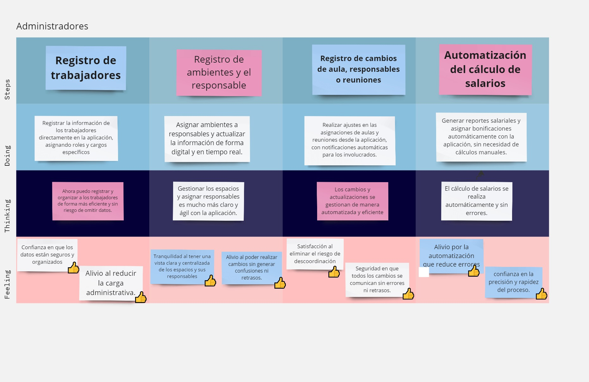
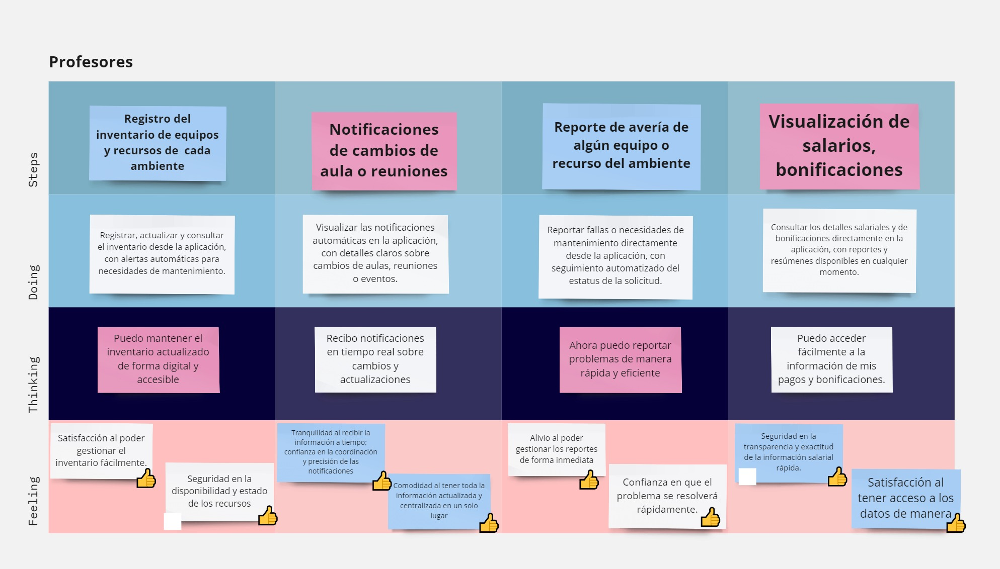

# Capítulo III: Requirements Specification
## 3.1. To-Be Scenario Mapping.
### Segmento: Administradores

### Segmento: Docentes

## 3.2. User Stories.

**Users Stories**

| EPIC ID | Título                              | Descripción                                                                                   |
|---------|-------------------------------------|-----------------------------------------------------------------------------------------------|
| EP01    | Accesibilidad de la Landing Page    | Como visitante de la landing page, quiero que la información sobre la aplicación sea fácil de entender para poder comprender rápidamente su propósito. |
| EP02    | Interfaz de la Landing Page         | Como visitante de la Landing Page, quiero la página sea visualmente agradable para que atraiga mi atención. |
| EP03    | Acceso a la aplicación              | Como usuario de la aplicación, quiero acceder con mi información para hacer uso de las características disponibles. |
| EP04    | Registro del docente                | Como administrador, quiero registrar información de los docentes de mi institución para que tengan acceso a la aplicación web. |
| EP05    | Registro de ambientes y sus recursos| Como administrador, quiero registrar aulas, espacios deportivos y ambientes compartidos para poder gestionarlos. |
| EP06    | Registro de reuniones               | Como administrador, quiero registrar reuniones para que los docentes estén enterados de cuándo y dónde es. |
| EP07    | Recepción de actualizaciones de los docentes | Como administrador, quiero recibir actualizaciones de los docentes, para mantenerme comunicado con ellos. |
| EP08    | Gestión de docentes encargados de un ambiente | Como administrador, quiero gestionar quién está a cargo de un ambiente, para contactarlo ante cualquier emergencia. |
| EP09    | Automatización del cálculo de salarios | Como administrador, quiero que el cálculo de salarios sea automático, para evitar perder tiempo realizando cálculos. |
| EP10    | Recepción de actualizaciones de los administradores | Como docente, quiero recibir actualizaciones por parte de administradores, para poder estar informado acerca de reuniones y otros eventos. |
| EP11    | Reserva de los espacios compartidos | Como docente, quiero reservar un espacio si está disponible, para poder hacer uso de la misma. |
| EP12    | Registro de reportes                | Como docente, quiero registrar reportes para que la administración esté informada sobre diversos asuntos. |

**Users Stories**

| ID   | Título                                      | Descripción                                                                                                                                                           | Criterios de aceptación                                                                                                                                                                                                                                                                                                                                                         | EpicID |
|------|---------------------------------------------|-----------------------------------------------------------------------------------------------------------------------------------------------------------------------|----------------------------------------------------------------------------------------------------------------------------------------------------------------------------------------------------------------------------------------------------------------------------------------------------------------------------------------------------------------|--------|
| US01 | Accesibilidad de la aplicación en diferentes dispositivos | Como visitante, quiero que la aplicación se adapte a diferentes dispositivos para que pueda acceder a la plataforma desde cualquier lugar y en cualquier momento | **Escenario 1: Acceso desde un dispositivo** Dado que el usuario se encuentra en la Landing Page desde un dispositivo móvil, tablet o computador, Cuando abre la aplicación, Entonces la interfaz debe adaptarse correctamente al tamaño de la pantalla del dispositivo. Y todas las características deben ser accesibles y utilizables. | 01     |
| US02 | Encontrar información del propósito de la aplicación | Como visitante, quiero saber sobre el propósito de la aplicación para entender qué beneficios y funcionalidades ofrece y decidir si es adecuada para mis necesidades | **Escenario 1: Encontrar información desde la página de inicio** Dado que el visitante se encuentra en la Landing Page, Cuando busca información sobre el propósito de la aplicación, Entonces la interfaz debe mostrar una descripción clara y accesible del propósito en la página principal. Y debe haber enlaces o secciones destacadas que dirijan a más detalles si es necesario. | 01     |
| US03 | Visualización de imágenes y gráficos relevantes | Como visitante, quiero que las imágenes y gráficos en la landing page sean de alta calidad y relevantes para captar mi interés | **Escenario 1: Relevancia de gráficos en la página principal** Dado que el visitante ha accedido a la landing page, Cuando se visualiza los gráficos en la página, Entonces el sistema debe mostrar gráficos que representen información relevante y directamente relacionada con el contenido de la página. | 02     |
| US04 | Tipografía cómoda y agradable estéticamente | Como visitante, quiero que la tipografía en la landing page sea legible y estéticamente agradable para facilitar la lectura y la navegación | **Escenario 1: Legibilidad de la tipografía** Dado que el visitante se encuentra en el landing page, Cuando lee el contenido de la página, Entonces el sistema debe mostrar una tipografía que sea clara y fácil de leer. | 02     |
| US05 | Registro como Administrador                  | Como administrador, quiero registrarme en la aplicación web, para hacer uso de las características disponibles | **Escenario 1: Registro exitoso del administrador** Dado que el administrador ha completado el formulario de registro con un correo institucional válido, Cuando el administrador hace clic en el botón "Registrarse", Entonces el sistema debe validar los datos ingresados. Y el sistema debe enviar un correo de confirmación al correo institucional del administrador. Y el sistema debe mostrar un mensaje de éxito indicando que el registro ha sido exitoso y que debe verificar su correo para activar la cuenta. **Escenario 2: Falta de campos obligatorios en el registro** Dado que el administrador ha dejado campos obligatorios del formulario sin completar, Cuando hace clic en el botón "Registrarse", Entonces el sistema debe mostrar mensajes de error en los campos faltantes. Y el sistema no debe permitir finalizar el registro hasta que todos los campos obligatorios estén completos. | 03     |
| US06 | Inicio de sesión como profesor              | Como profesor, quiero iniciar sesión en la aplicación, para acceder a las funcionalidades específicas para docentes | **Escenario 1: Inicio de sesión exitoso** Dado que el docente ingresa sus credenciales en los campos del login, Cuando el docente hace clic en el botón “Iniciar sesión”, Entonces el sistema debe autenticar que las credenciales del docente sean las correctas. Y el sistema debe permitir al docente acceder a las funcionalidades y recursos específicos para su rol educativo. **Escenario 2: Manejo de errores de inicio de sesión** Dado que el docente ingresa credenciales incorrectos en los campos del login, Cuando el docente hace clic en el botón “Iniciar sesión”, Entonces el sistema debe mostrar un mensaje de error adecuado indicando que las credenciales son inválidas. Y el sistema debe permitir al docente realizar nuevos intentos de inicio de sesión. | 03     |
| US07 | Inicio de sesión administrador               | Como administrador, quiero iniciar sesión en la aplicación, para gestionar la administración de ambientes y recursos | **Escenario 1: Inicio de sesión exitoso** Dado que el administrador ha ingresado sus credenciales en los campos del login, Cuando el administrador hace clic en el botón “Iniciar sesión”, Entonces el sistema debe autenticar al administrador correctamente. Y el sistema debe permitir al administrador acceder a las funcionalidades para gestionar la administración. **Escenario 2: Manejo de errores de inicio de sesión** Dado que el administrador ha ingresado credenciales incorrectas en los campos del login, Cuando el administrador hace clic en el botón “Iniciar sesión”, Entonces el sistema debe mostrar un mensaje de error indicando que las credenciales no son válidas. Y el sistema debe permitir al administrador realizar nuevos intentos de inicio de sesión, sin bloquear el acceso inmediatamente. | 03     |
| US08 | Registro de información personal del docente | Como administrador, quiero registrar la información personal del docente, para tener una base de datos actualizada | **Escenario 1: Registro de información** Dado que el administrador ingresa datos correctos en el formulario de registro, Cuando le da click en guardar, Entonces los datos del docente se almacenan en la base de datos. **Escenario 2: Información incompleta** Dado que la información de algunos campos son incorrectos, Cuando se intente guardar la información, Entonces el sistema muestra un mensaje de error. | 04     |
| US09 | Registro de información de acceso del docente | Como administrador, quiero registrar las información de acceso del docente, para que puedan iniciar sesión en la plataforma web | **Escenario 1: Información de acceso exitoso** Dado que el formulario de registro del docente fue completado con datos válidos. Cuando se guarda la información de acceso, Entonces las credenciales del docente se almacenan en la base de datos. Y el docente podrá iniciar sesión correctamente. **Escenario 2: Información de acceso incorrecta** Dado que los campos de información de acceso tienen errores, Cuando se intente guardar la información de acceso, Entonces el sistema muestra un mensaje de error. | 04     |
| US10 | Registro de salones                         | Como administrador, quiero registrar los salones de la institución, para que puedan ser gestionados y asignados en la plataforma web | **Escenario 1: Registro exitoso de salones** Dado que el administrador llenó los campos del formulario de registro con datos correctos, Cuando le da click en el botón “guardar”, Entonces el salón se almacena correctamente. Y se actualizará la lista de salones registrados. **Escenario 2: Información incorrecta de salones** Dado que algunos campos del registro del salón son incorrectos, Cuando le da click en el botón “guardar”, Entonces el sistema muestra un mensaje de error. | 05     |
| US11 | Registro de espacios compartidos            | Como administrador, quiero registrar los espacios compartidos, para que puedan ser gestionados en la plataforma web | **Escenario 1: Registro de espacios compartidos exitosos** Dado que el administrador llenó los campos del formulario de registro con datos correctos, Cuando le da click en el botón “guardar”, Entonces el espacio compartido se almacena en la base de datos. Y los espacios registrados se actualizan. **Escenario 2: Información de espacios compartidos incorrectos** Dado que algunos campos del registro del espacio compartido son incorrectos, Cuando le da click en el botón “guardar”, Entonces el sistema muestra un mensaje de error. | 05     |
| US12 | Registro de horarios de espacios compartidos | Como administrador, quiero registrar los horarios en los que un espacio compartido está disponible, para que se pueda gestionar su uso de manera eficiente | **Escenario 1: Registro de horarios exitoso** Dado que el administrador ha ingresado la información correcta en el formulario de horarios de disponibilidad, Cuando presiona el botón "Guardar", Entonces los horarios de disponibilidad del espacio compartido se deben registrar correctamente en la base de datos. **Escenario 2: Información incorrecta de horarios** Dado que el administrador ha ingresado información incorrecta en el formulario de horarios, Cuando presiona el botón "Guardar", Entonces el sistema debe mostrar un mensaje de error indicando qué campos son incorrectos. Y el sistema no debe permitir guardar la información hasta que todos los datos sean correctos. | 05     |
| US13 | Registro de recursos                        | Como administrador, quiero registrar los recursos de los ambientes, para mantener un inventario actualizado y optimizar la gestión de los recursos disponibles | **Escenario 1: Registro exitoso de un recurso** Dado que el administrador ha completado el formulario de registro con información correcta, Cuando presiona el botón "Guardar", Entonces el recurso se debe almacenar correctamente en el sistema. Y se debe reflejar en la lista de recursos disponibles. **Escenario 2: Información incorrecta del recurso** Dado que el administrador ha ingresado información incorrecta o incompleta en el formulario, Cuando presiona el botón "Guardar", Entonces el sistema debe mostrar un mensaje de error indicando qué campos son incorrectos o están incompletos. Y no debe permitir guardar el recurso hasta que todos los campos sean correctos. | 06     |
| US14 | Registro de horarios de disponibilidad de recursos | Como administrador, quiero registrar los horarios en los que los recursos están disponibles, para gestionar adecuadamente su uso y evitar conflictos | **Escenario 1: Registro exitoso de horarios de disponibilidad** Dado que el administrador ha ingresado la información correcta en el formulario de horarios de disponibilidad, Cuando presiona el botón "Guardar", Entonces los horarios de disponibilidad del recurso se deben registrar correctamente en la base de datos. Y el sistema debe reflejar estos horarios en la lista de horarios disponibles. **Escenario 2: Información incorrecta de horarios** Dado que el administrador ha ingresado información incorrecta en el formulario de horarios, Cuando presiona el botón "Guardar", Entonces el sistema debe mostrar un mensaje de error indicando qué campos son incorrectos. Y el sistema no debe permitir guardar la información hasta que todos los datos sean correctos. | 06     |
| US15 | Generación de reportes automáticos de asistencia | Como administrador, quiero generar reportes automáticos de asistencia de los docentes, para tener un registro preciso y actualizado de la presencia del personal | **Escenario 1: Generación exitosa de reportes de asistencia** Dado que el administrador ha solicitado la generación del reporte de asistencia, Cuando el sistema procesa la solicitud, Entonces el sistema debe generar un reporte detallado de la asistencia de los docentes en formato PDF o Excel. Y el reporte debe incluir la fecha, hora, y el estado de la asistencia de cada docente. **Escenario 2: Problemas con la generación del reporte** Dado que el sistema encuentra un error al procesar la solicitud del reporte, Cuando el administrador solicita el reporte, Entonces el sistema debe mostrar un mensaje de error informando sobre el problema. Y el administrador debe poder intentar generar el reporte nuevamente o contactar al soporte técnico. | 07     |
| US16 | Configuración de alertas para eventos importantes | Como administrador, quiero configurar alertas para eventos importantes relacionados con la gestión de espacios y recursos, para no perder ninguna notificación relevante | **Escenario 1: Configuración exitosa de alertas** Dado que el administrador ha configurado alertas para eventos importantes, Cuando se produce un evento relevante, Entonces el sistema debe enviar una notificación al administrador según las configuraciones realizadas. **Escenario 2: Problemas con la configuración de alertas** Dado que hay un problema al configurar las alertas, Cuando el administrador intenta configurar alertas, Entonces el sistema debe mostrar un mensaje de error indicando el problema y permitir al administrador realizar ajustes o intentar nuevamente. | 08     |
| US17 | Actualización de información de recursos      | Como administrador, quiero actualizar la información de los recursos registrados, para mantener los datos precisos y actualizados | **Escenario 1: Actualización exitosa de la información de recursos** Dado que el administrador ha ingresado información actualizada y correcta, Cuando presiona el botón "Actualizar", Entonces el sistema debe actualizar la información del recurso en la base de datos. Y el recurso actualizado debe reflejarse en la lista de recursos disponibles. **Escenario 2: Información incorrecta en la actualización** Dado que el administrador ha ingresado información incorrecta o incompleta durante la actualización, Cuando presiona el botón "Actualizar", Entonces el sistema debe mostrar un mensaje de error indicando qué campos son incorrectos o están incompletos. Y no debe permitir actualizar la información hasta que todos los campos sean correctos. | 09     |
| US18 | Eliminación de recursos                      | Como administrador, quiero eliminar recursos que ya no se utilizan, para mantener el inventario actualizado y libre de elementos innecesarios | **Escenario 1: Eliminación exitosa de un recurso** Dado que el administrador selecciona un recurso para eliminar, Cuando confirma la eliminación, Entonces el recurso debe ser eliminado de la base de datos. Y la lista de recursos disponibles debe actualizarse para reflejar la eliminación. **Escenario 2: Error en la eliminación del recurso** Dado que hay un problema al intentar eliminar un recurso, Cuando el administrador confirma la eliminación, Entonces el sistema debe mostrar un mensaje de error indicando el problema y permitir al administrador intentar nuevamente. | 09     |
| US19 | Gestión de permisos de acceso                 | Como administrador, quiero gestionar los permisos de acceso de los usuarios, para controlar quién puede acceder a qué funcionalidades en la plataforma | **Escenario 1: Configuración exitosa de permisos** Dado que el administrador ha configurado los permisos de acceso para un usuario, Cuando el administrador guarda los cambios, Entonces los permisos configurados deben aplicarse al usuario. Y el usuario debe tener acceso a las funcionalidades según los permisos asignados. **Escenario 2: Problemas con la configuración de permisos** Dado que hay un error al configurar los permisos de acceso, Cuando el administrador guarda los cambios, Entonces el sistema debe mostrar un mensaje de error indicando el problema. Y el administrador debe poder intentar configurar los permisos nuevamente o contactar al soporte técnico. | 10     |
| US20 | Notificación de cambios de disponibilidad      | Como docente, quiero recibir notificaciones cuando cambie la disponibilidad de un espacio o recurso, para poder planificar mis actividades en consecuencia | **Escenario 1: Notificación exitosa de cambios de disponibilidad** Dado que se ha realizado un cambio en la disponibilidad de un espacio o recurso, Cuando se actualiza la información, Entonces el sistema debe enviar una notificación al docente afectado por el cambio. Y la notificación debe incluir detalles sobre el cambio realizado. **Escenario 2: Problemas con el envío de notificaciones** Dado que hay un problema al enviar una notificación, Cuando se realiza un cambio en la disponibilidad, Entonces el sistema debe mostrar un mensaje de error indicando el problema. Y el sistema debe permitir reintentar el envío de la notificación o contactar al soporte técnico. | 11     |
| US21 | Reserva de espacios compartidos              | Como docente, quiero reservar espacios compartidos para actividades, para asegurarme de que estén disponibles cuando los necesite | **Escenario 1: Reserva exitosa de un espacio compartido** Dado que el docente ha seleccionado un espacio compartido y ha ingresado la información de la reserva, Cuando confirma la reserva, Entonces el sistema debe guardar la reserva en la base de datos. Y el espacio compartido debe reflejarse como reservado en el calendario de disponibilidad. **Escenario 2: Problemas con la reserva de espacios** Dado que hay un problema al intentar reservar un espacio compartido, Cuando el docente confirma la reserva, Entonces el sistema debe mostrar un mensaje de error indicando el problema. Y el docente debe poder intentar reservar el espacio nuevamente o contactar al soporte técnico. | 12     |
| US22 | Reporte de averías de equipos                | Como docente, quiero reportar averías en los equipos de los ambientes, para asegurarme de que se solucionen y no interfieran con las clases | **Escenario 1: Reporte exitoso de averías** Dado que el docente ha ingresado la información sobre una avería en el formulario de reporte, Cuando envía el reporte, Entonces el sistema debe almacenar la información de la avería en la base de datos. Y el sistema debe notificar al personal de mantenimiento sobre la avería. **Escenario 2: Información incorrecta en el reporte de averías** Dado que el docente ha ingresado información incorrecta en el reporte de avería, Cuando envía el reporte, Entonces el sistema debe mostrar un mensaje de error indicando qué campos son incorrectos. Y el sistema no debe permitir enviar el reporte hasta que todos los campos sean correctos. | 13     |
| US23 | Visualización de horarios de disponibilidad de recursos | Como docente, quiero ver los horarios de disponibilidad de los recursos, para planificar mejor mis actividades y reservas | **Escenario 1: Visualización exitosa de horarios de disponibilidad** Dado que el docente accede a la sección de horarios de disponibilidad, Cuando el sistema carga la información, Entonces el docente debe poder ver una lista clara y actualizada de los horarios de disponibilidad de los recursos. **Escenario 2: Problemas con la visualización de horarios** Dado que hay un problema al cargar la información de los horarios, Cuando el docente intenta ver los horarios de disponibilidad, Entonces el sistema debe mostrar un mensaje de error indicando el problema. Y el sistema debe permitir intentar visualizar los horarios nuevamente o contactar al soporte técnico. | 13     |
| US24 | Configuración de alertas para reservas y cambios | Como docente, quiero configurar alertas para reservas y cambios en la disponibilidad de espacios y recursos, para no perderme ninguna información importante | **Escenario 1: Configuración exitosa de alertas** Dado que el docente ha configurado alertas para reservas y cambios, Cuando se realiza una reserva o cambio relevante, Entonces el sistema debe enviar una notificación al docente según las configuraciones realizadas. **Escenario 2: Problemas con la configuración de alertas** Dado que hay un problema al configurar las alertas, Cuando el docente intenta configurar alertas, Entonces el sistema debe mostrar un mensaje de error indicando el problema. Y el docente debe poder intentar configurar las alertas nuevamente o contactar al soporte técnico. | 14     |
| US25 | Visualización de historial de reservas y cambios | Como docente, quiero visualizar el historial de mis reservas y cambios en la disponibilidad de espacios y recursos, para llevar un registro de mis actividades | **Escenario 1: Visualización exitosa del historial** Dado que el docente accede a la sección de historial de reservas y cambios, Cuando el sistema carga la información, Entonces el docente debe poder ver un historial claro y detallado de todas las reservas y cambios realizadas. **Escenario 2: Problemas con la visualización del historial** Dado que hay un problema al cargar el historial, Cuando el docente intenta ver el historial de reservas y cambios, Entonces el sistema debe mostrar un mensaje de error indicando el problema. Y el sistema debe permitir intentar visualizar el historial nuevamente o contactar al soporte técnico. | 15     |
| US26 | Modificación de reservas existentes           | Como docente, quiero modificar reservas existentes en caso de cambios en mi planificación, para ajustar la disponibilidad según mis necesidades | **Escenario 1: Modificación exitosa de una reserva** Dado que el docente ha ingresado la nueva información para modificar una reserva, Cuando confirma los cambios, Entonces el sistema debe actualizar la reserva en la base de datos. Y la disponibilidad del espacio o recurso debe reflejar los cambios realizados. **Escenario 2: Problemas con la modificación de reservas** Dado que hay un problema al intentar modificar una reserva, Cuando el docente confirma los cambios, Entonces el sistema debe mostrar un mensaje de error indicando el problema. Y el docente debe poder intentar modificar la reserva nuevamente o contactar al soporte técnico. | 16     |
| US27 | Cancelación de reservas                      | Como docente, quiero cancelar reservas que ya no necesito, para liberar el espacio o recurso para otros usuarios | **Escenario 1: Cancelación exitosa de una reserva** Dado que el docente ha seleccionado una reserva para cancelar, Cuando confirma la cancelación, Entonces el sistema debe eliminar la reserva de la base de datos. Y el espacio o recurso debe reflejarse como disponible en el calendario de disponibilidad. **Escenario 2: Problemas con la cancelación de reservas** Dado que hay un problema al intentar cancelar una reserva, Cuando el docente confirma la cancelación, Entonces el sistema debe mostrar un mensaje de error indicando el problema. Y el docente debe poder intentar cancelar la reserva nuevamente o contactar al soporte técnico. | 17     |
| US28 | Visualización de perfil del usuario          | Como usuario, quiero visualizar mi perfil para revisar y actualizar mi información personal, de contacto y preferencias en la plataforma | **Escenario 1: Visualización exitosa del perfil** Dado que el usuario ha accedido a la sección de perfil, Cuando el sistema carga la información, Entonces el usuario debe poder ver toda la información personal, de contacto y preferencias actualizadas en su perfil. **Escenario 2: Problemas con la visualización del perfil** Dado que hay un problema al cargar la información del perfil, Cuando el usuario intenta ver su perfil, Entonces el sistema debe mostrar un mensaje de error indicando el problema. Y el usuario debe poder intentar visualizar su perfil nuevamente o contactar al soporte técnico. | 18     |

## 3.3. Impact Mapping.

## 3.4. Product Backlog.

| Orden | User Story / Technical Story Id | Título                                          | Descripción                                                                                                                                                        | Story Points (1 / 2 / 3 / 5 / 8) |
|-------|---------------------------------|-------------------------------------------------|--------------------------------------------------------------------------------------------------------------------------------------------------------------------|----------------------------------|
| 1     | US02                            | Encontrar información del propósito de la aplicación | Como visitante, quiero saber sobre el propósito de la aplicación para entender qué beneficios y funcionalidades ofrece y decidir si es adecuada para mis necesidades. | 2                                |
| 2     | US03                            | Visualización de imágenes y gráficos relevantes | Como visitante, quiero que las imágenes y gráficos en la landing page sean de alta calidad y relevantes para captar mi interés.                                   | 2                                |
| 3     | US04                            | Tipografía cómoda y agradable estéticamente   | Como visitante, quiero que la tipografía en la landing page sea legible y estéticamente agradable para facilitar la lectura y la navegación.                      | 1                                |
| 4     | US01                            | Accesibilidad de la aplicación en diferentes dispositivos | Como visitante, quiero que la aplicación se adapte a diferentes dispositivos para que pueda acceder a la plataforma desde cualquier lugar y en cualquier momento. | 5                                |
| 5     | US08                            | Registro de información personal del docente  | Como administrador, quiero registrar la información personal del docente, para tener una base de datos actualizada y poder gestionar al personal de manera eficiente. | 3                                |
| 6     | US09                            | Registro de información de acceso del docente | Como administrador, quiero registrar la información de acceso del docente, para que puedan iniciar sesión en la plataforma web sin problemas.                      | 3                                |
| 7     | US10                            | Registro de salones                           | Como administrador, quiero registrar los salones de la institución, para que puedan ser gestionados y asignados en la plataforma web de manera efectiva.         | 8                                |
| 8     | US11                            | Registro de espacios compartidos               | Como administrador, quiero registrar los espacios compartidos, para que puedan ser gestionados y reservados en la plataforma web.                                | 8                                |
| 9     | US12                            | Registro de recursos                          | Como administrador, quiero registrar los recursos de los ambientes, para mantener un inventario actualizado y optimizar la gestión de los recursos disponibles. | 5                                |
| 10    | US13                            | Registro de horarios de espacios compartidos   | Como administrador, quiero registrar los horarios en los que un espacio compartido está disponible, para gestionar su uso de manera eficiente y evitar conflictos. | 8                                |
| 11    | US14                            | Registro de la hora y lugar de la reunión      | Como administrador, quiero registrar la hora y lugar de la reunión, para asegurar que todos los participantes tengan la información correcta sobre la reunión.  | 5                                |
| 12    | US15                            | Registro de invitados de la reunión            | Como administrador, quiero invitar a docentes a la reunión, para asegurarme de que los participantes necesarios estén presentes y puedan participar de manera efectiva. | 5                                |
| 13    | US16                            | Visualización de espacios compartidos          | Como docente, quiero visualizar los espacios disponibles para poder planificar actividades, reuniones o clases adicionales de manera eficiente.                  | 5                                |
| 14    | US17                            | Reserva de espacios compartidos               | Como docente, quiero reservar un espacio, para asegurar su disponibilidad y organizar actividades o reuniones de manera efectiva.                                | 8                                |
| 15    | US18                            | Cancelación de reserva de espacios compartidos | Como docente, deseo cancelar la reserva que hice de un espacio, para liberar el espacio y permitir que otros lo utilicen.                                      | 5                                |
| 16    | US19                            | Registrar docente encargado de un ambiente    | Como administrador, deseo registrar qué docente está encargado de cada ambiente, para asignar responsabilidades y mejorar la gestión de los espacios.             | 5                                |
| 17    | US20                            | Ingreso de salarios del docente                | Como administrador, quiero ingresar el salario del docente, para que se calcule su salario neto después de las deducciones e impuestos.                           | 5                                |
| 18    | US21                            | Envío de salarios a docentes                   | Como administrador, quiero enviar el salario neto a los docentes, para asegurar que reciban su compensación de manera oportuna y precisa.                      | 2                                |
| 19    | US22                            | Recibir notificación de reporte                | Como administrador, quiero recibir una notificación cuando el docente haga un reporte, para estar al tanto de los problemas o incidencias reportados por el personal. | 8                                |
| 20    | US23                            | Recibir notificación de asistencia             | Como administrador, quiero recibir notificaciones cuando el docente confirme su asistencia a la reunión, para tener un registro actualizado de los participantes.  | 8                                |
| 21    | US24                            | Notificación de reunión                       | Como docente, quiero recibir una notificación cuando haya una nueva reunión, para estar informado y poder asistir puntualmente.                                 | 8                                |
| 22    | US25                            | Notificación de actualización de reunión      | Como docente, quiero recibir una notificación cuando haya un cambio en la reunión, para poder ajustar mi agenda y no perder información importante.            | 8                                |
| 23    | US26                            | Notificación de envío de salario              | Como docente, quiero recibir una notificación cuando el administrador haya enviado la información de mi salario, para poder confirmar y verificar el monto recibido. | 8                                |
| 24    | US27                            | Registro de reporte de avería                 | Como docente, deseo reportar una avería, para asegurar que sea informada y reparada a la brevedad.                                                               | 3                                |
| 25    | US28                            | Actualizar docente encargado de un ambiente  | Como administrador, quiero actualizar qué docente está encargado de cada ambiente, para reflejar cambios en la asignación de responsabilidades.                   | 3                                |
