# Capítulo V: Product Implementation, Validation & Deployment
## 5.1 Software Configuration Management
A continuación, presentaremos el proceso por el cual organizamos, gestionamos y controlamos los cambios en el desarrollo de este proyecto.
### 5.1.1. Software Development Environment Configuration.
Requirements Management
1. Trello: Es una herramienta utilizada para gestionar el flujo de trabajo de proyectos principalmente basados en marcos de
   trabajos ágiles. Será empleado para visualizar y actualizar el estado actual de las tareas e historias de usuario
   pertenecientes al sprint a desarrollar.  
   Ruta de referencia: https://trello.com/es

Product UX/UI Design

1. Figma: Plataforma de elaboración de prototipos y edición gráfica, principalmente utilizado para el diseño digital. En el
   caso del proyecto, será utilizado para el prototipado de la aplicación y sus versiones de Desktop y Mobile Web Browser.

   Ruta de referencia: https://www.figma.com/login
2. Lucidchart: Aplicación para diagramar flujos. Será empleado para el diseño de wireflows, user-flows y el diagrama de
   clases asociado a la aplicación.

   Ruta de referencia: https://www.lucidchart.com/

Software Development
1. WebStorm: Entorno de desarrollo integrado elegido por su soporte completo para tecnologías web como JavaScript, HTML, CSS y frameworks como React y Angular. Ofrece refactorización avanzada, depuración, integración con Git y la posibilidad de agregar plugins. Es compatible con varios sistemas operativos, facilitando la colaboración en equipo.

   Ruta de referencia: https://www.jetbrains.com/webstorm/
    
2. HTML5: HyperText Markup Language, o por sus siglas HTML, es un lenguaje de etiquetado para páginas web. Será
   empleado en el desarrollo del proyecto para la presentación del contenido en la aplicación.

   Ruta de referencia: https://www.w3schools.com/html/html5_syntax.asp   
    
3. CSS: Cascading Style Sheets es un lenguaje que maneja el diseño y presentación de las páginas web, el cual va de la mano
   con HTML.

   Ruta de referencia: https://google.github.io/styleguide/htmlcssguide.html
    
    
4. JavaScript: Es un lenguaje de programación interpretado y orientado a objetos. Se utilizará para elaborar la interfaz de
   usuario dentro de la aplicación.

   Ruta de referencia: https://developer.mozilla.org/es/docs/Web/JavaScript

  

5. Git: Una herramienta de control de versiones que facilita el registro y la gestión de las distintas versiones del programa. Su propósito es mantener un historial de cambios y simplificar la corrección de errores. Los integrantes del equipo
   accederán a través de la línea de comandos en sus sistemas locales.

Ruta de referencia: https://git-scm.com/
 
 
Software Documentation and Project Management
6. Github: Una plataforma en la nube que hospedará los repositorios de código del proyecto. Permitirá la colaboración en
   tiempo real y la revisión de contribuciones de cada miembro del equipo. Los integrantes del equipo podrán acceder a través de sus navegadores web.

   Ruta de referencia: https://github.com/

 

Software Deployment

1. Github Pages: GitHub Pages es un servicio de alojamiento web que permite a los usuarios crear y publicar sitios web estáticos directamente desde sus repositorios de GitHub. Es especialmente útil para proyectos personales, portafolios, documentación de proyectos o blogs.

Ruta de referencia: https://pages.github.com/

2. Vercel: es una plataforma que optimiza el proceso de desarrollo y despliegue de aplicaciones web, especialmente con frameworks como Next.js y React. Proporciona un entorno colaborativo que agiliza los despliegues rápidos y genera previsualizaciones automáticas con cada commit, lo que facilita la revisión de modificaciones antes de su publicación.

Ruta de referencia: https://vercel.com/

### 5.1.2. Source Code Management.
El proyecto seguirá las convenciones del flujo de trabajo establecido por el modelo GitFlow para el control de versiones, empleando GitHub como plataforma y sistema de control de versiones. A continuación, se describirá la implementación de GitFlow como un flujo de trabajo para el control de versiones, junto con el enlace del Landing Page.

Repositorio de GitHub:
- Enlace para acceder a la organización en GitHub: https://github.com/pro-devs-SI730
- Enlace para acceder al repositorio de la landing Page: https://github.com/pro-devs-SI730/landing-page
- Enlace para acceder al repositorio del reporte final: https://github.com/pro-devs-SI730/final-report
- Enlace para acceder al repositorio del front end: https://github.com/pro-devs-SI730/eduspace-frontend
- Enlace para acceder al repositorio del back end: https://github.com/FullStack-Fury/eduspace-platform

Flujo de trabajo GitFlow

El flujo de trabajo a ser implementado para el desarrollo del proyecto se basará en el modelo propuesto por Vincent Driessen en "A successful Git branching model".

Estructura de branches (Ramas):
1. Master branch (Rama principal): Esta rama servirá como la principal para la aplicación, alojando versiones estables y finales del desarrollo. Únicamente se aceptarán cambios que hayan sido previamente probados y verificados en los features y de ahí en Developer.
2. Develop branch (Rama de desarrollo): El propósito de esta rama es facilitar los avances del proyecto en equipo y mantener los archivos centrales del desarrollo continuo.
3. Feature branch(Ramas de funcionalidad): Cada capitulo desarrollado por el equipo, o separada del enfoque actual del desarrollo, tendrá su propia rama. Una vez que una funcionalidad esté completamente trabajada, se fusionará con la rama de desarrollo del proyecto. Las convenciones para nombrar las ramas de funcionalidad seguirán un patrón descriptivo y único, por ejemplo, "feature/chapter-#".
### 5.1.3. Source Code Style Guide & Conventions.
HTML: Algunas de las prácticas que deben de seguirse para alcanzar un código coherente, sostenible y ordenado son las
siguientes:
1. Cerrar todos los elementos HTML: Por ejemplo, 
Esto es un párrafo.

2. Siempre declarar el tipo de documento en la primera línea del documento, para
   HTML es "<!DOCTYPE html>”.
3. Escribir en una línea los comentarios cortos.
4. Utilizar comillas en caso de que los atributos contengan espacios entre sí.
5. Procurar especificar el texto alt y las dimensiones width y height de las imágenes, ya que de esta manera se facilitará la
   disponibilidad del contenido. Por ejemplo:   
6. Se nos recomienda no usar el espacio al momento de utilizar los signos porque
   es más fácil de leerlo de esta forma.  
    
   HTML: (https://www.w3schools.com/html/html5_syntax.asp)

CSS: Entre las prácticas empleadas se menciona:

1. Se nos recomienda tener una sangría por 2 espacios a la vez, no debemos
   utilizar tabulaciones ni mezclarlas tabulaciones con espacios para la sangría.
2. Todo el código debe estar en minúscula.
3. Eliminar los espacios en blanco.
4. Usar comentarios para explicar el código.
5. Utilizar nombres de clase significativos o genéricos, nombres que reflejen el
   propósito de su elemento.  
    

   CSS: (https://google.github.io/styleguide/htmlcssguide.html)

JavaScrip: Algunas de las mejores prácticas para programar incluyen:

1. Utilizar nombres de variables claros: Es importante que los nombres reflejen el propósito de la variable.
2. Ser consistente con las comillas: Elegir entre comillas simples o dobles y mantener esa elección a lo largo del código.
3. Incluir comentarios explicativos: Usar comentarios para aclarar bloques de código, especialmente en secciones complejas, facilita la comprensión.
4. Minimizar el uso de variables globales: Limitar el ámbito de las variables para evitar conflictos y mejorar la mantenibilidad del código.
5. Encapsular lógica en funciones: Mantener el código modular y reutilizable mediante el uso de funciones.
6. Seguir un estilo de codificación uniforme: Mantener un formato consistente mejora la legibilidad del código.

   JS: (https://www.w3schools.com/js/DEFAULT.asp)

Vue.js: Para asegurar que el código en Vue.js sea claro y eficiente, se recomiendan las siguientes prácticas:

1. Estructura de carpetas organizada: Mantener una estructura clara para components, pages, model y services.
2. Crear componentes reutilizables: Diseñar componentes que puedan ser utilizados en diversas partes de la aplicación.
3. Separar lógica de negocio de la vista: Utilizar métodos y propiedades computadas para mantener la lógica separada de la presentación.
4. Emplear Vue Router para la navegación: Usar Vue Router para gestionar eficazmente la navegación entre vistas.
5. Documentar componentes: Incluir comentarios y documentación sobre props, eventos y métodos dentro de los componentes.

Vue: (https://vuejs.org/guide/introduction)

### 5.1.4. Software Deployment Configuration.
### Landing page deployment:

Para el despliegue de nuestra Landing Page, empleamos GitHub Pages como herramienta de deployment. Creamos un repositorio en GitHub llamado "landing-page" donde alojamos todo el código de la página, realizando el despliegue directamente desde la rama "main". Esta integración permitió un proceso ágil y automatizado, asegurando que cualquier actualización en el código de la rama principal se reflejara inmediatamente en la página en producción.

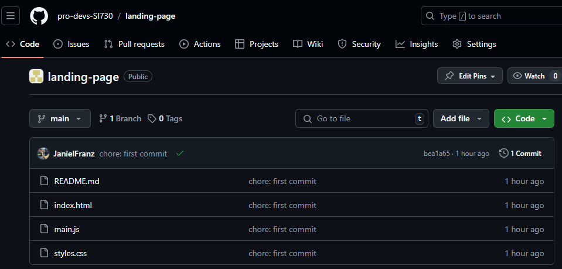

## GithubPages

Después de crear el repositorio, accedemos a la configuración y seleccionamos la sección de Pages. Allí, ingresamos los datos requeridos, como la fuente del branch que se utilizará para el deployment. Finalmente, GitHub Pages nos proporciona un enlace y publica nuestra Landing Page en la web. Enlace del Landing Page: https://pro-devs-si730.github.io/landing-page/

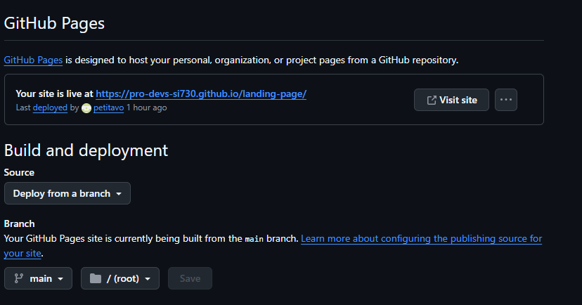p

### Web App deployment:
Para el despliegue de nuestra web app, utilizamos Vercel como plataforma de hosting y deployment. 
Esta herramienta nos permitió desplegar la aplicación de manera rápida y eficiente, integrándose de
forma sencilla con nuestro repositorio de GitHub.

Primero, creamos un repositorio llamado "eduspace-frontend" en GitHub donde alojamos todo el código de nuestra
aplicación. Luego, vinculamos este repositorio con Vercel, lo que automatiza el proceso de despliegue.
Cada vez que realizamos un push en la rama principal del repositorio, Vercel ejecuta automáticamente el build 
y despliega la nueva versión de la aplicación.

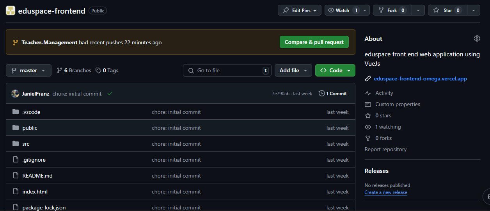

Después de conectar el repositorio, configuramos
los ajustes de deployment en el panel de Vercel. Especificamos 
la rama "master" como fuente del build. Una vez completado el proceso de deployment, la plataforma
nos proporciona una URL pública donde nuestra web app es accesible 
al público. El enlace para acceder a la web app es:
https://eduspace-frontend-omega.vercel.app

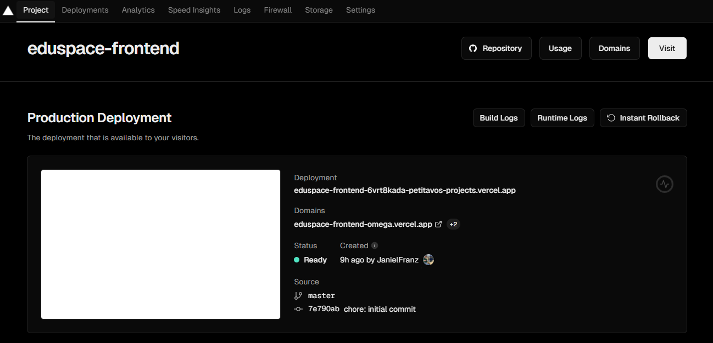

### 5.2. Landing Page, Services & Applications Implementation.

## 5.2. Landing Page, Services & Applications Implementation
En esta sección se explicará y evidenciará el proceso de implementación, pruebas,
documentación y despliegue del Landing Page.

### 5.2.1. Sprint 1

### 5.2.1.1. Sprint Planning 1

Para este primer sprint nos enfocaremos en los tasks para la
elaboración de la Landing Page. Nos dividiremos entre nosotros cada
una de las tareas identificadas para el sprint.

| Sprint #                        | Sprint 1                                                                                                                                                         |
|---------------------------------|------------------------------------------------------------------------------------------------------------------------------------------------------------------|
| Sprint Planning Background      |                                                                                                                                                                  |
| Date                            | 30/08/2024                                                                                                                                                       |
| Time                            | 06:00 PM                                                                                                                                                         |
| Location                        | Servidor de Discord del Equipo                                                                                                                                   |
| Prepared By                     | Franz Escalante                                                                                                                                                  |
| Attendees (to planning meeting) | Franz Escalante/ Randel Ventura / Gustavo Huanca / Camila Espinoza / Alheli Huapaya                                                                              |
| Sprint 1 Review Summary         | En esta primera seccion se planteo el desarrollo de la Landing Page para el proyecto                                                                             |
| Sprint 1 Retrospective Summary  | En esta seccion todos los integrantes mencionaron tener aciertos en partes del codigo y en otras partes poder mejorar sus habilidades realizando la Landing Page |
| Sprint Goal & User Stories      |                            |
| Sprint 1 Goal                   | Nuestro objetivo es desarrollar, desplegar y hacer visible la landing page, integrando todos sus componentes clave y garantizando una apariencia coherente con los mockups de la aplicación. El éxito se logrará cuando la página esté completamente funcional y accesible para los usuarios.       |
| Sprint 1 Velocity               | 4 Velocity                                                                                                                                                       |
| Sum of Story Points             | 6 Story Points.                                                                                                                                                  |

### 5.2.1.2. Sprint Backlog 1

| User Story Id | User Story Title                                  | Work-Item/Task Id | Work-Item/Task Title                                    | Description                                                                                                  | Estimation | Assigned To | Status |
|---------------|---------------------------------------------------|-------------------|---------------------------------------------------------|--------------------------------------------------------------------------------------------------------------|------------|-------------|--------|
| US02          | Encontrar información del propósito de la aplicación | UT01              | Barra de tareas con principales propósitos               | Añadir una barra de tareas sencilla y que dirija a las secciones importantes del Landing page                 | 1          | Franz       | Done   |
| US03          | Visualización de imágenes y gráficos relevantes    | UT02              | Añadir header con su imagen                              | Añadir el header con su imagen.                                                                               | 1          | Franz       | Done   |
| US03          | Visualización de imágenes y gráficos relevantes    | UT03              | Añadir sección de características de la aplicación       | Añadir el dashboard de características de la aplicación de administrador y docente                            | 2          | Gustavo     | Done   |
| US04          | Tipografía cómoda y agradable estéticamente        | UT04              | Añadir tipografía con colores verdes y amarillos         | Añadir tipografía que cumpla con lo mostrado en el prototipado                                                | 1          | Franz       | Done   |
| US02          | Encontrar información del propósito de la aplicación | UT05              | Añadir las etiquetas tools                               | Añadir la información sobre las herramientas que proporciona nuestra aplicación.                              | 1          | Ariana      | Done   |
| US01          | Accesibilidad de la aplicación en diferentes dispositivos | UT06              | Crear el diseño del responsive                           | Crear el responsive que garantice una visualización óptima en distintos dispositivos y tamaños de pantalla     | 1          | Camila      | Done   |
| US03          | Visualización de imágenes y gráficos relevantes    | UT07              | Añadir la sección de planes                              | Crear una sección dedicada a dar información sobre los planes de servicio                                     | 1          | Camila      | Done   |
| US02          | Encontrar información del propósito de la aplicación | UT08              | Añadir formulario                                        | Crear una sección dedicada para el Contact Us de la landing page                                              | 1          | Randel      | Done   |

### 5.2.1.3. Development Evidence for Sprint Review

En esta sección se presentan los avances de implementación con relación a los productos desarrollados en el presente Sprint. La implementación que se desarrolló fue la primera version del Landing Page, se implementaron las distintas secciones para conocer más sobre nuestra plataforma. Con ello completamos el primer sprint de implementación.

| Repository | Branch | Commit Id | Commit Message | Commit message body | Committed on |
|------------|--------|-----------|----------------|---------------------|--------------|
| pro-devs-SI730/landing-page | main | 41170e | fix(html): header picture name modified | - | Sep 8, 2024  |
| pro-devs-SI730/landing-page | main | 14c9fbc | feat: button for language added | - | Sep 8, 2024  |
| pro-devs-SI730/landing-page | main | 7b28f6d | feat: spanish html added | - | Sep 8, 2024  |
| pro-devs-SI730/landing-page | main | 4217571 | feat: button for i18n and styles added | - | Sep 8, 2024  |
| pro-devs-SI730/landing-page | main | 4bd2f5a | Merge remote-tracking branch 'origin/develop' into ariana | - | Sep 8, 2024  |
| pro-devs-SI730/landing-page | main | 47ee00e | fix(html): cards position fixed | - | Sep 8, 2024  |
| pro-devs-SI730/landing-page | main | e591222 | fix(landing-page): tools | - | Sep 8, 2024  |
| pro-devs-SI730/landing-page | main | 832490d | feat(dashboard): dashboards added. | - | Sep 8, 2024  |
| pro-devs-SI730/landing-page | main | 870ef91 | feat(landing-page): tools | - | Sep 8, 2024  |
| pro-devs-SI730/landing-page | main | ac9421c | fix(html): camila's section modified | - | Sep 7, 2024  |
| pro-devs-SI730/landing-page | main | 6891dca | Merge remote-tracking branch 'origin/randel' into develop | - | Sep 7, 2024  |
| pro-devs-SI730/landing-page | main | 8a62faa | feat(footer): added footer section. | - | Sep 7, 2024  |
| pro-devs-SI730/landing-page | main | 14ae088 | feat(contact-us): added contact-us form section. | - | Sep 7, 2024  |
| pro-devs-SI730/landing-page | main | 2f1f09e | feat(membership/customers): advance customers section in index.html, styles.css and main.js | - | Sep 7, 2024  |
| pro-devs-SI730/landing-page | main | bf43c8b | feat(css): About us styles | - | Sep 7, 2024  |
| pro-devs-SI730/landing-page | main | 9cad35c | feat(css): about section finished | - | Sep 7, 2024  |
| pro-devs-SI730/landing-page | main | ea8503f | feat(css): all css | - | Sep 7, 2024  |
| pro-devs-SI730/landing-page | main | 5f8a664 | fix(html): title of hero fixed | - | Sep 7, 2024  |
| pro-devs-SI730/landing-page | main | 70e2564 | feat(html): footer, contactus and plan section added | - | Sep 7, 2024  |
| pro-devs-SI730/landing-page | main | 71c8e7e | feat(html): abut section added | - | Sep 7, 2024  |
| pro-devs-SI730/landing-page | main | 7592218 | feat(html): hero added | - | Sep 7, 2024  |
| pro-devs-SI730/landing-page | main | 6b8c528 | feat(html): navbar styles added | - | Sep 7, 2024  |
| pro-devs-SI730/landing-page | main | 1d8c5db | feat(html): navbar added | - | Sep 7, 2024  |
| pro-devs-SI730/landing-page | main | bea1a65 | chore: first commit | - | Sep 7, 2024  |

### 5.2.1.4. Testing Suite Evidence for Sprint Review

Para la entrega de este primer Sprint no se realizo testeo de la landing page.

### 5.2.1.5. Execution Evidence for Sprint Review

Para este primer entregable, hemos elaborado la Landing Page del proyecto de "EduSpace". De tal modo, se podrá visualizar la información relevante sobre nuestra plataforma. En el siguiente enlace se tendra el video que ilustre y explique la visualización y navegación logrados en este Sprint: https://bit.ly/40FxRnZ

US02-Encontrar información del propósito de la aplicación

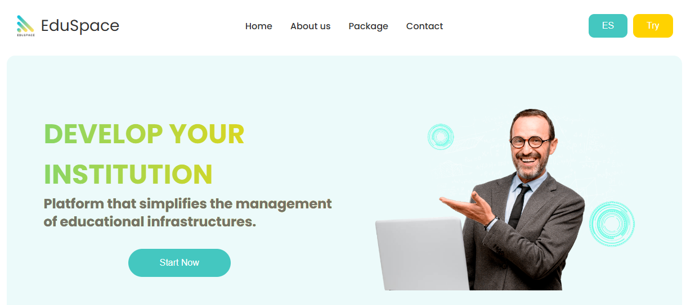

US02-Encontrar información del propósito de la aplicación

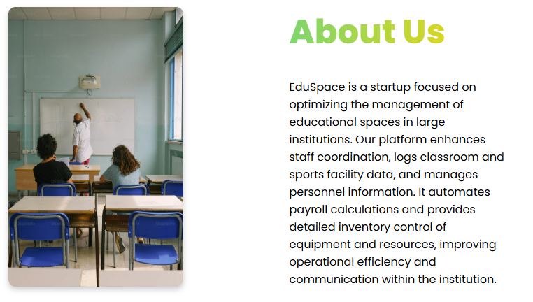

US04-Tipografía cómoda y agradable estéticamente

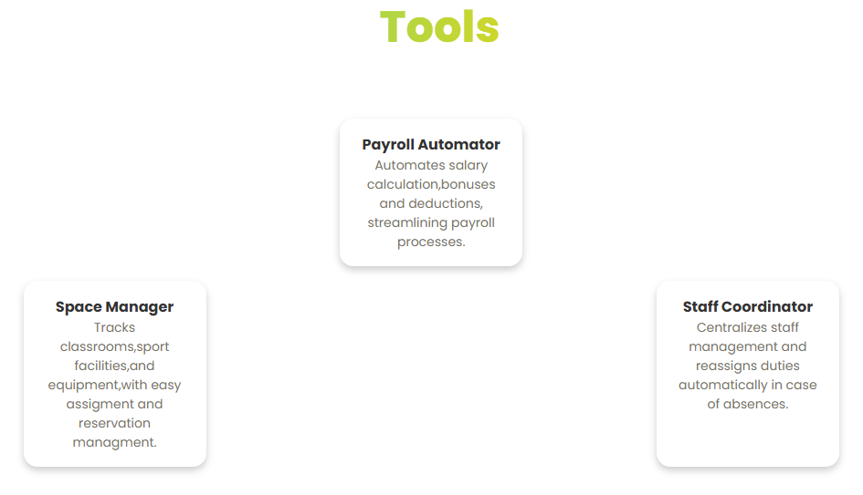

US03-Visualización de imágenes y gráficos relevantes

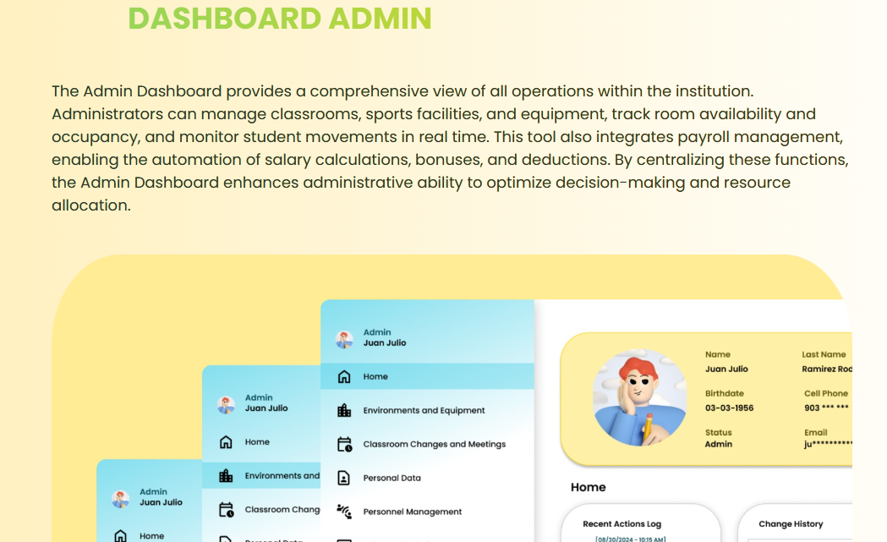

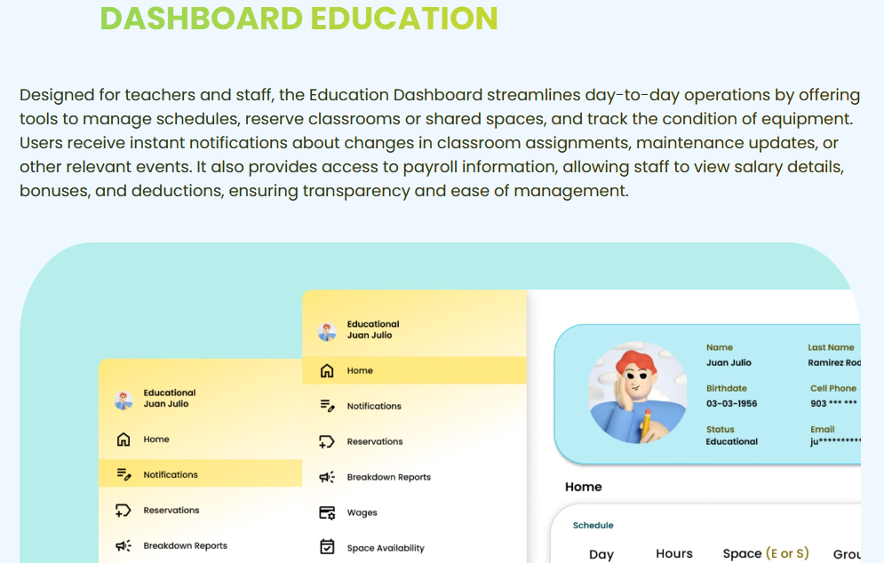

US01-Accesibilidad de la aplicación en diferentes dispositivos

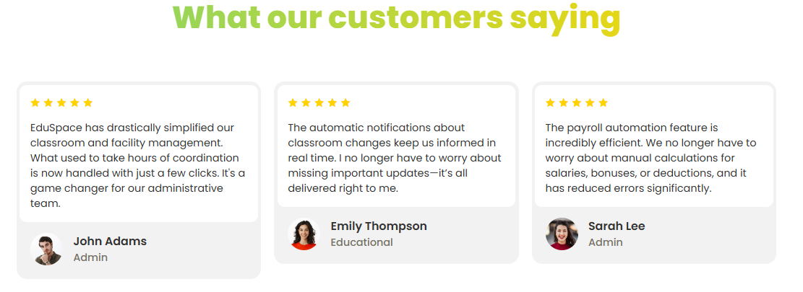

US03-Visualización de imágenes y gráficos relevantes

US02-Encontrar información del propósito de la aplicación

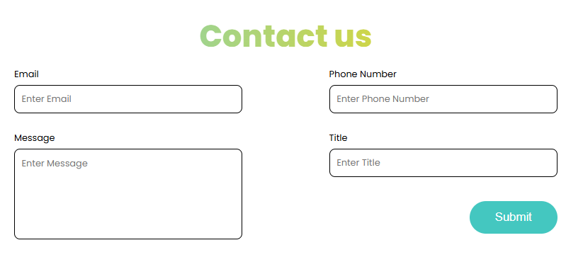

### 5.2.1.6. Services Documentation Evidence for Sprint Review

En el presente sprint solo se desarrollo la Landing Page.

### 5.2.1.7. Software Deployment Evidence for Sprint Review

 Utilizamos Github Pages para el despligue de la <a href="https://fullstack-fury.github.io/landing-page/">Landing Page de la Aplicación.</a>

 Link URL de la Landing Page : <a href="https://fullstack-fury.github.io/landing-page/">https://fullstack-fury.github.io/landing-page/</a>

### 5.2.1.8. Team Collaboration Insights during Sprint

Para el desarrollo de este primer sprint, todos los miembros del equipo desarrollaron y colaboraron de manera activa y continua. De tal modo, se muestra como evidencia los insights de cada miembro del equipo.

Colaboraciones de cada miembro del equipo:

<table>
   <tr>
      <th><strong>Alumno</th>
      <th><strong>Actividad</th>
   </tr>
   <tr>
      <td>Janiel Franz Escalante Baygorrea</td>
      <td>Implementación del encabezado y vista Brief Introduction y About Us</td>
   </tr>
   <tr>
      <td>Huapaya Buitron, Ariana Alheli</td>
      <td>Implementación de la sección tools y vista de Planes</td>
   </tr>
   <tr>
      <td>Huanca Navarro Gustavo Esau</td>
      <td>Imlementación de la vista Dashboard Admin y Education</td>
   </tr>
   <tr>
      <td>Camila Leonor, Espinoza Vivas</td>
      <td>Imlpementación de la vista Valoraciones y Vista de Planes</td>
   </tr>
   <tr>
      <td>Randel Russell Ventura Allasi</td>
      <td>Implementación de la sección Contact Us y Footer</td>
   </tr>   
</table>

Commits:

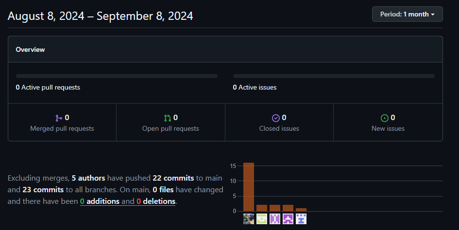

Analiticas de Colaboración:

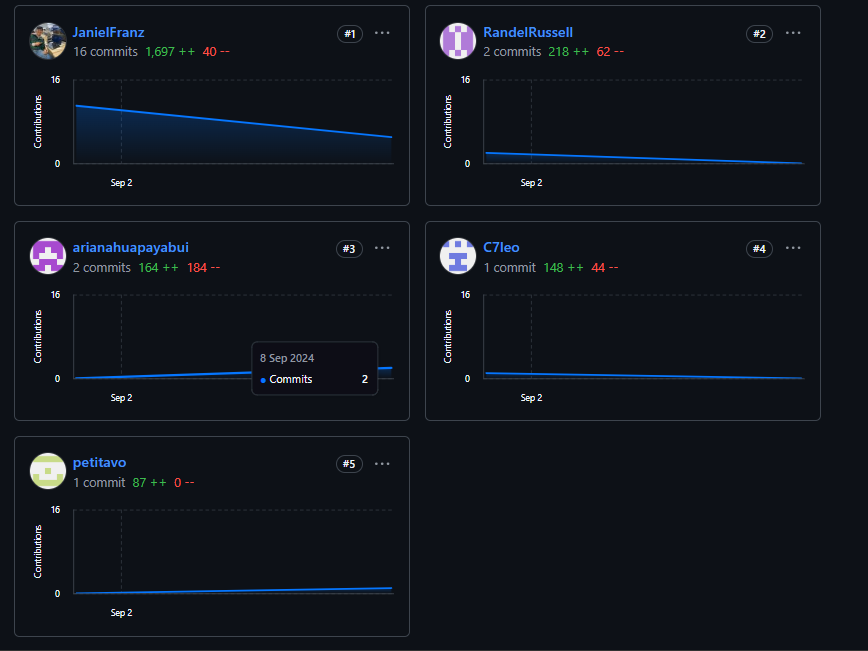

Commits Actualizados: 

### 5.2.2. Sprint 2

### 5.2.2.1. Sprint Planning 2

Para este segundo sprint

| Sprint #                        | Sprint 2                                                                                                        |
|---------------------------------|-----------------------------------------------------------------------------------------------------------------|
| Sprint Planning Background      |                                                                                                                 |
| Date                            | 22/09/2024                                                                                                      |
| Time                            | 06:00 PM                                                                                                        |
| Location                        | Servidor de Discord del Equipo                                                                                  |
| Prepared By                     | Franz Escalante                                                                                                 |
| Attendees (to planning meeting) | Franz Escalante/ R andel Ventura / Gustavo Huanca / Camila Espinoza / Alheli Huapaya                            |
| Sprint 2 Review Summary         |    En la reunión se planteo la velocidad y los story points del sprint backlog 2                                                                                                             |
| Sprint 2 Retrospective Summary  |           En este segundo sprint muchos de los integrantes tuvieron problemas al completar sus user tasks. Hubieron muchas reuniones, sin embargo no fue posible cumplir con la entega de todos los user tasks.                                                                                                      |
| Sprint Goal & User Stories      |
| Sprint 2 Goal                   | Nuestro objetivo es implementar las funcionalidades clave descritas en los bounded contexts, incluyendo el registro de información personal y credenciales de docentes, la gestión de aulas y espacios compartidos, y la administración de salarios. Esto implica formularios de registro, gestión de horarios y reservas de espacios, y un sistema automatizado para enviar salarios. El éxito se logrará cuando todos estos módulos estén completamente operativos y accesibles para usuarios y administradores. |
| Sprint 2 Velocity               | 4 Velocity                                                                                                      |
| Sum of Story Points             | 28 Story Points.                                                                                                |

### 5.2.2.2. Sprint Backlog 2

<table>
  <tr>
    <th colspan="3">Sprint #</th>
    <th colspan="10">Sprint 2</th>
  </tr>
  <tr>
    <td colspan="3">User Story</td>
    <td colspan="10">Work-Item/Task</td>
  </tr>
  <tr>
    <td colspan="1">Id</td>
    <td colspan="2">Title</td>
    <td colspan="1">Id</td>
    <td colspan="2">Title</td>
    <td colspan="3">Description</td>
    <td colspan="1">Estimation</td>
    <td colspan="2">Assigned To</td>
    <td colspan="1">Status (To-do /InProcess /To-Review /Done)</td>
  </tr>
  <tr>
    <td colspan="1">US08</td>
    <td colspan="2">Registro de información personal del docente</td>
    <td colspan="1">TSK001</td>
    <td colspan="2">Formulario de registro</td>
    <td colspan="3">Desarrollar un formulario que permita a los docentes ingresar su información personal, incluyendo nombre, apellidos, etc.</td>
    <td colspan="1"></td>
    <td colspan="2"></td>
    <td colspan="1"></td>
  </tr>
  <tr>
    <td colspan="1">US09</td>
    <td colspan="2">Registro de información de acceso del docente</td>
    <td colspan="1">TSK002</td>
    <td colspan="2">Gestión de credenciales</td>
    <td colspan="3">Implementar un sistema para que los administradores creen y gestionen los credenciales de acceso al sistema para los docentes.</td>
    <td colspan="1"></td>
    <td colspan="2"></td>
    <td colspan="1"></td>
  </tr>
  <tr>
    <td colspan="1">US10</td>
    <td colspan="2">Registro de salones</td>
    <td colspan="1">TSK003</td>
    <td colspan="2">Registro de aulas</td>
    <td colspan="3">Crear un módulo para registrar y gestionar información sobre las aulas disponibles, incluyendo capacidad y equipamiento.</td>
    <td colspan="1"></td>
    <td colspan="2"></td>
    <td colspan="1"></td>
  </tr>
   <tr>
    <td colspan="1">US11</td>
    <td colspan="2">Registro de espacios compartidos</td>
    <td colspan="1">TSK004</td>
    <td colspan="2">Módulo de espacios</td>
    <td colspan="3">Desarrollar un módulo que permita el registro de espacios compartidos y su disponibilidad.</td>
    <td colspan="1"></td>
    <td colspan="2"></td>
    <td colspan="1"></td>
  </tr>
   <tr>
    <td colspan="1">US12</td>
    <td colspan="2">Registro de horarios de espacios compartidos</td>
    <td colspan="1">TSK005</td>
    <td colspan="2">Gestión de horarios</td>
    <td colspan="3">Implementar un sistema para registrar los horarios de uso de los espacios compartidos y su disponibilidad.</td>
    <td colspan="1"></td>
    <td colspan="2"></td>
    <td colspan="1"></td>
  </tr>
   <tr>
    <td colspan="1">US13</td>
    <td colspan="2">Registro de la hora y lugar de la reunión</td>
    <td colspan="1">TSK006</td>
    <td colspan="2">Registro de reuniones</td>
    <td colspan="3">Desarrollar un formulario para que los administradores registren la hora y lugar de las reuniones que organizan.</td>
    <td colspan="1">5</td>
    <td colspan="2">Camila Espinoza</td>
    <td colspan="1">Done</td>
  </tr>
   <tr>
    <td colspan="1">US14</td>
    <td colspan="2">Registro de invitados de la reunión</td>
    <td colspan="1">TSK007</td>
    <td colspan="2">Módulo de invitados</td>
    <td colspan="3">Implementar un sistema para que los administradores registren los invitados a las reuniones, con sus datos de nombre.</td>
    <td colspan="1">2</td>
    <td colspan="2">Camila Espinoza</td>
    <td colspan="1">Done</td>
  </tr>
   <tr>
    <td colspan="1">US24</td>
    <td colspan="2">Visualización de espacios compartidos</td>
    <td colspan="1">TSK008</td>
    <td colspan="2">Vista de espacios</td>
    <td colspan="3">Desarrollar una vista que permita a los docentes visualizar los espacios compartidos disponibles y su estado.</td>
    <td colspan="1">4</td>
    <td colspan="2">Janiel Franz</td>
    <td colspan="1">Done</td>
  </tr>
   <tr>
    <td colspan="1">US25</td>
    <td colspan="2">Registro de salones</td>
    <td colspan="1">TSK009</td>
    <td colspan="2">Sistema de registro de salones</td>
    <td colspan="3">Crear un sistema que permita a los administradores registrar salones</td>
    <td colspan="1"></td>
    <td colspan="2"></td>
    <td colspan="1"></td>
  </tr>
   <tr>
    <td colspan="1">US25</td>
    <td colspan="2">Reserva de espacios compartidos</td>
    <td colspan="1">TSK010</td>
    <td colspan="2">Sistema de reservas</td>
    <td colspan="3">Crear un sistema que permita a los docentes reservar espacios compartidos de forma sencilla y eficiente.</td>
    <td colspan="1">4</td>
    <td colspan="2">Janiel Franz Escalante Baygorrea</td>
    <td colspan="1">Done</td>
  </tr>
   <tr>
    <td colspan="1">US19</td>
    <td colspan="2">Ingreso de salarios del docente</td>
    <td colspan="1">TSK011</td>
    <td colspan="2">Registro de salarios</td>
    <td colspan="3">Desarrollar un módulo que permita el ingreso y actualización de los salarios de los docentes.</td>
    <td colspan="1">4</td>
    <td colspan="2">Antayhua Castillo, Oscar Josué</td>
    <td colspan="1">Done</td>
  </tr>
    <tr>
    <td colspan="1">US20</td>
    <td colspan="2">Envío de salarios a docentes</td>
    <td colspan="1">TSK012</td>
    <td colspan="2">Sistema de envío de salarios</td>
    <td colspan="3">Crear un sistema que facilite el envío de salarios a los docentes de manera automatizada.</td>
    <td colspan="1"></td>
    <td colspan="2"></td>
    <td colspan="1"></td>
  </tr>
</table>

### 5.2.2.3. Development Evidence for Sprint Review

En esta sección se presentan los avances de implementación con relación a los productos desarrollados en el presente Sprint.

| Repository        | Branch | Commit Id | Commit Message                                                                           | Commit Message Body | Committed on |
|-------------------|--------|-----------|------------------------------------------------------------------------------------------|---------------------|--------------|
| eduspace-frontend | master | be30aac   | refactor(reservation-scheduling): change structure of the calendar for reactivity        |                     | 27/09/2024   |
| eduspace-frontend | master | 918ac1b   | refactor(reservation-scheduling): changed reservations for events                        |                     | 27/09/2024   |
| eduspace-frontend | master | 7e28dbe   | refactor(reservation-scheduling): attributes of the model reservation changed and the db |                     | 27/09/2024   |
| eduspace-frontend | master | fa587dd   | feat(reservation-scheduling): receiving the reservations from the service                |                     | 27/09/2024   |
| eduspace-frontend | master | 93ac1ab   | feat(reservation-scheduling): calendar component added                                   |                     | 27/09/2024   |
| eduspace-frontend | master | 9e5d59d   | feat(reservation-scheduling): reservation management page added                          |                     | 27/09/2024   |
| eduspace-frontend | master | 0e1ce7b   | feat(reservation-scheduling): toolbar added                                              |                     | 27/09/2024   |
| eduspace-frontend | master | b60d840   | fix(.env deleted): deleted .env variables.                                               |                     | 27/09/2024   |
| eduspace-frontend | master | 1a9a9ff   | feat(payroll-management): added view-component for payroll management of the teacher.    |                     | 27/09/2024   |
| eduspace-frontend | master | 32ddad0   | feat(services): common http added                                                        |                     | 27/09/2024   |
| eduspace-frontend | master | 757a4b6   | feat: router added                                                                       |                     | 27/09/2024   |
| eduspace-frontend | master | f3cb11a   | feat: prime vue added                                                                    |                     | 27/09/2024   |
| eduspace-frontend | master | 1ad463c   | feat: .env.example added                                                                 |                     | 27/09/2024   |
| eduspace-frontend | master | dca7d4a   | refactor: i18n added                                                                     |                     | 27/09/2024   |
| eduspace-frontend | master | 1a5269d   | feat(services): fixed.                                                                   |                     | 27/09/2024   |
| eduspace-frontend | master | 7cb1c44   | feat(services): fixed.                                                                   |                     | 27/09/2024   |
| eduspace-frontend | master | 8f54978   | feat(teacher): fixed.                                                                    |                     | 27/09/2024   |
| eduspace-frontend | master | c8cc404   | feat(teacher): routes fixed.                                                             |                     | 27/09/2024   |
| eduspace-frontend | master | 64c5cd3   | Merge branch 'payroll-management' into Teacher-Management                                |                     | 27/09/2024   |
| eduspace-frontend | master | 26bc595   | feat(teacher): routes fixed.                                                             |                     | 27/09/2024   |
| eduspace-frontend | master | 1ab5f08   | feat(meet): added "Invite" column to the table                                           |                     | 27/09/2024   |
| eduspace-frontend | master | c8660f3   | feat(services): common http added                                                        |                     | 27/09/2024   |
| eduspace-frontend | master | 379ebcf   | Update http-common.js                                                                    |                     | 27/09/2024   |
| eduspace-frontend | master | ee5271c   | feat(http-common): added fake api                                                        |                     | 27/09/2024   |
| eduspace-frontend | master | 55456a5   | feat(env): deleted file                                                                  |                     | 27/09/2024   |
| eduspace-frontend | master | a2f6340   | feat(meet): fixed getting time and day correctly                                         |                     | 27/09/2024   |
| eduspace-frontend | master | 72f4e32   | feat(meet): fixed getting time and day correctly                                         |                     | 27/09/2024   |

### 5.2.2.4. Testing Suite Evidence for Sprint Review

Para la entrega de este primer Sprint no se realizo testeo de la landing page.

### 5.2.2.5. Execution Evidence for Sprint Review

Para este segundo entregable, hemos elaborado el front-end del proyecto de "EduSpace".

### 5.2.2.6. Services Documentation Evidence for Sprint Review

En el presente sprint solo se desarrollo la Landing Page.

### 5.2.1.7. Software Deployment Evidence for Sprint Review

### 5.2.2.8. Team Collaboration Insights during Sprint

Para el desarrollo de este segundo sprint, todos los miembros del equipo desarrollaron y colaboraron de manera activa y continua. De tal modo, se muestra como evidencia los insights de cada miembro del equipo.

Commits:

Analiticas de Colaboración:

### 5.2.3 Sprint 3

### 5.2.3.1.Spring Planning 3

| Sprint #                        | Sprint 3                                                                                                        |
|---------------------------------|-----------------------------------------------------------------------------------------------------------------|
| Sprint Planning Background      |                                                                                                                 |
| Date                            | 19/10/2024                                                                                                      |
| Time                            | 06:00 PM                                                                                                        |
| Location                        | Servidor de Discord del Equipo                                                                                  |
| Prepared By                     | Franz Escalante                                                                                                 |
| Attendees (to planning meeting) | Franz Escalante/ Camila Espinoza / Oscar Antayhua / Andres Torres / Angelo Curi                                 |
| Sprint 3 Review Summary         |   Se alcanzaron los objetivos: Funcionamiento y despliegue de nuestra Web API.                                  |
| Sprint 3 Retrospective Summary  |   Este sprint ha sido el más desafiante en comparación con los anteriores, ya que, requería que tanto el informe y el Front End esten completos para así realizar la implementación del Backend.                                                                                                                                            |
| Sprint Goal & User Stories      ||
| Sprint 3 Goal                   |Nuestro enfoque está en mejorar la accesibilidad del sitio web, implementar nuevas funcionalidades clave para la gestión de aulas y nóminas, y habilitar la interacción del frontendmediante una API robusta.   Creemos que esto proporcionará una mejor experiencia de usuario en todos los dispositivos, permitirá una gestión más eficiente de las aulas y nóminas, y facilitará el desarrollo de nuevas integraciones en la plataforma.   Esto se confirmará cuando el sitio sea totalmente responsive, las nuevas funcionalidades de Classroom y Payroll Management estén operativas, y los desarrolladores utilicen la API para gestionar el frontend.                                                                                                                     |
| Sprint 3 Velocity               | 75                                                                                                             |
| Sum of Story Points             |  81                                                                                                               |

### 5.2.3.2. Sprint Backlog 3

|Sprint#|Sprint 3|||||||
| :- | :- | :- | :- | :- | :- | :- | :- |
|User Story|Work-Item/Task|||||||
|Id|Title|Id|Title|Description|Estimation|Asigned To|Status (To-do/InProcess/To-Review/Done)|
|TS19|Añadir información del salario del docente través de un RESTful API	|TSK001|Desarrollar la capa  “domain”|Desarrollar la capa de dominio para encapsular la lógica del cálculo de salario usando OOP.|3h|Oscar|Done|
|TS19|Añadir información del salario del docente través de un RESTful API	|TSK002|Desarrollar la capa “application”|Desarrollar la capa de aplicación para implementar los servicios de la capa de dominio para el cálculo del salario.	|3h|Oscar|Done|
|TS19|Añadir información del salario del docente través de un RESTful API|TSK003|Desarrollar la capa “infrastructure”|Desarrollar la capa de infraestructura para mapear los objetos de datos en la base de datos para almacenar la información del salario.	|2h	|Oscar|Done|
|TS19|Añadir información del salario del docente través de un RESTful API	|TSK004|Desarrollar la capa “interface”	|Desarrollar la capa de interfaz que comunique el API con el exterior, implementando el endpoint REST para añadir salarios.	|3h|Oscar|Done|
|TS26|Añadir información del reporte de avería a través de un RESTful API|TSK005|Desarrollar la capa “domain”|Desarrollar la capa de dominio para encapsular la lógica de negocio utilizando OOP.|3h|Angelo|Done|
|TS26|Añadir información del reporte de avería a través de un RESTful API|TSK006|Desarrollar la capa “application”|Desarrollar la capa de aplicación para implementar los servicios que utilicen la lógica de la capa de dominio.|3h|Angelo|Done|
|TS26|Añadir información del reporte de avería a través de un RESTful API|TSK007|Desarrollar la capa “infrastructure”|Desarrollar la capa de infraestructura para conectar las entidades del dominio con la base de datos.|3h|Angelo|Done|
|TS26|Añadir información del reporte de avería a través de un RESTful API|TSK008|Desarrollar la capa “interface”|Desarrollar la capa de interfaz para permitir la comunicación entre el API REST con el exterior.|2h|Angelo|Done|
|TS08 |Añadir información de salones a través de un RESTful API|TSK009|Desarrollar la capa “domain”|Desarrollar la capa de dominio para encapsular la lógica de negocio usando OOP. |3h|Andres|Done|
|TS08 |Añadir información de salones a través de un RESTful API|TSK010|Desarrollar la capa “application”|Desarrollar la capa de aplicación para implementar los servicios de la capa de dominio.|3h|Andres|Done|
|TS08 |Añadir información de salones a través de un RESTful API|TSK011|Desarrollar la capa “infrastructure”|Desarrollar la capa de infrastructure para mapear los objetos en la base de datos.|3h|Andres|Done|
|TS08 |Añadir información de salones a través de un RESTful API|TSK012|Desarrollar la capa “interface”|Desarrollar la capa de interface para comunicar el endpoint con el exterior usando REST|3h|Andres|Done|
|TS09|Añadir información de espacios compartidos través de un RESTful API|TSK013|Desarrollar la capa “domain”|Desarrollar la capa de dominio para encapsular la lógica de negocio usando OOP. |3h|Andres|Done|
|TS09|Añadir información de espacios compartidos través de un RESTful API|TSK014|Desarrollar la capa “application”|Desarrollar la capa de aplicación para implementar los servicios de la capa de dominio.|3h|Andres|Done|
|TS09|Añadir información de espacios compartidos través de un RESTful API|TSK015|Desarrollar la capa “infrastructure”|Desarrollar la capa de infrastructure para mapear los objetos en la base de datos.|3h|Andres|Done|
|TS09|Añadir información de espacios compartidos través de un RESTful API|TSK016|Desarrollar la capa “interface”|Desarrollar la capa de interface para comunicar el endpoint con el exterior usando REST|3h|Andres|Done|
|TS12|Añadir información de hora y lugar de una reunión a través de un RESTful API|TSK017|Desarrollar la capa “domain”|Desarrollar la capa de dominio para encapsular la lógica de negocio usando OOP para gestionar reuniones.|3h|Camila|Done|
|TS12|Añadir información de hora y lugar de una reunión a través de un RESTful API|TSK018|Desarrollar la capa “application”|Desarrollar la capa de aplicación para implementar los servicios de la capa de dominio para las reuniones.|3h|Camila|Done|
|TS12|Añadir información de hora y lugar de una reunión a través de un RESTful API|TSK019|Desarrollar la capa “infrastructure”|Desarrollar la capa de infraestructura para mapear los objetos de datos en la base de datos para las reuniones.|3h|Camila|Done|
|TS12|Añadir información de hora y lugar de una reunión a través de un RESTful API|TSK020|Desarrollar la capa “interface”|Desarrollar la capa de interfaz para implementar el endpoint REST para añadir la información de reuniones.|3h|Camila|Done|
|TS13|Añadir información de los invitados de una reunión a través de un RESTful API|TSK021|Desarrollar la capa “domain”|Desarrollar la capa de dominio para encapsular la lógica de negocio sobre la gestión de invitados a reuniones.|3h|Camila|Done|
|TS13|Añadir información de los invitados de una reunión a través de un RESTful API|TSK022|Desarrollar la capa “application”|Desarrollar la capa de aplicación para implementar los servicios de la capa de dominio para los invitados|3h|Camila|Done|
|TS13|Añadir información de los invitados de una reunión a través de un RESTful API|TSK023|Desarrollar la capa “infrastructure”|Desarrollar la capa de infraestructura para mapear los datos de invitados en la base de datos.|3h|Camila|Done|
|TS13|Añadir información de los invitados de una reunión a través de un RESTful API|TSK024|Desarrollar la capa “interface”|Desarrollar la capa de interfaz para implementar el endpoint REST para añadir la información de invitados.|3h|Camila|Done|
|TS24|Añadir reserva a un espacios compartido a través de un RESTful API|TSK025|Desarrollar la capa “domain”|Desarrollar la capa de dominio para encapsular la lógica de negocio usando OOP. |3h|Franz|Done|
|TS24|Añadir reserva a un espacios compartido a través de un RESTful API|TSK026|Desarrollar la capa “application”|Desarrollar la capa de aplicación para implementar los servicios de la capa de dominio.|2h|Franz|Done|
|TS24|Añadir reserva a un espacios compartido a través de un RESTful API|TSK027|Desarrollar la capa “infrastructure”|Desarrollar la capa de infrastructure para mapear los objetos en la base de datos.|1h|Franz|Done|
|TS24|Añadir reserva a un espacios compartido a través de un RESTful API|TSK028|Desarrollar la capa “interface”|Desarrollar la capa de interface para comunicar el endpoint con el exterior usando REST|3h|Franz|Done|
|TS25|Eliminar reserva a un espacios compartido a través de un RESTful API|TSK029|Agregar los comandos a la capa de dominio y usarlos en la de aplicación|Agregar commands e implementarlos en la capa de aplicación|1h|Franz|Done|
|TS23|Obtener información de la disponibilidad de espacios compartidos a través de un RESTful API|TSK030|Agregar queries |Agregar queries en la capa de domain y agregar la función para obtener recursos en la capa de interface|1h|Franz|Done|

### 5.2.3.3. Development Evidence for Sprint Review

**Front End**

En el frontend del proyecto FullStackFury/Eduspace, se han realizado importantes mejoras. Se añadió un dashboard para cada segmento, incluyendo profesores y administradores, facilitando así la gestión y el acceso a la información relevante. Además, se implementaron las partes que faltaron en la entrega pasada, que incluyen los bounded contexts de Payroll Management, Breakdown Management y Spaces and Resources Management.

Asimismo, se realizó un cambio en el diseño del frontend para que sea más similar a los mockups, mejorando la coherencia visual y la experiencia del usuario. Estas implementaciones y ajustes optimizan la funcionalidad y la usabilidad de la aplicación.

| Repository | Branch  | Commit Id | Commit Message   | Commit message body  | Committed on |
|-------|---------|-----------|-------|----------------------------|---------------------------|
| FullStackFury/eduspace-frontend | develop | fb728ff   | chore: fixed dark mode to light mode.                             |                     | 2024-11-02 11:23:11 -0500 |
| FullStackFury/eduspace-frontend | develop | 9175174   | refactor: eliminate the unnecessary icon                          |                     | 2024-10-29 18:13:58 -0500 |
| FullStackFury/eduspace-frontend | develop | ad063a4   | refactor: change name space area service                          |                     | 2024-10-29 18:13:18 -0500 |
| FullStackFury/eduspace-frontend | develop | 71e52d3   | feat: add the action button in space card for go to the add      |                     | 2024-10-29 18:12:55 -0500 |
| FullStackFury/eduspace-frontend | develop | 30023e7   | feat: add the route for view add                                   |                     | 2024-10-29 18:11:48 -0500 |
| FullStackFury/eduspace-frontend | develop | 3d87fa6   | feat: create the view add for add share space                     |                     | 2024-10-29 18:11:01 -0500 |
| FullStackFury/eduspace-frontend | develop | 45c6564   | feat: create the entity space area                                 |                     | 2024-10-29 16:02:03 -0500 |
| FullStackFury/eduspace-frontend | develop | 576e081   | feat: create the card space card                                   |                     | 2024-10-29 16:01:11 -0500 |
| FullStackFury/eduspace-frontend | develop | edaa84d   | feat: create the view for the sport facilities                    |                     | 2024-10-29 16:00:34 -0500 |
| FullStackFury/eduspace-frontend | develop | 1cd24f1   | feat: create the service http for the space area                  |                     | 2024-10-29 15:59:39 -0500 |
| FullStackFury/eduspace-frontend | develop | 904b99a   | feat(index-js): add route to sport facilities                      |                     | 2024-10-29 15:58:52 -0500 |
| FullStackFury/eduspace-frontend | develop | 1f723f0   | feat: add route to sport facilities                                 |                     | 2024-10-29 15:58:27 -0500 |
| FullStackFury/eduspace-frontend | develop | 369ce4e   | docs: add one attribute in shared area                             |                     | 2024-10-29 15:57:02 -0500 |
| FullStackFury/eduspace-frontend | develop | 1ea49ad   | chore: added env                                                  |                     | 2024-10-28 10:22:03 -0500 |
| FullStackFury/eduspace-frontend | develop | 34f8cc3   | feat(index-js): fix route                                         |                     | 2024-10-28 09:23:36 -0500 |
| FullStackFury/eduspace-frontend | develop | e894c03   | feat(teacher): create temporal teacher service                     |                     | 2024-10-28 05:38:52 -0500 |
| FullStackFury/eduspace-frontend | develop | b873f5f   | chore: update style                                              |                     | 2024-10-28 05:38:34 -0500 |
| FullStackFury/eduspace-frontend | develop | c9d20bb   | feat(payroll): update component.                                   |                     | 2024-10-28 05:38:17 -0500 |
| FullStackFury/eduspace-frontend | develop | 37ecc1d   | feat(index-js): update routes.                                     |                     | 2024-10-27 20:25:59 -0500 |
| FullStackFury/eduspace-frontend | develop | ee536ab   | feat(payroll): updated database.                                   |                     | 2024-10-27 20:25:31 -0500 |
| FullStackFury/eduspace-frontend | develop | 51a2494   | feat(payroll): fixed payroll components.                           |                     | 2024-10-27 20:25:19 -0500 |
| FullStackFury/eduspace-frontend | develop | ac8f146   | feat(payroll): fixed payroll entity.                               |                     | 2024-10-27 20:24:52 -0500 |
| FullStackFury/eduspace-frontend | develop | 9c3a96a   | feat(app): fixed styles.                                          |                     | 2024-10-27 20:24:37 -0500 |
| FullStackFury/eduspace-frontend | develop | d544d7e   | feat(app): fixed styles.                                          |                     | 2024-10-27 14:09:05 -0500 |
| FullStackFury/eduspace-frontend | develop | edad26d   | feat(app-vue): fixed styles.                                     |                     | 2024-10-27 11:16:29 -0500 |
| FullStackFury/eduspace-frontend | develop | 8e3e1d3   | feat(assets): added icons.                                       |                     | 2024-10-27 11:16:12 -0500 |
| FullStackFury/eduspace-frontend | develop | 8398941   | feat(assets): added icons.                                       |                     | 2024-10-27 00:53:40 -0500 |
| FullStackFury/eduspace-frontend | develop | d604a47   | feat(style): added font family.                                   |                     | 2024-10-27 00:52:51 -0500 |
| FullStackFury/eduspace-frontend | develop | d0c5438   | feat(app-vue): fixed teacher name on edit.                       |                     | 2024-10-27 00:52:08 -0500 |
| FullStackFury/eduspace-frontend | develop | 3f9febc   | feat(meet): fixed teacher name on edit.                          |                     | 2024-10-26 21:18:20 -0500 |
| FullStackFury/eduspace-frontend | develop | 3436002   | feat(meet): fixed button cancel.                                  |                     | 2024-10-26 21:11:55 -0500 |
| FullStackFury/eduspace-frontend | develop | 20e6f1e   | feat(app): update                                                 |                     | 2024-10-24 21:52:50 -0500 |
| FullStackFury/eduspace-frontend | develop | 6e9485a   | feat(app-vue): updated css.                                       |                     | 2024-10-22 20:14:27 -0500 |
| FullStackFury/eduspace-frontend | develop | d3d0294   | feat(meet): update                                               |                     | 2024-10-20 01:23:59 -0500 |
| FullStackFury/eduspace-frontend | develop | 5f47a44   | feat(dashboard-teacher): added components                         |                     | 2024-10-20 01:14:24 -0500 |
| FullStackFury/eduspace-frontend | develop | b731e51   | feat(reservations): added cards                                   |                     | 2024-10-20 01:13:54 -0500 |
| FullStackFury/eduspace-frontend | develop | 20f78ef   | feat(breakdown-reports): added cards                             |                     | 2024-10-20 01:13:29 -0500 |
| FullStackFury/eduspace-frontend | develop | 0ec461d   | feat(index): added routes from dashboard teacher                 |                     | 2024-10-20 01:13:03 -0500 |
| FullStackFury/eduspace-frontend | develop | ca1ce02   | feat(style): fixed                                               |                     | 2024-10-19 23:29:11 -0500 |
| FullStackFury/eduspace-frontend | develop | 517b021   | feat(environments-equipment): added cards                        |                     | 2024-10-19 23:28:36 -0500 |
| FullStackFury/eduspace-frontend | develop | 937bab7   | feat(classroom-changes-meeting): added cards                    |                     | 2024-10-19 23:28:04 -0500 |
| FullStackFury/eduspace-frontend | develop | c7e9aa4   | feat(app): "style" was fixed                                     |                     | 2024-10-19 23:26:32 -0500 |
| FullStackFury/eduspace-frontend | develop | d7da14a   | feat(app): Fixed sticky sidebar and added routes                 |                     | 2024-10-19 01:09:09 -0500 |
| FullStackFury/eduspace-frontend | develop | dd6da0c   | feat(dashboard-admin): added components                          |                     | 2024-10-19 01:07:26 -0500 |
| FullStackFury/eduspace-frontend | develop | be35e93   | feat(router): added new routes for Dashboard Admin              |                     | 2024-10-19 01:04:30 -0500 |
| FullStackFury/eduspace-frontend | develop | 7b84ec7   | feat(login-component): button for teacher storing id and role    |                     | 2024-10-15 15:23:51 -0500 |
| FullStackFury/eduspace-frontend | develop | 7791c3c   | refactor(app-vue): toolbar change for teacher and logout working |                     | 2024-10-15 15:22:27 -0500 |
| FullStackFury/eduspace-frontend | develop | a89b41f   | Merge remote-tracking branch 'origin/develop' into feature/breakdown-management |                     | 2024-10-15 00:15:01 -0500 |
| FullStackFury/eduspace-frontend | develop | a05994a   | Merge remote-tracking branch 'origin/feature/payroll-management2' into develop |                     | 2024-10-15 00:01:41 -0500 |
| FullStackFury/eduspace-frontend | develop | 8ae4556   | Merge branch 'feature/reservation-scheduling' into develop      |                     | 2024-10-14 23:55:40 -0500 |
| FullStackFury/eduspace-frontend | develop | 7020844   | feat(app): update.                                              |                     | 2024-10-14 19:02:29 -0500 |
| FullStackFury/eduspace-frontend | develop | c83c21f   | feat(payroll): create and set payroll-create-wrapper component. |                     | 2024-10-14 19:02:14 -0500 |
| FullStackFury/eduspace-frontend | develop | 7965e99   | feat(payroll): updated management and create-and-edit.         |                     | 2024-10-14 19:01:54 -0500 |
| FullStackFury/eduspace-frontend | develop | efaba74   | feat(main-js): updated.                                        |                     | 2024-10-14 19:01:28 -0500 |
| FullStackFury/eduspace-frontend | develop | 2dc984f   | feat(index-js): update routes.                                  |                     | 2024-10-14 19:01:11 -0500 |
| FullStackFury/eduspace-frontend | develop | fae9959   | feat(db): update database.                                     |                     | 2024-10-14 19:00:55 -0500 |
| FullStackFury/eduspace-frontend | develop | b359c29   | feat(package): update primevue.                                |                     | 2024-10-14 19:00:48 -0500 |
| FullStackFury/eduspace-frontend | develop | badee12   | feat: Routes for new components are added                      |                     | 2024-10-14 11:31:26 -0500 |
| FullStackFury/eduspace-frontend | develop | 13b7b84   | feat: added in db.json, resources, classroom, reports         |                     | 2024-10-14 11:30:54 -0500 |
| FullStackFury/eduspace-frontend | develop | 9c4ea77   | feat: created report service, report-resource component        |                     | 2024-10-14 11:29:39 -0500 |
| FullStackFury/eduspace-frontend | develop | dceb30d   | feat: created resource-management componente, entity, service  |                     | 2024-10-14 11:29:18 -0500 |
| FullStackFury/eduspace-frontend | develop | 4fd2ae1   | feat: created classroom-management component                    |                     | 2024-10-14 11:28:49 -0500 |
| FullStackFury/eduspace-frontend | develop | 29f9c75   | feat: created classroom service, entity                         |                     | 2024-10-14 11:28:33 -0500 |
| FullStackFury/eduspace-frontend | develop | 7a483c0   | feat(payroll): fixed payroll management component.              |                     | 2024-10-14 06:24:48 -0500 |
| FullStackFury/eduspace-frontend | develop | 0aa2f52   | feat(payroll):                                                  |                     | 2024-10-14 06:24:33 -0500 |
| FullStackFury/eduspace-frontend | develop | 07c45ed   | feat(db): fixed database.                                         |                     | 2024-10-14 06:24:11 -0500 |
| FullStackFury/eduspace-frontend | develop | a289172   | feat(payroll): fixed entity.                                     |                     | 2024-10-14 06:23:05 -0500 |
| FullStackFury/eduspace-frontend | develop | 0025311   | feat(db): fixed database.                                         |                     | 2024-10-14 06:22:52 -0500 |
| FullStackFury/eduspace-frontend | develop | 01c0745   | feat(payroll): create and set payroll-management component.      |                     | 2024-10-14 06:20:45 -0500 |
| FullStackFury/eduspace-frontend | develop | 6cf71eb   | feat(payroll): create and set payroll-create-and-edit component. |                     | 2024-10-14 06:20:33 -0500 |
| FullStackFury/eduspace-frontend | develop | 5cf7287   | feat(payroll): create and set payroll service.                  |                     | 2024-10-14 06:20:13 -0500 |
| FullStackFury/eduspace-frontend | develop | aff4cc1   | feat(payroll): create and set payroll entity.                   |                     | 2024-10-14 06:19:59 -0500 |
| FullStackFury/eduspace-frontend | develop | ace0942   | feat(index-js): added dropdown component.                        |                     | 2024-10-14 06:19:34 -0500 |
| FullStackFury/eduspace-frontend | develop | 6d1b7f5   | feat(index-js): added payroll-management route.                  |                     | 2024-10-14 06:19:19 -0500 |
| FullStackFury/eduspace-frontend | develop | ccc4088   | feat(db): added new endpoint.                                    |                     | 2024-10-14 06:18:58 -0500 |
| FullStackFury/eduspace-frontend | develop | f6c5f96   | feat(app): added wages route.                                    |                     | 2024-10-14 06:18:23 -0500 |
| FullStackFury/eduspace-frontend | develop | 03cade1   | feat(reservation-scheduling): userId and userRole fetch from store(vuex) |             | 2024-10-13 23:19:02 -0500 |
| FullStackFury/eduspace-frontend | develop | 57a68be   | feat(reservation-scheduling): weekly calendar receives areaId and UserId from page |            | 2024-10-13 23:18:22 -0500 |
| FullStackFury/eduspace-frontend | develop | f459238   | feat(reservation-scheduling): dialog component created           |                     | 2024-10-13 23:17:46 -0500 |
| FullStackFury/eduspace-frontend | develop | 5759f44   | feat: new components from primevue added                         |                     | 2024-10-13 23:17:05 -0500 |
| FullStackFury/eduspace-frontend | develop | 1312e32   | refactor: new version of vueJs                                   |                     | 2024-10-13 23:16:37 -0500 |
| FullStackFury/eduspace-frontend | develop | b59bbf3   | fix(http-common): cors error                                     |                     | 2024-10-13 15:55:30 -0500 |

**Back End**

En el backend del proyecto FullStackFury/eduspace-platform, se crearon durante este sprint las funcionalidades necesarias para los administradores y docentes. Se desarrollaron controladores y servicios para manejar operaciones CRUD, asegurando una gestión eficiente de la información. Además, se añadió la documentación de Swagger para facilitar la interacción.

| Repository | Branch  | Commit Id | Commit Message   | Commit message body  | Committed on |
|-------|---------|-----------|-------|----------------------------|---------------------------|
| FullStackFury/eduspace-platform | develop | 4009869   | feat: app settings and program.cs working with environment variables |                     | 2024-11-01 22:22:13 -0500 |
| FullStackFury/eduspace-platform | develop | 2cbff5c   | feat(shared): app db context with fluent api                       |                     | 2024-11-01 22:20:45 -0500 |
| FullStackFury/eduspace-platform | develop | c7729b6   | fix(profiles): controllers working                                   |                     | 2024-11-01 22:19:57 -0500 |
| FullStackFury/eduspace-platform | develop | 6e5be5a   | refactor(profiles): create amind profile resource updated          |                     | 2024-11-01 22:19:24 -0500 |
| FullStackFury/eduspace-platform | develop | eaae4a2   | refactor(profiles): create resource updated                         |                     | 2024-11-01 22:18:55 -0500 |
| FullStackFury/eduspace-platform | develop | be8c306   | feat(profiles): all domain layer added to profiles                 |                     | 2024-11-01 22:18:24 -0500 |
| FullStackFury/eduspace-platform | develop | 9859e70   | feat(profiles): command and outbound service added                 |                     | 2024-11-01 22:17:54 -0500 |
| FullStackFury/eduspace-platform | develop | 245a92b   | feat(iam): authorize added to controller                            |                     | 2024-11-01 22:17:26 -0500 |
| FullStackFury/eduspace-platform | develop | eceb48d   | feat(iam): empty constructor added                                   |                     | 2024-11-01 22:16:18 -0500 |
| FullStackFury/eduspace-platform | develop | 01adc5f   | refactor(events-scheduling): repository value updated              |                     | 2024-11-01 22:15:49 -0500 |
| FullStackFury/eduspace-platform | develop | 9d6cb23   | feat(events-scheduling): empty constructor added to value objects   |                     | 2024-11-01 22:12:15 -0500 |
| FullStackFury/eduspace-platform | develop | edd5afa   | feat(events-scheduling): empty constructor added to aggregate       |                     | 2024-11-01 22:11:30 -0500 |
| FullStackFury/eduspace-platform | develop | 305e9ce   | feat(events-scheduling): external service interface added           |                     | 2024-11-01 22:10:38 -0500 |
| FullStackFury/eduspace-platform | develop | e687aab   | feat(events-scheduling): command services added                    |                     | 2024-11-01 22:10:13 -0500 |
| FullStackFury/eduspace-platform | develop | d2a9218   | things deleted previously                                          |                     | 2024-10-30 10:41:50 -0500 |
| FullStackFury/eduspace-platform | develop | 76e67f5   | Merge remote-tracking branch 'origin/feature/events-scheduling' into feature/events-scheduling | | 2024-10-30 10:39:55 -0500 |
| FullStackFury/eduspace-platform | develop | 425e79f   | feat(app-db-context): teacher profile added                        |                     | 2024-10-30 10:34:55 -0500 |
| FullStackFury/eduspace-platform | develop | 42ac7d6   | fix(events-scheduling): phone from private to public              |                     | 2024-10-30 10:34:27 -0500 |
| FullStackFury/eduspace-platform | develop | ddb863b   | chore: code for future get commented                               |                     | 2024-10-30 10:34:00 -0500 |
| FullStackFury/eduspace-platform | develop | bb63f3f   | feat(payroll): eliminate                                          |                     | 2024-10-30 00:53:27 -0500 |
| FullStackFury/eduspace-platform | develop | 60c3c22   | chore: update                                                    |                     | 2024-10-30 00:53:13 -0500 |
| FullStackFury/eduspace-platform | develop | 65e4611   | feat(events-scheduling): rest interface added to events scheduling |                     | 2024-10-30 00:32:10 -0500 |
| FullStackFury/eduspace-platform | develop | f6afe85   | feat(events-scheduling): infrastructure layer fro events scheduling added |              | 2024-10-30 00:31:44 -0500 |
| FullStackFury/eduspace-platform | develop | cbb450e   | feat(events-scheduling): domain layer for events scheduling       |                     | 2024-10-30 00:31:11 -0500 |
| FullStackFury/eduspace-platform | develop | 6eefcdb   | feat(events-scheduling): application layer for events scheduling   |                     | 2024-10-30 00:30:50 -0500 |
| FullStackFury/eduspace-platform | develop | b7902f2   | feat(profiles): teachers profile controller added                 |                     | 2024-10-29 19:16:52 -0500 |
| FullStackFury/eduspace-platform | develop | d811522   | feat(profiles): administrator controller added                     |                     | 2024-10-29 19:16:25 -0500 |
| FullStackFury/eduspace-platform | develop | e41e80c   | feat(profiles): interface layer added to profiles                 |                     | 2024-10-29 18:47:57 -0500 |
| FullStackFury/eduspace-platform | develop | 450bfa8   | feat(profiles): infrastructure layer added to profiles            |                     | 2024-10-29 18:47:16 -0500 |
| FullStackFury/eduspace-platform | develop | 7fcebd0   | feat(profiles): domain layer added to profiles                    |                     | 2024-10-29 18:46:18 -0500 |
| FullStackFury/eduspace-platform | develop | dbb90bd   | feat(profiles): application layer added to profiles               |                     | 2024-10-29 18:45:48 -0500 |
| FullStackFury/eduspace-platform | develop | ad2e458   | feat(iam): authentication controller added to iam                |                     | 2024-10-29 18:45:14 -0500 |
| FullStackFury/eduspace-platform | develop | 45065f7   | feat(iam): transform added to iam interface                       |                     | 2024-10-29 18:44:41 -0500 |
| FullStackFury/eduspace-platform | develop | b25a458   | feat(iam): resources added to iam interface                       |                     | 2024-10-29 18:43:30 -0500 |
| FullStackFury/eduspace-platform | develop | 36b683e   | feat: iam infrastructure layer added                               |                     | 2024-10-29 18:42:57 -0500 |
| FullStackFury/eduspace-platform | develop | a43d392   | feat: iam domain layer added                                       |                     | 2024-10-29 18:42:37 -0500 |
| FullStackFury/eduspace-platform | develop | 6d61eb3   | feat: iam application layer added                                   |                     | 2024-10-29 18:42:17 -0500 |
| FullStackFury/eduspace-platform | develop | 3d01744   | feat(profiles): resources added to the interface layer            |                     | 2024-10-28 15:47:16 -0500 |
| FullStackFury/eduspace-platform | develop | 2277aee   | feat(profiles): repository added in efc at infrastructure layer   |                     | 2024-10-28 15:01:22 -0500 |
| FullStackFury/eduspace-platform | develop | 8f5aa27   | feat(profiles): services added to domain layer                    |                     | 2024-10-28 14:34:54 -0500 |
| FullStackFury/eduspace-platform | develop | f237899   | feat(profiles): repositories contract added to domain             |                     | 2024-10-28 14:34:01 -0500 |
| FullStackFury/eduspace-platform | develop | b65da4a   | feat(profiles): queries and commands added                        |                     | 2024-10-28 14:33:35 -0500 |
| FullStackFury/eduspace-platform | develop | 1d3674e   | feat(profiles): value objects added                                |                     | 2024-10-28 14:33:14 -0500 |
| FullStackFury/eduspace-platform | develop | cb9938e   | feat(profiles): aggregates added                                   |                     | 2024-10-28 14:32:50 -0500 |
| FullStackFury/eduspace-platform | develop | 1439d83   | feat(payroll-query): update payroll query.                        |                     | 2024-10-28 07:48:24 -0500 |
| FullStackFury/eduspace-platform | develop | 3cb1acd   | feat(payroll): update payroll.cs                                   |                     | 2024-10-28 07:34:00 -0500 |
| FullStackFury/eduspace-platform | develop | 1f808b9   | feat(program): updated program.cs                                  |                     | 2024-10-28 07:33:42 -0500 |
| FullStackFury/eduspace-platform | develop | 3de406e   | feat(db-context): updated dbcontext                                |                     | 2024-10-28 07:33:11 -0500 |
| FullStackFury/eduspace-platform | develop | 28cbf67   | commit(payroll): added                                            |                     | 2024-10-28 05:37:38 -0500 |
| FullStackFury/eduspace-platform | develop | 994558a   | feat(db-context): updated dbcontext                                |                     | 2024-10-28 05:36:55 -0500 |
| FullStackFury/eduspace-platform | develop | c353ad4   | feat(payroll): update payroll.cs                                   |                     | 2024-10-28 05:36:26 -0500 |
| FullStackFury/eduspace-platform | develop | ad20ead   | feat(value-objects): created more value objects                   |                     | 2024-10-28 05:36:04 -0500 |
| FullStackFury/eduspace-platform | develop | abb1f74   | commit(appsetting): added connection                               |                     | 2024-10-28 05:35:43 -0500 |
| FullStackFury/eduspace-platform | develop | 34f4381   | commit(payroll-query): created query for id                       |                     | 2024-10-28 05:35:20 -0500 |
| FullStackFury/eduspace-platform | develop | 8c4f941   | commit(payroll): update payroll.                                   |                     | 2024-10-28 05:34:44 -0500 |
| FullStackFury/eduspace-platform | develop | 9d6143c   | chore: update AppDbContext.cs                                     |                     | 2024-10-25 13:43:36 -0500 |
| FullStackFury/eduspace-platform | develop | e1bb94a   | chore: updated program.cs                                          |                     | 2024-10-25 13:35:05 -0500 |
| FullStackFury/eduspace-platform | develop | 5dcf38d   | feat(payroll-management): payroll command and query interface added to application layer. | | 2024-10-25 13:32:45 -0500 |
| FullStackFury/eduspace-platform | develop | 38187ee   | feat(payroll-management): payroll interface repository added to domain layer. | | 2024-10-25 13:22:46 -0500 |
| FullStackFury/eduspace-platform | develop | 1be766d   | feat(payroll-management): payroll command and query interface added to domain layer. | | 2024-10-25 13:20:25 -0500 |
| FullStackFury/eduspace-platform | develop | f5c9958   | feat(payroll-management): payroll interface repository added to domain layer | | 2024-10-25 13:19:21 -0500 |
| FullStackFury/eduspace-platform | develop | 5c667e5   | feat(payroll-management): queries added and setted.              |                     | 2024-10-25 13:18:08 -0500 |
| FullStackFury/eduspace-platform | develop | 8e6d50a   | feat(payroll-management): value objects created and setted.      |                     | 2024-10-25 13:17:12 -0500 |
| FullStackFury/eduspace-platform | develop | 992798a   | feat(payroll-management): aggregate added.                        |                     | 2024-10-25 13:15:43 -0500 |
| FullStackFury/eduspace-platform | develop | a421b29   | feat(payroll-management): commands added                          |                     | 2024-10-25 13:07:39 -0500 |
| FullStackFury/eduspace-platform | develop | cc95794   | feat(events-scheduling): command service for reservation in application layer implementing the interface | | 2024-10-23 00:17:47 -0500 |
| FullStackFury/eduspace-platform | develop | d061c9a   | feat(events-scheduling): query to get reservation by areaid, month and day added | | 2024-10-23 00:16:59 -0500 |
| FullStackFury/eduspace-platform | develop | f7e1a1c   | feat: domain logic to validate if it can be reserved or not      |                     | 2024-10-23 00:16:35 -0500 |
| FullStackFury/eduspace-platform | develop | 0f341b1   | feat(events-scheduling): new handle added, maybe it's irrelevant |                     | 2024-10-23 00:15:55 -0500 |
| FullStackFury/eduspace-platform | develop | 0108b53   | feat(events-scheduling): find by areaid month and day method added to repository | | 2024-10-23 00:15:13 -0500 |
| FullStackFury/eduspace-platform | develop | 2d2db85   | feat(events-scheduling): commands added to command in the model package | | 2024-10-22 17:25:05 -0500 |
| FullStackFury/eduspace-platform | develop | bf2a1da   | feat(events-scheduling): command constructor added in the aggregate | | 2024-10-22 17:24:31 -0500 |
| FullStackFury/eduspace-platform | develop | 6826594   | feat(events-scheduling): reservation and query service added to application layer | | 2024-10-22 17:24:11 -0500 |
| FullStackFury/eduspace-platform | develop | 6d115e2   | feat(events-scheduling): Reservation repository added to infrastructure layer | | 2024-10-22 16:50:14 -0500 |
| FullStackFury/eduspace-platform | develop | 47e13b5   | feat(events-scheduling): reservation command and query interface added to domain layer | | 2024-10-22 16:50:14 -0500 |
| FullStackFury/eduspace-platform | develop | 57144da   | feat(events-scheduling): queries fixed                             |                     | 2024-10-22 16:48:49 -0500 |
| FullStackFury/eduspace-platform | develop | 26d700d   | feat(events-scheduling): reservation interface repository added to domain layer | | 2024-10-22 16:25:24 -0500 |
| FullStackFury/eduspace-platform | develop | 5290bf9   | feat(events-scheduling): value objects validation added           |                     | 2024-10-22 16:24:45 -0500 |
| FullStackFury/eduspace-platform | develop | e92806b   | feat(events-scheduling): queries added                            |                     | 2024-10-22 16:24:21 -0500 |
| FullStackFury/eduspace-platform | develop | 6ad5433   | feat(events-scheduling): commands added                           |                     | 2024-10-22 16:24:05 -0500 |
| FullStackFury/eduspace-platform | develop | 14c88df   | feat(events-scheduling): aggregate added                          |                     | 2024-10-22 16:22:36 -0500 |
| FullStackFury/eduspace-platform | develop | 913bbcf   | feat(events-scheduling): areaId and teacherId value object added |                     | 2024-10-22 15:10:44 -0500 |
| FullStackFury/eduspace-platform | develop | cae1613   | feat(events-scheduling): reservationDate value object with validation | | 2024-10-22 15:10:19 -0500 |
| FullStackFury/eduspace-platform | develop | f0cc5c3   | chore: base config                                                 |                     | 2024-10-17 22:36:34 -0500 |
| FullStackFury/eduspace-platform | reservation-scheduling | eddd254   | feat(meeting): update meeting creation.                          |                     | 2024-11-02 11:41:16 -0500 |
| FullStackFury/eduspace-platform | reservation-scheduling | 717c148   | feat(meeting): update                                            |                     | 2024-11-02 00:43:11 -0500 |
| FullStackFury/eduspace-platform | reservation-scheduling | 2635941   | feat(meeting): controller                                        |                     | 2024-11-02 00:42:24 -0500 |
| FullStackFury/eduspace-platform | reservation-scheduling | 3d5c80c   | feat(meeting): add command from resource assembler               |                     | 2024-11-02 00:41:59 -0500 |
| FullStackFury/eduspace-platform | reservation-scheduling | 44bc267   | feat(meeting): add resource from entity assembler                |                     | 2024-11-02 00:41:27 -0500 |
| FullStackFury/eduspace-platform | reservation-scheduling | 805ea94   | feat(meeting): add record resources                              |                     | 2024-11-02 00:39:49 -0500 |
| FullStackFury/eduspace-platform | reservation-scheduling | ae2d0ef   | feat(meeting): add meeting repository                            |                     | 2024-11-02 00:38:34 -0500 |
| FullStackFury/eduspace-platform | reservation-scheduling | d2ca91a   | feat(meeting): add interface query service                      |                     | 2024-11-02 00:34:29 -0500 |
| FullStackFury/eduspace-platform | reservation-scheduling | 48307f4   | feat(meeting): add interface command service                    |                     | 2024-11-02 00:33:45 -0500 |
| FullStackFury/eduspace-platform | reservation-scheduling | 6665f08   | feat(meeting): add repository interface                          |                     | 2024-11-02 00:32:54 -0500 |
| FullStackFury/eduspace-platform | reservation-scheduling | 24cf6e8   | feat(meeting): add get queries                                   |                     | 2024-11-02 00:32:05 -0500 |
| FullStackFury/eduspace-platform | reservation-scheduling | 672421d   | feat(meeting): add commands                                      |                     | 2024-11-02 00:31:13 -0500 |
| FullStackFury/eduspace-platform | reservation-scheduling | f330e4b   | feat(meeting): add query services                                |                     | 2024-11-02 00:30:32 -0500 |
| FullStackFury/eduspace-platform | reservation-scheduling | c4de6aa   | feat(meeting): add command services                              |                     | 2024-11-02 00:29:30 -0500 |
| FullStackFury/eduspace-platform | reservation-scheduling | 4a74652   | feat(meeting): add aggregates                                    |                     | 2024-11-02 00:28:23 -0500 |
| FullStackFury/eduspace-platform | reservation-scheduling | 427d8f3   | feat(meeting): created entities teacher and administrator        |                     | 2024-11-02 00:27:55 -0500 |
| FullStackFury/eduspace-platform | spaces-and-resources-management | 76985e0   | merge develop into "space-and-resource-management"             |                     | 2024-11-02 11:15:32 -0500 |
| FullStackFury/eduspace-platform | spaces-and-resources-management | 7f23dd1   | feat: create the shared area controller                         |                     | 2024-11-01 00:50:34 -0500 |
| FullStackFury/eduspace-platform | spaces-and-resources-management | 8495244   | feat: create the assemblers to shared area                     |                     | 2024-11-01 00:37:27 -0500 |
| FullStackFury/eduspace-platform | spaces-and-resources-management | f990114   | feat: create the resource and Create resource to shared area   |                     | 2024-11-01 00:29:58 -0500 |
| FullStackFury/eduspace-platform | spaces-and-resources-management | de6a989   | refactor: organizer the folder                                  |                     | 2024-11-01 00:29:31 -0500 |
| FullStackFury/eduspace-platform | spaces-and-resources-management | 2ad8df2   | feat: create the repository to shared area                     |                     | 2024-11-01 00:23:13 -0500 |
| FullStackFury/eduspace-platform | spaces-and-resources-management | b184174   | refactor: rename sharedArea -> SharedArea                     |                     | 2024-11-01 00:22:54 -0500 |
| FullStackFury/eduspace-platform | spaces-and-resources-management | b85ce5f   | feat: Create the query service to shared area                  |                     | 2024-11-01 00:14:36 -0500 |
| FullStackFury/eduspace-platform | spaces-and-resources-management | e29d5c2   | feat: create the command service to Shared Area                |                     | 2024-11-01 00:14:19 -0500 |
| FullStackFury/eduspace-platform | spaces-and-resources-management | f4d624d   | feat: create the interface to repository to shared area        |                     | 2024-10-31 23:33:18 -0500 |
| FullStackFury/eduspace-platform | spaces-and-resources-management | 908981e   | feat: create the interface to Query service to Shared area     |                     | 2024-10-31 23:32:55 -0500 |
| FullStackFury/eduspace-platform | spaces-and-resources-management | 5d74c66   | feat: create the interface to Command service to Shared area   |                     | 2024-10-31 23:32:33 -0500 |
| FullStackFury/eduspace-platform | spaces-and-resources-management | 50bebba   | feat: create the create command to shared area                 |                     | 2024-10-31 23:15:37 -0500 |
| FullStackFury/eduspace-platform | spaces-and-resources-management | bf09ce9   | feat: create the query to get the shared area                  |                     | 2024-10-31 23:15:22 -0500 |
| FullStackFury/eduspace-platform | spaces-and-resources-management | 6ba5e8d   | feat: create the aggregate sharedArea and SharedAreaAudit     |                     | 2024-10-31 23:13:16 -0500 |
| FullStackFury/eduspace-platform | spaces-and-resources-management | 5340814   | refactor: moving the files to their respective folder for more organization |                | 2024-10-31 23:12:36 -0500 |
| FullStackFury/eduspace-platform | spaces-and-resources-management | c80fbfa   | feat: create the controller for to the endpoint                |                     | 2024-10-31 11:04:53 -0500 |
| FullStackFury/eduspace-platform | spaces-and-resources-management | 8a387bf   | feat: create the create resource resource                      |                     | 2024-10-31 11:04:18 -0500 |
| FullStackFury/eduspace-platform | spaces-and-resources-management | 0af7f9e   | feat: create the resource resource                              |                     | 2024-10-31 11:03:57 -0500 |
| FullStackFury/eduspace-platform | spaces-and-resources-management | 76693da   | feat: create te Resource to resource from entity assembler     |                     | 2024-10-31 11:03:44 -0500 |
| FullStackFury/eduspace-platform | spaces-and-resources-management | f75ca92   | feat: create to transform the resource to resource             |                     | 2024-10-31 11:03:16 -0500 |
| FullStackFury/eduspace-platform | breakdown-management | b5a4bb7   | feat: update AppDbContext                                         |                     | 2024-10-27 00:51:18 -0500 |
| FullStackFury/eduspace-platform | breakdown-management | aab037a   | feat: created Repository, Report.cs                             |                     | 2024-10-26 02:22:52 -0500 |
| FullStackFury/eduspace-platform | breakdown-management | af52a57   | feat: created command, service                                   |                     | 2024-10-26 02:22:30 -0500 |
| FullStackFury/eduspace-platform | breakdown-management | e93baca   | feat: Created GeAllReportQuery                                   |                     | 2024-10-26 02:22:11 -0500 |
| FullStackFury/eduspace-platform | breakdown-management | 7b0c0fa   | feat: created GetReportByResourceIdQuery                        |                     | 2024-10-26 02:21:42 -0500 |
| FullStackFury/eduspace-platform | breakdown-management | 048a7e3   | feat: Created service commando, query                           |                     | 2024-10-26 02:21:14 -0500 |
| FullStackFury/eduspace-platform | breakdown-management | 0487566   | feat: created ReportRepository                                   |                     | 2024-10-26 02:20:43 -0500 |
| FullStackFury/eduspace-platform | breakdown-management | fd1d59e   | feat: created valuesObjects                                      |                     | 2024-10-26 02:20:19 -0500 |
| FullStackFury/eduspace-platform | breakdown-management | e6d79f3   | feat: create ReportCommand create, delete                       |                     | 2024-10-26 02:19:56 -0500 |
| FullStackFury/eduspace-platform | breakdown-management | 61ab9d8   | feat: update AppDbContext                                        |                     | 2024-10-26 02:18:52 -0500 |
| FullStackFury/eduspace-platform | breakdown-management | 9d6143c   | chore: update AppDbContext.cs                                    |                     | 2024-10-25 13:43:36 -0500 |
| FullStackFury/eduspace-platform | breakdown-management | e1bb94a   | chore: updated program.cs                                        |                     | 2024-10-25 13:35:05 -0500 |
| FullStackFury/eduspace-platform | payroll-management      | 0a2a6f7   | feat(app-db-context): added payroll context.                      |                     | 2024-11-03 01:51:39 -0500 |
| FullStackFury/eduspace-platform | payroll-management      | 6c30d60   | feat(payroll): update payroll.                                    |                     | 2024-11-03 01:51:11 -0500 |
| FullStackFury/eduspace-platform | payroll-management      | 899bd21   | feat(payroll-management): unfinished fluent api                  |                     | 2024-11-02 14:26:39 -0500 |
| FullStackFury/eduspace-platform | payroll-management      | 6cc2c16   | chore(payroll-management): update method delete from the service interface |                 | 2024-11-02 14:26:02 -0500 |
| FullStackFury/eduspace-platform | payroll-management      | 5f03875   | chore(payroll-management): unused update command deleted         |                     | 2024-11-02 14:25:18 -0500 |
| FullStackFury/eduspace-platform | payroll-management      | 5777da1   | chore(payroll-management): unused value objects deleted          |                     | 2024-11-02 14:24:46 -0500 |
| FullStackFury/eduspace-platform | payroll-management      | 4928217   | refactor(payroll-management): model of payroll refactored for better performance | | 2024-11-02 14:24:21 -0500 |
| FullStackFury/eduspace-platform | payroll-management      | 70293ff   | chore(payroll-management): command service without update method |                     | 2024-11-02 14:22:45 -0500 |
| FullStackFury/eduspace-platform | payroll-management      | a61a833   | feat(payroll): set external profile service                      |                     | 2024-10-30 21:23:35 -0500 |
| FullStackFury/eduspace-platform | payroll-management      | e6a1fbd   | feat(payroll): set update payroll resource                       |                     | 2024-10-30 21:23:12 -0500 |
| FullStackFury/eduspace-platform | payroll-management      | 93e467f   | feat(payroll): set query service                                 |                     | 2024-10-30 21:22:58 -0500 |
| FullStackFury/eduspace-platform | payroll-management      | 77ba57c   | feat(payroll): update command service                            |                     | 2024-10-30 21:22:42 -0500 |
| FullStackFury/eduspace-platform | payroll-management      | 8e261d1   | feat(payrrol): update summary                                    |                     | 2024-10-30 21:22:25 -0500 |
| FullStackFury/eduspace-platform | payroll-management      | 21384b6   | feat(payroll-command): update summary                            |                     | 2024-10-30 21:21:53 -0500 |
| FullStackFury/eduspace-platform | payroll-management      | 731be55   | feat(payroll): set payroll controller                            |                     | 2024-10-30 21:21:31 -0500 |
| FullStackFury/eduspace-platform | payroll-management      | 4703648   | feat(payroll): set interface transform                           |                     | 2024-10-30 21:21:08 -0500 |
| FullStackFury/eduspace-platform | payroll-management      | 4e7b3ff   | feat(payroll): set interface resources                           |                     | 2024-10-30 21:20:48 -0500 |

### 5.2.3.4. Testing Suite Evidence for Sprint Review

No se realizaron tests durante el sprint

### 5.2.3.5. Execution Evidence for Sprint Review

### 5.2.3.6. Services Documentation Evidence for Sprint Review

Esta sección muestra los logros alcanzados en la documentación de Web Services durante el Sprint, detallando la implementación de endpoints para gestionar reservas, informes, nóminas, reuniones, aulas, recursos, áreas compartidas y perfiles de profesores. Cada endpoint incluye su acción correspondiente, el verbo HTTP y los parámetros necesarios para las consultas. Se presentan ejemplos de respuesta y capturas que ilustran la interacción con los datos. Además, se incluye un enlace al repositorio con los commits relacionados con la documentación de este Sprint.

| URL    | Endpoint          | HTTP Verb | Acción Implementada    | Sintaxis de Llamada        | Parámetros Posibles      | Ejemplo de Response                | Explicación del Response                |
|-----------------|-------------|-----------|----------|-------------------|------------------------------|----------------------------------------|-----------------------------------------|
|  | /api/v1/Classrooms        | GET    |  Obtener toda las aulas       |  'accept: application/json'         |  Ninguno     |`{"id": 1,  "name": "A102",  "description": "string"...}`         |  Retorna un array de objetos aulas        | 
|  | /api/v1/Classrooms        | POST    |  Agregar un nuevo aula       |  'Content-Type: application/json' -d `{"name": "string",  "description": "string"...}`         |  JSON con datos del aula      | `{"id": 10,  "name": "A302",  "description": "Aula del centro"...}`           |   Retorna el objeto aula creado        | 
|  | /api/v1/Classrooms/{classroomId}        | GET    |  Obtener un aula por ID       | 'accept: application/json'          |  `id` (path parameter)    |  `{"id": 10,  "name": "A302",  "description": "Aula del centro"...}`          |  Retorna un objeto aula especifico        | 
|  | /api/v1/Classrooms/{classroomId}/resources    | GET    |   Obtener recursos por ID del aula      | 'accept: application/json'          |  `id` (path parameter)      |   `{"id": 3,"name": "Pupitre","kindOfResource": "Mobiliario", "classroom":...}`       | Retorna un array de objeto recursos de un aula especifica      | 
|  | /api/v1/Revervations  | GET  | Obtener toda las reservas | 'accept: application/json' | Ninguno | `{"id": 10,"start": "2024-11-02","end": "2024-11-10"}`| Retorna un array de objetos reservas    | 
|  | /api/v1/Reservations        | POST   |  Agregar una nueva reserva        | 'Content-Type: application/json' -d `{"title": "string","start": "2024-11-03T03:21:10.303Z","end": "2024-11-03T03:21:10.303Z"...}`     |  JSON con datos de reserva      |  `{"id": 10,"start": "2024-11-15, "end": "2024-11-30"}`    |  Retorna el objeto reserva creado         | 
|  | /api/v1/Reservations/areas/{areaId}        | GET   |  Otener reservas de un area por ID       |   'accept: application/json'        |  `id` (path parameter)     | `{"id": 15,"start": "2024-11-25, "end": "2024-12-30"}`          |  Retorna un objeto reserva de una area especifica        | 
|  | /api/v1/Resource        | GET    |  Otener todo los recursos       |  'accept: application/json'         |  Ninguno     |  `{"id": 6,"name": "Pupitre","kindOfResource": "Mobiliario", "classroom":...}`         |  Retorna un arraya de objetos recursos  |
|  | /api/v1/Resource        | POST   |  Crear un nuevo recurso       | 'Content-Type: application/json' -d `{"name": "string","kindOfResource": "string","classroomId": 0}` | JSON con datos del recurso      |  `{"id": 3,"name": "Pupitre","kindOfResource": "Mobiliario", "classroom":...}`         |  Retorna el objeto recurso creado         |
|  | /api/v1/Resource/{resourceId}        | GET   |  Otener recurso por ID       |  'accept: application/json'         |  `id` (path parameter)  | `{"id": 10,"name": "Pizarra","kindOfResource": "Mobiliario", "classroom":...}`          | Retorna un objeto recurso especifico         |
|  | /api/v1/SharedArea        | GET     |  Obtener toda las areas compartidas        |  'accept: application/json'         | Ninguno      |  `{"id": 10,"name": "Aula Multiusos","capacity":25,"description": "Area equipada con ..."}`     |  Retorna un array de objetos de areas compartidas       |
|  | /api/v1/SharedArea        | POST    |  Agregar una nueva area compartida      |  'Content-Type: application/json' -d `{"name": "string","capacity": 0,"description": "string"}`   | JSON con datos de area compartida       |  `{"id": 10,"name": "Laboratorio Multiuso","capacity":15,"description": "Area equipada con ..."}`         |  Retorna el objeto area compartida creado         |
|  | /api/v1/SharedArea/{sharedAreaId}        | GET    |  Otener una area compartida por ID       | 'accept: application/json'          |  `id` (path parameter)      |  `{"id": 20,"name": "Biblioteca","capacity":40,"description": "Area equipada con ..."}`        | Retorna un objeto area compartida especifica         |
|  | /api/v1/Meetings       | GET    | Otener todo las reuniones       |  'accept: application/json'         | Ninguno      |  `{"meetingId": "3fa85f64-5717-4562-b3fc-2c963f66afa6","title": "Repasemos","description": "En esta sesión...","startTime": "2024-11-03","endTime": "2024-11-20", "date":...}`           |  Retorna un array de objetos reuniones        |
|  | /api/v1/Meetings       | POST    |  Agregar una nueva reunión       | 'Content-Type: application/json' -d `{"title": "string","description": "string","startTime": "2024-11-03T03:58:43.890Z","endTime": "2024-11-03T03:58:43.890Z","date":...}` | JSON con datos de reunion | `{"meetingId": "3fa85f64-5717-4562-b3fc-2c963f66afa6","title": "Teoría del Conductismo ","description": "En esta sesión...","startTime": "2025-01-03","endTime": "2025-01-05", "date":...}`| Retorna el objeto reunion creado          |       
|  | /api/v1/Meetings/{meetingId}       | GET    | Otener una reunión por ID        | 'accept: application/json'          | `id` (path parameter)      |   `{"meetingId": "3fa85f64-5717-4562-b3fc-2c963f66afa6","title": "Teoría Sociocultural","description": "En esta sesión...","startTime": "2025-01-05 13:00:00","endTime": "2025-01-05 14:00:00", "date":...}`     |  Retorna un objeto reunión especifica        |
|  | /api/v1/Reports        | GET    |  Obtener todo los reportes de averias       |  'accept: application/json'         | Ninguno      |  `{"id": 5,"kindOfReport": "Software","description": "Tiene fallos frecuentes...","resourceId": 5,"createdAt": "2024-11-03","status": "pendiente"}`         | Retorna un array de objetos reportes          |
|  | /api/v1/Reports        | POST   |  Agregar un nuevo reporte de averia       | 'Content-Type: application/json' -d `{"kindOfReport": "string","description": "string","resourceId": 0,"createdAt": "2024-11-03T04:22:23.075Z"}`|  JSON con datos de reporte |  `{"kindOfReport": "Red","description": "Desconexión frecuente...","resourceId": 10,"createdAt": "2024-11-03"}`  | Retorna un objeto reporte creado          |
|  | /api/v1/Reports/resources/{resourceId}        | GET    |  Otener reportes de un recurso por ID      |  'accept: application/json'         | `id` (path parameter) | `{"kindOfReport": "Equipos","description": "Dejo de funcionar...","resourceId": 10,"createdAt": "2024-11-03"},...`          |  Retorna un array de objetos reportes de un recurso especifico        |
|  | /api/v1/TeachersProfiles        |  POST   |  Agregar un nuevo perfil de profesor        |   'Content-Type: application/json' -d `{"firstName": "string","lastName": "string","email": "string","dni": "string","address": "string","phone": "string","accountId": 0,"username": "string","password": "string","role": "string"}`        |   JSON con datos de perfil del profesor    |   `{"firstName": "Faker","lastName": "Perez","email": "farkerperez@gmail.com","dni": "71655458","address":"Las flores 120","phone": "989545214","accountId": 5,"username": "fa32k","password": "5mundiales","role": "Profesor"}`        |  Retorna un objeto Perfil de profesor     |

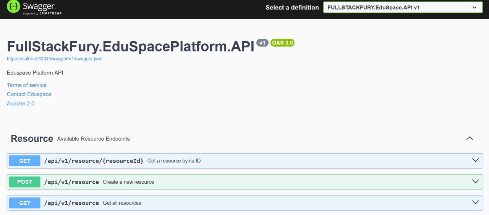
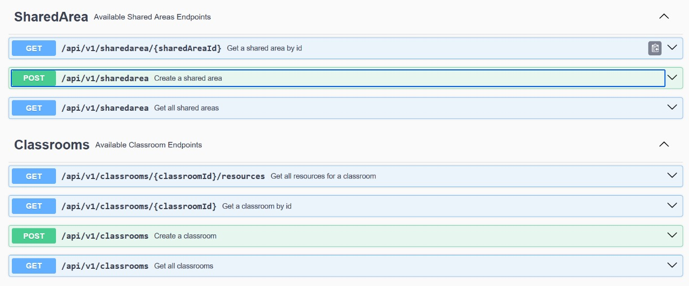
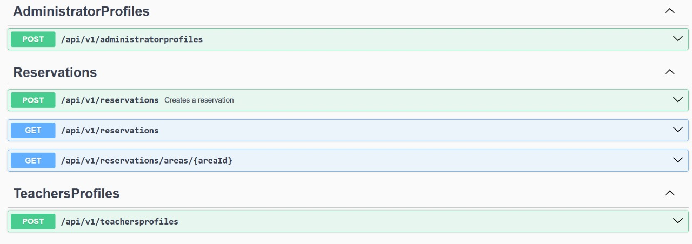
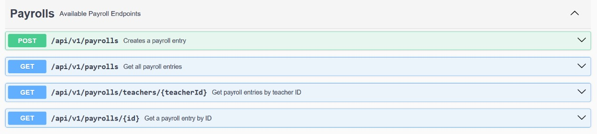
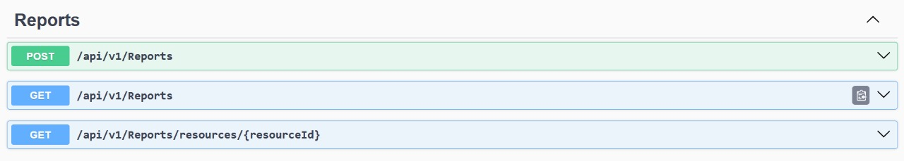
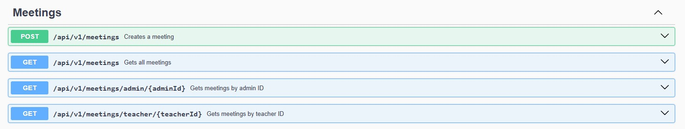

### 5.2.3.7. Software Deployment Evidence for Sprint Review

A continuación, se describe la configuración detallada del despliegue de cada componente de la solución, estableciendo los pasos necesarios para que, a partir de los repositorios de código fuente, se logre la publicación satisfactoria de los productos digitales involucrados, como la Landing Page, los Web Services y las aplicaciones web del frontend.

**Link del backend desplegado** : https://bit.ly/3AHEfAp

**Link del frontend desplegado** : https://bit.ly/40LdfKR

**Link de la landing page desplegada** : https://bit.ly/3VcWJjx

Deploy DataBase:

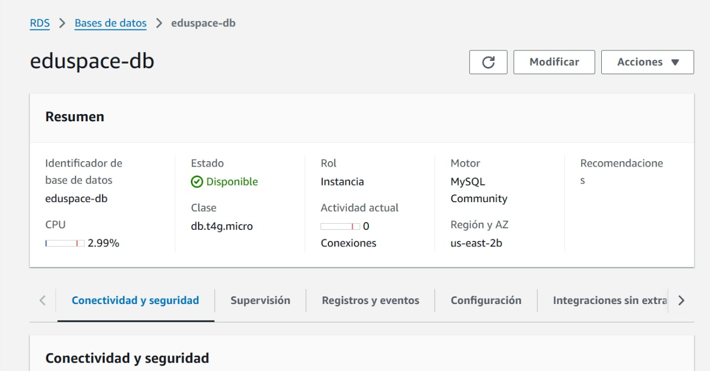
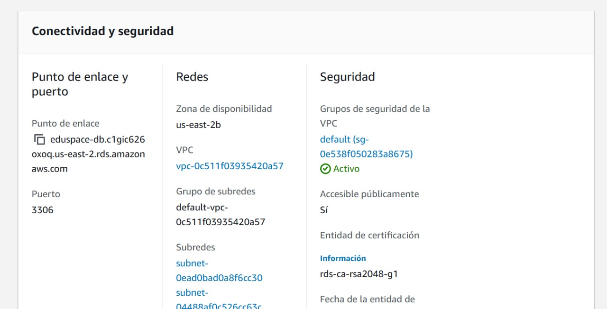

#### Despliegue del Web Service:

Para el despliegue del Web Service, se utilizó la plataforma MonsterASP
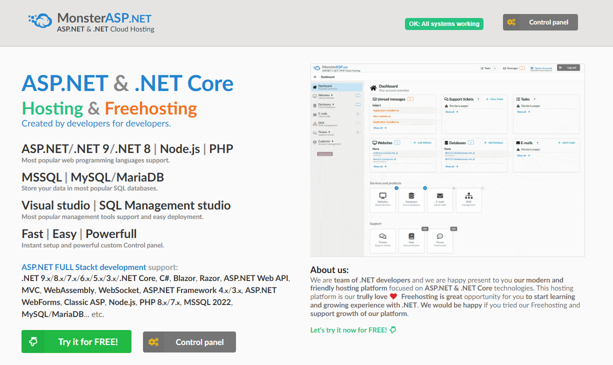

**1-. Primero debemos de registrarnos para hacer uso de la plataforma.**
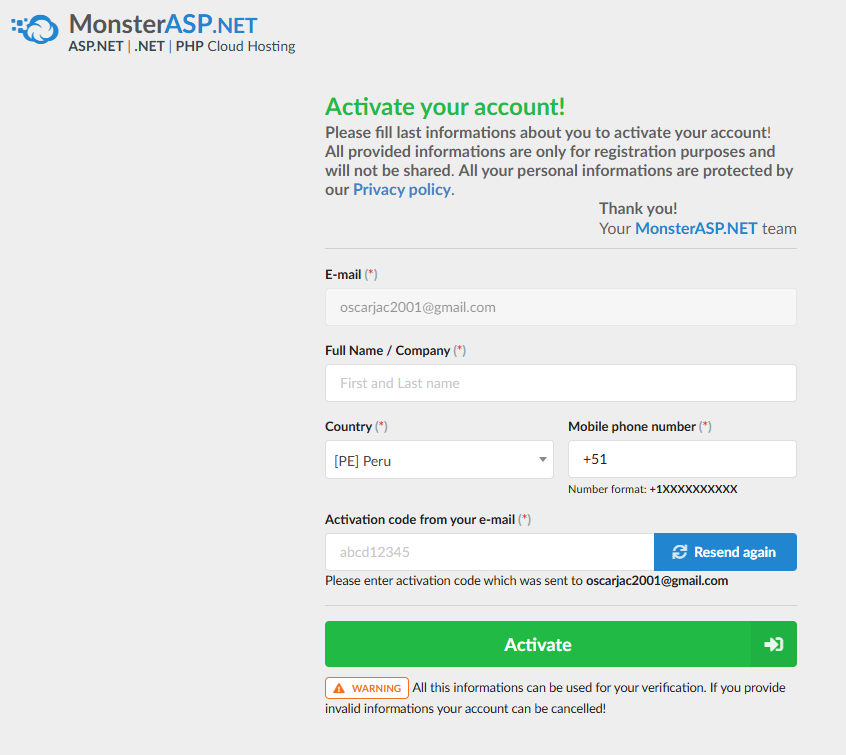

**2-. Una vez ingresados creamos un nuevo website.**
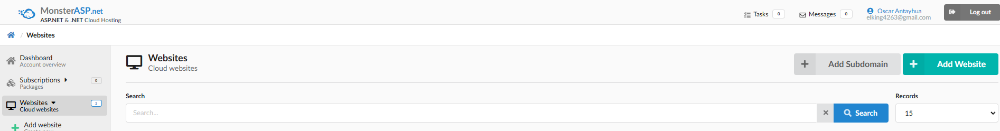

**3-. Luego en el panel de control, nos dirigimos al apartado deploy y en WebDeploy Access lo colocamos en "Enable" y descargarmos el perfil de publicación**

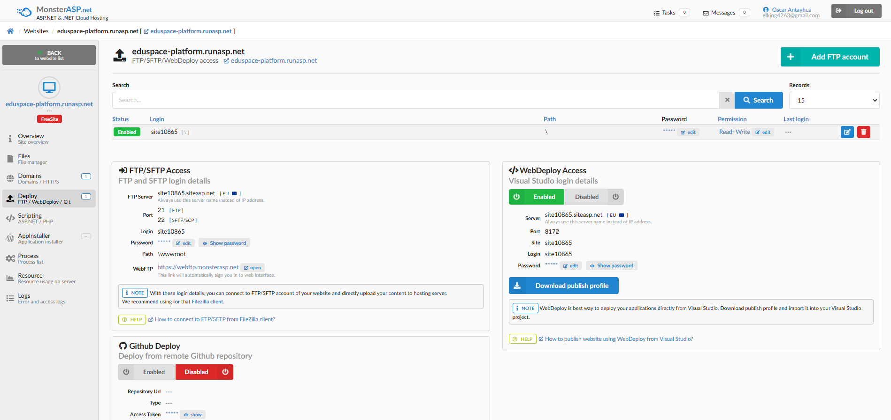

**4-. Para utilizar el perfil debemos primero cargar nuestro proyecto dentro de Visual Studio**
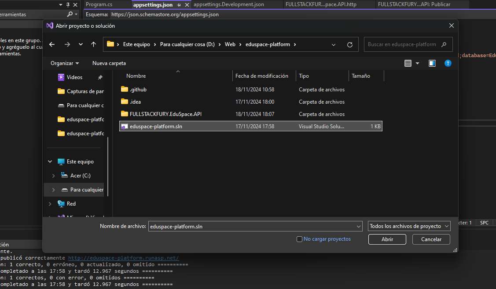

**5-. Una vez cargado el proyecto, le damos click derecho sobre este y luego a "Publicar"**
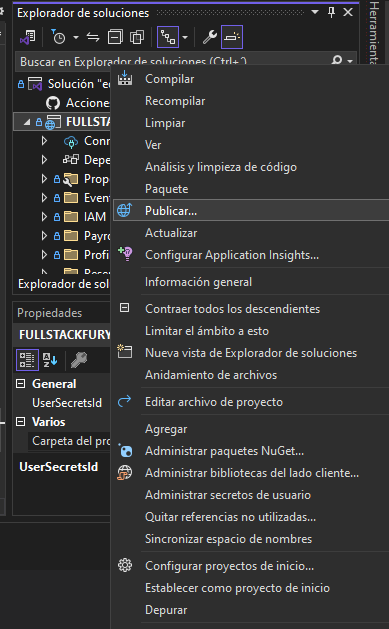

**6-. Configuramos el program.cs para que el Swagger este disponible para producción"**
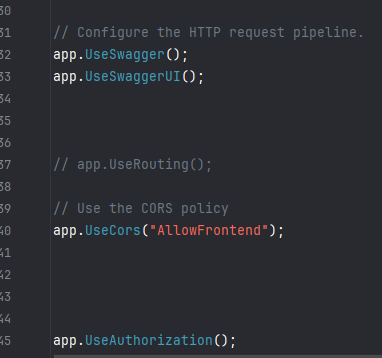

**6-. Seleccionamos la opción de "Importar Pefil"**
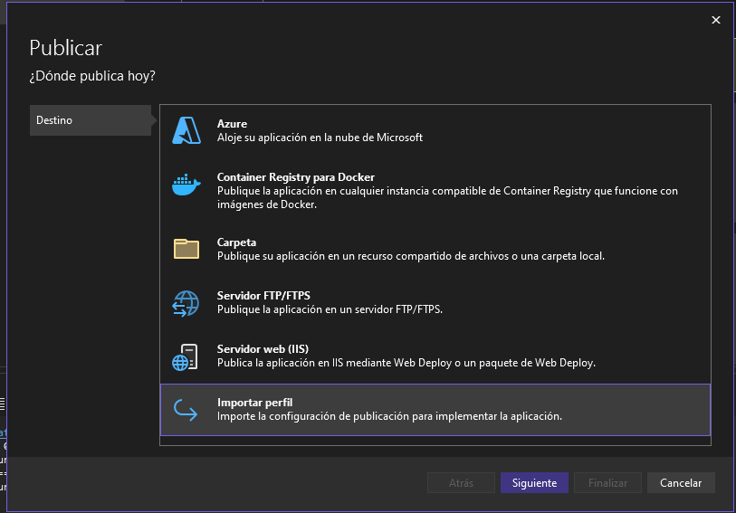

**7-. Seleccionamos el perfil que descargamos en el panel de control de MonsterAsp"**
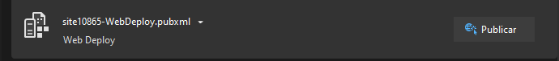

**8-. Con esto ya tenemos desplegado nuestro Web Service**
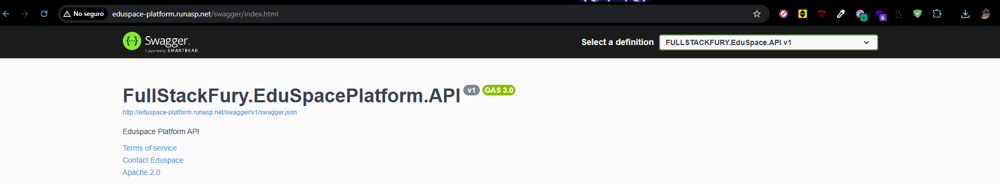

Link del Web Service desplegado: http://eduspace-platform.runasp.net/swagger/index.html

### 5.2.3.8. Team Collaboration Insights during Sprint

Para la realización de los commits de nuestro Sprint, hemos hecho uso de la herramienta Rider y Web Storm, además del uso de Git. Uno de los integrantes realizó un primer commit para la creación del repositorio, luego utilizando Git clonamos el repositorio, para luego realizar los cambios en Web Storm/ Rider y crear los branches correspondientes a dichos cambios, para finalmente realizar el commit, el cual deberá ser revisado dentro del repositorio de Github.

**Back-end:**

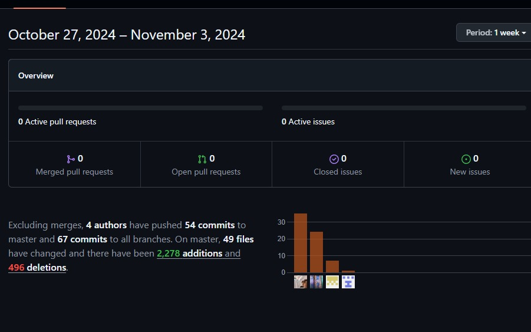

## 5.2.4. Sprint 4

### 5.2.4.1 Spring Planning 4.

| Sprint #                        | Sprint 4                                                                                                        |
|---------------------------------|-----------------------------------------------------------------------------------------------------------------|
| Sprint Planning Background      |   |
| Date                            | 18/11/2024 |
| Time                            | 06:00 PM  |
| Location                        | Servidor de Discord del Equipo   |
| Prepared By                     | Franz Escalante  |
| Attendees (to planning meeting) | Franz Escalante/ Camila Espinoza / Oscar Antayhua / Andres Torres / Angelo Curi |
| Sprint 4 Review Summary         | Se lograron alcanzar los objetivos establecidos: Corrección de los endpoints, Conexión entre el Front-end y el Back-End, Integración del Hash.   |
| Sprint 4 Retrospective Summary  |Este sprint ha sido muy complejo debido a las correcciones que debimos de realizar tanto para el front-end como el back-end, además de integrar las validaciones del token dentro del inicio de sesión del usuario para así concluir con todo el proyecto completo.   |
| Sprint Goal & User Stories      |     |
| Sprint 4 Goal                   |Nuestro enfoque es permitir a las instituciones educativas registrarse y acceder a todas nuestras características, incluyendo la capacidad de crear cuentas para su personal y gestionar integralmente sus espacios. Creemos que implementar estas características nos permitirá ofrecer una aplicación útil para los administradores educativos y su personal. Esto se confirmará cuando, al elegir su plan, el administrador de la institución educativa sea capaz de registrar y gestionar cada ambiente, como aulas y áreas deportivas, incluyendo aforo, responsables y equipamiento. Por otro lado, los docentes podrán registrar su disponibilidad y actividades, mejorando la coordinación y comunicación en la institución.  |
| Sprint 4 Velocity               |   |
| Sum of Story Points             |    |

### 5.2.4.2 Sprint Backlog 4.

|Sprint#|Sprint 4|||||||
| :- | :- | :- | :- | :- | :- | :- | :- |
|User Story|Work-Item/Task|||||||
|Id|Title|Id|Title|Description|Estimation|Asigned To|Status (To-do/InProcess/To-Review/Done)|
|TS01|Añadir administrador a través de un RESTful API|TSK01|Agregar hasheo|Agregar hasheo a la contraseña del administrador|2h|Franz|Done|
|TS01|Añadir administrador a través de un RESTful API|TSK02|Agregar token|Entregar token al realizar el registro del administrador|4h|Franz|Done|
|TS02|Añadir un docente a través de un RESTful API|TSK03|Agregar hasheo|Agregar hasheo a la contraseña del docente|2h|Franz|Done|
|TS05|Inicio de sesión a través de un RESTful API|TSK04|Buscar usuario y contraseña|Buscar el usuario y comparar contraseñas usando hasheo|1h|Franz|Done|
|TS05|Inicio de sesión a través de un RESTful API|TSK05|Enviar rol y id en el payload|Enviar rol y id en el payload del token|1h|Franz|Done|
|TS05|Inicio de sesión a través de un RESTful API|TSK06|Permitir uso de endpoints de acuerdo al rol|Permitir uso de endpoints de acuerdo al rol asignado en el payload del token|5h|Franz|Done|
|TS11|Añadir información de los recursos de un salón a través de un RESTful API|TSK07|Añadir endpoint para registrar recursos de un salón a través de un RESTful API|Crear un endpoint HTTP POST que permita registrar un nuevo recurso para un salón, utilizando el ID del profesor para asociar el recurso con un salón específico|3h|Andres|Done|
|TS11|Añadir información de los recursos de un salón a través de un RESTful API|TSK08|Eliminar recurso de un salón asociado a un profesor a través de un RESTful API|Crear un endpoint HTTP DELETE que permita eliminar un recurso de un salón, utilizando el ID del recurso y el ID del profesor|3h|Andres|Done|
|TS12|Añadir información de hora y lugar de una reunión a través de un RESTful API|TSK09|Añadir endpoint para actualizar la reunión a través de un RESTful API|Crear un endpoint HTTP PUT que permita actualizar una reunión, utilizando el ID de la reunión|4h|Camila|Done|
|TS12|Añadir información de hora y lugar de una reunión a través de un RESTful API|TSK10|Añadir un endpoint para eliminar la reunión a través de un RESTful API|Crear un endpoint HTTP DELETE que permita eliminar una reunión, utilizando el ID de la reunión|4h|Camila|Done|
|TS13|Añadir información de los invitados de una reunión a través de un RESTful API|TSK11|Añadir un recurso para que guarde los invitados de una reunión a través de un RESTful API|Agregar método para añadir a los invitados en una reunión|4h|Camila|Done|
|TS14|Obtener notificación de reporte a través de un RESTful API|TSK12|Actualizar el diagrama físico de la base de datos|Actualizar el diagrama físico de la base de datos. Añadiendo tabla para notificaciones y corrección de errores|1h|Franz|Done|
|TS14|Obtener notificación de reporte a través de un RESTful API|TSK13|Agregar eventos y comunicación entre bounded context|Emitir evento después de que ocurra un reporte y enviarlo al bounded context del administrador|6h|Franz|Done|
|TS15|Obtener notificación de asistencia a través de un RESTful API|TSK14|Actualizar el diagrama físico de la base de datos|Actualizar el diagrama físico de la base de datos en base al registro de asistencia y la notificación|1h|Franz|Done|
|TS15|Obtener notificación de asistencia a través de un RESTful API|TSK15|Agregar eventos y comunicación entre bounded context|Agregar la emisión del evento al confirmar la asistencia. Si no está el recurso de confirmar asistencia se debe agregar.|4h|Franz|Done|
|TS16|Obtener notificación de creación de reunión a través de un RESTful API|TSK16|Actualizar el diagrama físico de la base de datos|Actualizar el diagrama físico de la base de datos en base al registro de reunión y la notificación|1h|Franz|Done|
|TS16|Obtener notificación de creación de reunión a través de un RESTful API|TSK17|Agregar eventos y comunicación entre bounded context|Agregar la emisión del evento al agregar participantes en la reunión. Si no está el recurso de agregar participantes a la reunión se debe agregar.|4h|Franz|Done|
|TS17|Añadir información del encargado del aula a través de un RESTful API|TSK18|Agregar eventos y comunicación entre bounded context|Asignar un docente a un aula dentro del registro del mismo.|4h|Oscar|Done|
|TS18|Actualizar información del encargado del aula a través de un RESTful API|TSK19|Agregar eventos y comunicación entre bounded context|Actualizar el docente encargado de un aula ante cualquier eventualidad|4h|Oscar|Done|
| TS22 | Obtener notificación de actualización envío de salario a través de un RESTful API | TSK20 | Actualizar el diagrama físico de la base de datos | Actualizar el diagrama físico de la base de datos en base al registro del salario y la notificación | 1h | Franz | Done |
| TS22 | Obtener notificación de actualización envío de salario a través de un RESTful API | TSK21 | Agregar eventos y comunicación entre bounded context | Agregar la emisión del evento al asignar el salario a un docente. | 3h | Franz | Done |
| TS26 | Añadir información del reporte de avería a través de un RESTful API | TSK22 | Añadir endpoint para registrar reporte de avería a través de un RESTful API | Crear un endpoint HTTP POST que permita registrar un nuevo reporte de avería, utilizando el ID de recursos para asociar el reporte con un recurso específico | 3h | Angelo | Done |
| TS26 | Añadir información del reporte de avería a través de un RESTful API | TSK23 | Eliminar reporte de avería asociado a un recurso específico a través de un RESTful API | Crear un endpoint HTTP DELETE que permita eliminar un reporte de avería, mediante el ID del recurso y el ID del reporte de avería | 3h | Angelo | Done |
| US26 | Reserva de espacios compartidos | TSK24 | Enviar verbo HTTP POST al reservar | Enviar verbo HTTP POST al reservar un espacio compartido | 3h | Franz | Done |
| US26 | Reserva de espacios compartidos | TSK25 | Enviar verbo HTTP DELETE al eliminar | Enviar verbo HTTP DELETE al eliminar la reserva de un espacio compartido | 3h | Franz | Done |
### 5.2.4.3 Development Evidence for Sprint Review.

**Front-end:**

En el frontend del proyecto FullStackFury/Eduspace, se han realizado importantes mejoras. Se mejoró el bounded context Meeting Management, añadiendo funcionalidades clave y optimizando su flujo de trabajo. También se implementó la funcionalidad de Notificaciones, lo que permite a los usuarios estar al tanto de eventos importantes en tiempo real.

Además, se realizaron avances significativos en el bounded context Breakdown Management, solucionando aspectos pendientes de la entrega pasada, y se implementaron las funcionalidades del bounded context Personal Management. Se añadió un sistema de Login que asegura una correcta autenticación e integración con el backend.

| Repository | Branch  | Commit Id | Commit Message   | Commit message body  | Committed on |
|-------|---------|-----------|-------|----------------------------|---------------------------|
| FullStackFury/eduspace-frontend | develop | 5639d27   | feat(payroll): update |       | 2024-11-16 22:53:54 -0500 |
| FullStackFury/eduspace-frontend | develop | f4d6bb6   | feat(payroll): update |       | 2024-11-16 21:47:10 -0500 |
| FullStackFury/eduspace-frontend | develop | 7897fef   | feat(meet-dialog): update |       | 2024-11-16 17:34:02 -0500 |
| FullStackFury/eduspace-frontend | develop | f5f5f1c   | feat(meet): update |       | 2024-11-16 16:34:30 -0500 |
| FullStackFury/eduspace-frontend | develop | 98c86ab   | feat(meet): update |       | 2024-11-16 01:16:04 -0500 |
| FullStackFury/eduspace-frontend | develop | 849aed6   | feat(meet-dialog): update |       | 2024-11-15 23:48:33 -0500 |
| FullStackFury/eduspace-frontend | develop | 3522ac1   | feat(meet-dialog): update |       | 2024-11-15 21:10:03 -0500 |
| FullStackFury/eduspace-frontend | develop | 19539ae   | feat(db): update |       | 2024-11-15 20:47:13 -0500 |
| FullStackFury/eduspace-frontend | develop | 2a8e533   | feat(payroll): update. |       | 2024-11-15 14:09:47 -0500 |
| FullStackFury/eduspace-frontend | develop | 9ed00bc   | merge 'spaces-and-resources' into 'develop' |       | 2024-11-11 00:24:31 -0500 |
| FullStackFury/eduspace-frontend | develop | 6109428   | fix: the space and resource management |       | 2024-11-11 00:15:48 -0500 |
| FullStackFury/eduspace-frontend | develop | 8160f73   | feat: dbjson |       | 2024-11-10 23:51:04 -0500 |
| FullStackFury/eduspace-frontend | develop | c88c0ad   | refactor: change the name of the component and the route to classrooms and shared spaces |       | 2024-11-10 23:50:28 -0500 |
| FullStackFury/eduspace-frontend | develop | ef70610   | refactor: change the name component to classroom |       | 2024-11-10 23:49:56 -0500 |
| FullStackFury/eduspace-frontend | develop | 1c9f162   | refactor: change the name component to classroom |       | 2024-11-10 23:49:53 -0500 |
| FullStackFury/eduspace-frontend | develop | 2469d27   | refactor: change the name component to classroom |       | 2024-11-10 23:49:50 -0500 |
| FullStackFury/eduspace-frontend | develop | 5349a20   | refactor: change the name component to classroom |       | 2024-11-10 23:49:48 -0500 |
| FullStackFury/eduspace-frontend | develop | d6cf114   | refactor: change the name component to classroom |       | 2024-11-10 23:49:45 -0500 |
| FullStackFury/eduspace-frontend | develop | bde404a   | refactor: change the name route |       | 2024-11-10 23:49:22 -0500 |
| FullStackFury/eduspace-frontend | develop | 061a61b   | refactor: delete component |       | 2024-11-10 23:48:58 -0500 |
| FullStackFury/eduspace-frontend | develop | 03a8420   | refactor: change the name component to shared space |       | 2024-11-10 23:48:40 -0500 |
| FullStackFury/eduspace-frontend | develop | 8c299dd   | refactor: change the name component to shared space |       | 2024-11-10 23:48:36 -0500 |
| FullStackFury/eduspace-frontend | develop | 5709b7a   | refactor: change the name component to shared space |       | 2024-11-10 23:48:33 -0500 |
| FullStackFury/eduspace-frontend | develop | 8073804   | refactor: change the name component to shared space |       | 2024-11-10 23:48:25 -0500 |
| FullStackFury/eduspace-frontend | develop | 69684c6   | refactor: change the name |       | 2024-11-10 23:42:01 -0500 |
| FullStackFury/eduspace-frontend | develop | 884870c   | feat(asset): added default profile image. |       | 2024-11-05 19:15:13 -0500 |
| FullStackFury/eduspace-frontend | develop | 035a6f7   | feat(dashboard): update dashboard. |       | 2024-11-05 19:14:51 -0500 |
| FullStackFury/eduspace-frontend | develop | e5cc9e9   | feat(dashboard): update dashboard. |       | 2024-11-05 00:56:26 -0500 |
| FullStackFury/eduspace-frontend | develop | 4f96683   | Merge remote-tracking branch 'origin/master' into feature/dashboard |       | 2024-11-04 19:09:31 -0500 |
| FullStackFury/eduspace-frontend | develop | 58561e1   | Merge remote-tracking branch 'origin/develop' into feature/dashboard |       | 2024-11-04 19:07:31 -0500 |
| FullStackFury/eduspace-frontend | spaces-and-resources | d8f0674   | feat(admin): update |       | 2024-11-17 15:10:48 -0500 |
| FullStackFury/eduspace-frontend | spaces-and-resources | ce9fd7d   | feat(admin): update |       | 2024-11-17 15:09:27 -0500 |
| FullStackFury/eduspace-frontend | spaces-and-resources | a192264   | Merge remote-tracking branch 'origin/feature/breakdown-management2' into develop |       | 2024-11-17 14:28:43 -0500 |
| FullStackFury/eduspace-frontend | spaces-and-resources | 1e50b22   | feat(breakdown): update reports-management |       | 2024-11-17 14:25:22 -0500 |
| FullStackFury/eduspace-frontend | spaces-and-resources | ba8d5d9   | feat(breakdown): added idTeacher |       | 2024-11-17 14:14:57 -0500 |
| FullStackFury/eduspace-frontend | spaces-and-resources | 28dd651   | feat(payroll): update |       | 2024-11-17 13:38:37 -0500 |
| FullStackFury/eduspace-frontend | personal-management | 1d70c94   | feat: added notifications |       | 2024-11-07 01:46:18 -0500 |
| FullStackFury/eduspace-frontend | personal-management | 8c2ebe7   | feat: created notification logic |       | 2024-11-07 01:45:20 -0500 |
| FullStackFury/eduspace-frontend | personal-management | 491dbd6   | feat: created notification-management |       | 2024-11-07 01:44:43 -0500 |
| FullStackFury/eduspace-frontend | personal-management | 5f77606   | feat: added notification service |       | 2024-11-07 01:44:23 -0500 |
| FullStackFury/eduspace-frontend | personal-management | 0ad9ef1   | feat(personal-management): merge. |       | 2024-11-06 10:09:03 -0500 |
| FullStackFury/eduspace-frontend | personal-management | 8bda836   | feat(personal-management): added pv component. |       | 2024-11-06 00:48:28 -0500 |
| FullStackFury/eduspace-frontend | personal-management | 6cf4db1   | feat: created personal-management |       | 2024-11-06 00:36:03 -0500 |
| FullStackFury/eduspace-frontend | personal-management | 2da3555   | feat: delete personnel |       | 2024-11-06 00:35:18 -0500 |
| FullStackFury/eduspace-frontend | iam | 0c7db34   | refactor(login): app.vue updated with new roles |       | 2024-11-16 12:56:39 -0500 |
| FullStackFury/eduspace-frontend | iam | 30d22b0   | refactor(login): login component added |       | 2024-11-16 12:56:15 -0500 |
| FullStackFury/eduspace-frontend | iam | a9940e5   | feat(login): model updated |       | 2024-11-16 12:54:08 -0500 |
| FullStackFury/eduspace-frontend | iam | 6086f0d   | refactor(store): login service refactored |       | 2024-11-16 12:53:34 -0500 |
| FullStackFury/eduspace-frontend | iam | ffa01b9   | feat(store): token added to user vuex |       | 2024-11-16 12:52:54 -0500 |
| FullStackFury/eduspace-frontend | dashboard | e2d6ea9   | feat(db): update |       | 2024-11-15 20:58:06 -0500 |
| FullStackFury/eduspace-frontend | dashboard | a51e3d3   | Update db.json |       | 2024-11-15 20:55:35 -0500 |
| FullStackFury/eduspace-frontend | dashboard | d6672c1   | Update db.json |       | 2024-11-15 20:54:15 -0500 |

**Back-end:**

En el backend del proyecto FullStackFury/eduspace-platform, se lograron importantes avances durante este sprint. Se completaron los endpoints de todos los bounded contexts, incorporando las operaciones CRUD necesarias para garantizar una gestión eficiente de los datos.

Además, se implementó el uso de tokens para mejorar la autenticación y seguridad de la plataforma. También se optimizó la estructura y calidad del código, asegurando mayor legibilidad y mantenibilidad. Por último, se añadió y actualizó la documentación con Swagger, facilitando la interacción y comprensión de los servicios del backend por parte de los desarrolladores.

| Repository | Branch  | Commit Id | Commit Message   | Commit message body  | Committed on |
|-------|---------|-----------|-------|----------------------------|---------------------------|
| FullStackFury/eduspace-platform | spaces-and-resources-managament | 3a5cd54   | refactor: delete teacher |       | 2024-11-18 02:41:16 -0500 |
| FullStackFury/eduspace-platform | spaces-and-resources-managament | b2b054c   | feat(shared-area): added delete and update shared area |       | 2024-11-18 02:40:59 -0500 |
| FullStackFury/eduspace-platform | spaces-and-resources-managament | 7086067   | feat(Resource): added delete and update resource |       | 2024-11-18 02:40:22 -0500 |
| FullStackFury/eduspace-platform | spaces-and-resources-managament | d1fd07e   | feat(classroom): added delete and update classroom |       | 2024-11-18 02:39:42 -0500 |
| FullStackFury/eduspace-platform | spaces-and-resources-managament | 8b5cf04   | merge |       | 2024-11-17 23:57:01 -0500 |
| FullStackFury/eduspace-platform | spaces-and-resources-managament | ec3596d   | Merge branch 'feature/reservation-scheduling' of https://github.com/FullStack-Fury/eduspace-platform into feature/reservation-scheduling |       | 2024-11-17 23:50:33 -0500 |
| FullStackFury/eduspace-platform | spaces-and-resources-managament | 6f00d3d   | feat(space-and-resource): ClassroomsController.cs and Resource.cs |       | 2024-11-17 23:50:12 -0500 |
| FullStackFury/eduspace-platform | spaces-and-resources-managament | de2c977   | feat(meeting): add update meeting and delete meeting |       | 2024-11-17 18:57:33 -0500 |
| FullStackFury/eduspace-platform | spaces-and-resources-managament | 15c2ee0   | feat(meeting): add update meeting |       | 2024-11-17 18:57:19 -0500 |
| FullStackFury/eduspace-platform | spaces-and-resources-managament | 2c0fbb8   | feat(meeting): add update meeting |       | 2024-11-17 18:57:12 -0500 |
| FullStackFury/eduspace-platform | spaces-and-resources-managament | a3a432d   | feat(meeting): add update meeting |       | 2024-11-17 18:57:04 -0500 |
| FullStackFury/eduspace-platform | spaces-and-resources-managament | 69a97aa   | feat(meeting): add update meeting command from resource assembler |       | 2024-11-17 18:56:53 -0500 |
| FullStackFury/eduspace-platform | spaces-and-resources-managament | dea012c   | feat(meeting): add update meeting resource |       | 2024-11-17 18:56:34 -0500 |
| FullStackFury/eduspace-platform | spaces-and-resources-managament | 08e66f5   | feat(meeting): add update meeting command |       | 2024-11-17 18:56:14 -0500 |
| FullStackFury/eduspace-platform | reservation-scheduling | 455a436   | fix: camila's error fixed |       | 2024-11-18 14:34:35 -0500 |
| FullStackFury/eduspace-platform | reservation-scheduling | 6b2192d   | Merge remote-tracking branch 'origin/develop' into feature/reservation-scheduling |       | 2024-11-18 13:30:18 -0500 |
| FullStackFury/eduspace-platform | reservation-scheduling | cf444c8   | feat: last version |       | 2024-11-18 00:16:35 -0500 |
| FullStackFury/eduspace-platform | reservation-scheduling | bcf07ec   | Merge remote-tracking branch 'origin/feature/reservation-scheduling' into feature/reservation-scheduling |       | 2024-11-18 00:13:59 -0500 |
| FullStackFury/eduspace-platform | reservation-scheduling | 8b5cf04   | merge |       | 2024-11-17 23:57:01 -0500 |
| FullStackFury/eduspace-platform | reservation-scheduling | ec3596d   | Merge branch 'feature/reservation-scheduling' of https://github.com/FullStack-Fury/eduspace-platform into feature/reservation-scheduling |       | 2024-11-17 23:50:33 -0500 |
| FullStackFury/eduspace-platform | reservation-scheduling | 6f00d3d   | feat(space-and-resource): ClassroomsController.cs and Resource.cs |       | 2024-11-17 23:50:12 -0500 |
| FullStackFury/eduspace-platform | reservation-scheduling | 2bb0136   | Merge remote-tracking branch 'origin/develop' into feature/reservation-scheduling |       | 2024-11-17 20:58:37 -0500 |
| FullStackFury/eduspace-platform | reservation-scheduling | de2c977   | feat(meeting): add update meeting and delete meeting |       | 2024-11-17 18:57:33 -0500 |
| FullStackFury/eduspace-platform | reservation-scheduling | 15c2ee0   | feat(meeting): add update meeting |       | 2024-11-17 18:57:19 -0500 |
| FullStackFury/eduspace-platform | reservation-scheduling | 2c0fbb8   | feat(meeting): add update meeting |       | 2024-11-17 18:57:12 -0500 |
| FullStackFury/eduspace-platform | reservation-scheduling | a3a432d   | feat(meeting): add update meeting |       | 2024-11-17 18:57:04 -0500 |
| FullStackFury/eduspace-platform | reservation-scheduling | 69a97aa   | feat(meeting): add update meeting command from resource assembler |       | 2024-11-17 18:56:53 -0500 |
| FullStackFury/eduspace-platform | reservation-scheduling | dea012c   | feat(meeting): add update meeting resource |       | 2024-11-17 18:56:34 -0500 |
| FullStackFury/eduspace-platform | reservation-scheduling | 08e66f5   | feat(meeting): add update meeting command |       | 2024-11-17 18:56:14 -0500 |
| FullStackFury/eduspace-platform | derelease | 7dd760c   | fix(meeting): Andres fixed |       | Sun Nov 17 00:12:12 2024 -0500 | 
| FullStackFury/eduspace-platform | derelease | 5a2c67b   | feat(meet): update |       | Sat Nov 16 23:36:35 2024 -0500 | --date=iso
| FullStackFury/eduspace-platform | derelease |a1cf4af   | refactor(space-and-resource): rename rest shared area id |       | Sat Nov 16 23:32:32 2024 -0500 | 
| FullStackFury/eduspace-platform | derelease | 4ae0447   | fix: franz fixed |       | Sat Nov 16 23:21:51 2024 -0500 |
| FullStackFury/eduspace-platform | derelease |51da401   | feat(meet): update |       | Sat Nov 16 22:34:47 2024 -0500 | --date=iso
| FullStackFury/eduspace-platform | derelease |43e6cce   | feat(space-and-resource): connection to DB |       | Sat Nov 16 22:33:25 2024 -0500 | 
| FullStackFury/eduspace-platform | derelease |4f91647   | fix: franz fixed |       | Sat Nov 16 22:16:56 2024 -0500 | 
| FullStackFury/eduspace-platform | derelease |039a583   | feat(meet):update |       | Sat Nov 16 21:42:01 2024 -0500 | 
| FullStackFury/eduspace-platform | derelease |2312d00   | Merge branch 'feature/iam' into feature/spaces-and-resources-management |       | Sat Nov 16 18:53:03 2024 -0500 | 
| FullStackFury/eduspace-platform | derelease |dcb1d15   | docs: environments |       | Sat Nov 16 18:44:40 2024 -0500 | 
| FullStackFury/eduspace-platform | derelease |7aa5865   | fix: CORS error fixed |       | Sat Nov 16 13:07:18 2024 -0500 | 
| FullStackFury/eduspace-platform | derelease |cf421b4   | merge iam into spaces and resources management |       | Sat Nov 16 13:01:25 2024 -0500 | 
| FullStackFury/eduspace-platform | derelease |bd71821   | Merge branch 'feature/spaces-and-resources-management' into feature/reservation-scheduling |       | Sat Nov 16 11:29:12 2024 -0500 | 
| FullStackFury/eduspace-platform | derelease |0bfb4fc   | fix(iam): returning role |       | Fri Nov 15 22:21:53 2024 -0500 | 
| FullStackFury/eduspace-platform | derelease |96b07b4   | aa |       | Fri Nov 15 21:13:47 2024 -0500 | 
| FullStackFury/eduspace-platform | repayroll-managment | c2c9138   | feat(payroll): update payroll. |       | Sun Nov 17 14:26:12 2024 -0500 | 
| FullStackFury/eduspace-platform | iam | 7aa5865   | fix: CORS error fixed |       | Sat Nov 16 13:07:18 2024 -0500 |
| FullStackFury/eduspace-platform | iam| 0bfb4fc   | fix(iam): returning role |       | Fri Nov 15 22:21:53 2024 -0500 |
| FullStackFury/eduspace-platform | iam| 19a41c0   | feat: new dependencies added |       | Wed Nov 13 21:01:03 2024 -0500 |
| FullStackFury/eduspace-platform | iam| 71e733a   | refactor: app db context refactored |       | Wed Nov 13 21:00:39 2024 -0500 |
| FullStackFury/eduspace-platform | iam| a088cb4   | refactor(profiles): command and resources refactored |       | Wed Nov 13 20:56:08 2024 -0500 |
| FullStackFury/eduspace-platform | iam| 845e1af   | refactor(iam): rest controller, resources and transform classes refactored |       | Wed Nov 13 20:55:03 2024 -0500 |
| FullStackFury/eduspace-platform | iam| 2c3539a   | refactor(iam): acl folder changed |       | Wed Nov 13 20:54:05 2024 -0500 |
| FullStackFury/eduspace-platform | iam| a5499fc   | fix: interface resource and controller updated |       | Wed Nov 13 20:50:46 2024 -0500 |
| FullStackFury/eduspace-platform | iam| 1d7859c   | feat(iam): hashing and token service added |       | Wed Nov 13 20:50:25 2024 -0500 |
| FullStackFury/eduspace-platform | iam| f1ebbf5   | feat(iam): hashing and token service contracts |       | Wed Nov 13 20:49:47 2024 -0500 |
| FullStackFury/eduspace-platform | iam| 404fdde   | fix(iam): domain layer updated |       | Wed Nov 13 20:49:13 2024 -0500 |
| FullStackFury/eduspace-platform | breakdown-managament| b0ba59b   | feat(breakdown): update Report Resource |       | Sat Nov 16 21:08:39 2024 -0500 |
| FullStackFury/eduspace-platform | breakdown-managament| 5c8867e   | feat: created detele Report and GetByIdQuery |       | Thu Nov 14 19:40:10 2024 -0500 |
| FullStackFury/eduspace-platform | breakdown-managament| 3271114   | feat: created update |       | Thu Nov 14 19:39:50 2024 -0500 |
| FullStackFury/eduspace-platform | breakdown-managament| 51688a3   | feat: update Report final |       | Thu Nov 14 19:39:26 2024 -0500 |
| FullStackFury/eduspace-platform | breakdown-managament| ec666a5   | feat: update Resource status, Entity |       | Thu Nov 14 19:38:55 2024 -0500 |
| FullStackFury/eduspace-platform | breakdown-managament| 9a262d9   | feat: update Report Repository |       | Thu Nov 14 19:38:29 2024 -0500 |
| FullStackFury/eduspace-platform | breakdown-managament| a2be4a0   | feat: update ReportCommand |       | Thu Nov 14 19:38:12 2024 -0500 |
| FullStackFury/eduspace-platform | breakdown-managament| 9f38830   | feat: update Report queries |       | Thu Nov 14 19:37:55 2024 -0500 |
| FullStackFury/eduspace-platform | breakdown-managament| dc21313   | feat: update ReportCommand |       | Thu Nov 14 19:37:31 2024 -0500 |
| FullStackFury/eduspace-platform | breakdown-managament| 9435364   | feat: update dbContext |       | Thu Nov 14 19:37:05 2024 -0500 |

### 5.2.4.4 Testing Suite Evidence for Sprint Review.

No se realizaron tests durante el sprint
  
### 5.2.4.5 Execution Evidence for Sprint Review.

### 5.2.4.6 Services Documentation Evidence for Sprint Review.

Esta sección muestra los logros alcanzados en la documentación de Web Services durante el Sprint, detallando la implementación de endpoints para gestionar reservas, reportes, nóminas, reuniones, aulas, recursos, áreas compartidas y perfiles de profesores. Cada endpoint incluye su acción correspondiente, el verbo HTTP y los parámetros necesarios para las consultas. Se presentan ejemplos de respuesta y capturas que ilustran la interacción con los datos. Además, se incluye un enlace al repositorio con los commits relacionados con la documentación de este Sprint.

| URL    | Endpoint          | HTTP Verb | Acción Implementada    | Sintaxis de Llamada        | Parámetros Posibles      | Ejemplo de Response                | Explicación del Response                |
|-----------------|-------------|-----------|----------|-------------------|------------------------------|----------------------------------------|-----------------------------------------|
|  | /api/v1/Classrooms                 | GET    | Obtener todas las aulas                | 'accept: application/json'         | Ninguno     | `{"id": 1, "name": "A102", "description": "string"...}`         | Retorna un array de objetos aulas                  |
|  | /api/v1/Classrooms                 | POST   | Agregar un nuevo aula                  | 'Content-Type: application/json' -d `{"name": "string", "description": "string"...}`         | JSON con datos del aula      | `{"id": 10, "name": "A302", "description": "Aula del centro"...}`         | Retorna el objeto aula creado                     |
|  | /api/v1/Classrooms/{classroomId}   | GET    | Obtener un aula por ID                 | 'accept: application/json'          | `id` (path parameter)     | `{"id": 10, "name": "A302", "description": "Aula del centro"...}`          | Retorna un objeto aula específico                 |
|  | /api/v1/Classrooms/{classroomId}   | PUT    | Actualizar datos de un aula por ID     | 'Content-Type: application/json' -d `{"name": "string", "description": "string"...}`         | JSON con datos actualizados del aula      | `{"id": 10, "name": "A302", "description": "Aula renovada"...}`         | Retorna el objeto aula actualizado               |
|  | /api/v1/Classrooms/{classroomId}   | DELETE | Eliminar un aula por ID                | 'accept: application/json'          | `id` (path parameter)     | Ninguno                                                         | Retorna una confirmación de eliminación          |
|  | /api/v1/Reservations               | GET    | Obtener todas las reservas             | 'accept: application/json'         | Ninguno     | `{"id": 10, "start": "2024-11-02", "end": "2024-11-10"}`         | Retorna un array de objetos reservas              |
|  | /api/v1/Reservations               | POST   | Agregar una nueva reserva              | 'Content-Type: application/json' -d `{"title": "string", "start": "2024-11-03T03:21:10.303Z", "end": "2024-11-03T03:21:10.303Z"...}`         | JSON con datos de reserva      | `{"id": 10, "start": "2024-11-15", "end": "2024-11-30"}`         | Retorna el objeto reserva creado                 |
|  | /api/v1/Reservations/{reservationId} | GET    | Obtener una reserva por ID             | 'accept: application/json'          | `id` (path parameter)     | `{"id": 10, "start": "2024-11-02", "end": "2024-11-10"}`         | Retorna un objeto reserva específico             |
|  | /api/v1/Reservations/{reservationId} | PUT    | Actualizar datos de una reserva por ID | 'Content-Type: application/json' -d `{"title": "string", "start": "2024-11-15", "end": "2024-11-30"...}`         | JSON con datos actualizados de la reserva      | `{"id": 10, "start": "2024-11-20", "end": "2024-12-01"}`         | Retorna el objeto reserva actualizado           |
|  | /api/v1/Reservations/{reservationId} | DELETE | Eliminar una reserva por ID            | 'accept: application/json'          | `id` (path parameter)     | Ninguno                                                         | Retorna una confirmación de eliminación          |
|  | /api/v1/Resource                   | GET    | Obtener todos los recursos             | 'accept: application/json'         | Ninguno     | `{"id": 6, "name": "Pupitre", "kindOfResource": "Mobiliario", "classroom":...}`         | Retorna un array de objetos recursos             |
|  | /api/v1/Resource                   | POST   | Crear un nuevo recurso                 | 'Content-Type: application/json' -d `{"name": "string", "kindOfResource": "string", "classroomId": 0}`         | JSON con datos del recurso      | `{"id": 3, "name": "Pupitre", "kindOfResource": "Mobiliario", "classroom":...}`         | Retorna el objeto recurso creado                |
|  | /api/v1/Resource/{resourceId}      | GET    | Obtener un recurso por ID              | 'accept: application/json'          | `id` (path parameter)     | `{"id": 10, "name": "Pizarra", "kindOfResource": "Mobiliario", "classroom":...}`          | Retorna un objeto recurso específico            |
|  | /api/v1/Resource/{resourceId}      | PUT    | Actualizar datos de un recurso por ID  | 'Content-Type: application/json' -d `{"name": "string", "kindOfResource": "string", "classroomId": 0}`         | JSON con datos actualizados del recurso      | `{"id": 10, "name": "Pizarra Interactiva", "kindOfResource": "Tecnología"...}`         | Retorna el objeto recurso actualizado          |
|  | /api/v1/Resource/{resourceId}      | DELETE | Eliminar un recurso por ID             | 'accept: application/json'          | `id` (path parameter)     | Ninguno                                                         | Retorna una confirmación de eliminación          |
|  | /api/v1/SharedArea                 | GET    | Obtener todas las áreas compartidas    | 'accept: application/json'         | Ninguno     | `{"id": 10, "name": "Aula Multiusos", "capacity": 25, "description": "Area equipada con ..."}`         | Retorna un array de objetos de áreas compartidas |
|  | /api/v1/SharedArea                 | POST   | Agregar una nueva área compartida      | 'Content-Type: application/json' -d `{"name": "string", "capacity": 0, "description": "string"}`         | JSON con datos de área compartida      | `{"id": 10, "name": "Laboratorio Multiuso", "capacity": 15, "description": "Area equipada con ..."}`         | Retorna el objeto área compartida creado        |
|  | /api/v1/SharedArea/{sharedAreaId}  | GET    | Obtener un área compartida por ID      | 'accept: application/json'          | `id` (path parameter)     | `{"id": 20, "name": "Biblioteca", "capacity": 40, "description": "Area equipada con ..."}`          | Retorna un objeto área compartida específica     |
|  | /api/v1/SharedArea/{sharedAreaId}  | PUT    | Actualizar un área compartida por ID   | 'Content-Type: application/json' -d `{"name": "string", "capacity": 0, "description": "string"}`         | JSON con datos actualizados del área compartida      | `{"id": 20, "name": "Sala de Conferencias", "capacity": 50, "description": "Area con equipo audiovisual..."}`         | Retorna el objeto área compartida actualizado  |
|  | /api/v1/SharedArea/{sharedAreaId}  | DELETE | Eliminar un área compartida por ID     | 'accept: application/json'          | `id` (path parameter)     | Ninguno                                                         | Retorna una confirmación de eliminación          |
|  | /api/v1/TeachersProfiles        |  POST   |  Agregar un nuevo perfil de profesor        |   'Content-Type: application/json' -d `{"firstName": "string","lastName": "string","email": "string","dni": "string","address": "string","phone": "string","accountId": 0,"username": "string","password": "string","role": "string"}`        |   JSON con datos de perfil del profesor    |   `{"firstName": "Faker","lastName": "Perez","email": "farkerperez@gmail.com","dni": "71655458","address":"Las flores 120","phone": "989545214","accountId": 5,"username": "fa32k","password": "5mundiales","role": "Profesor"}`        |  Retorna un objeto Perfil de profesor     |
|  | /api/v1/Meetings                  | GET    | Obtener todas las reuniones            | 'accept: application/json'          | Ninguno     | `{"meetingId": "3fa85f64-5717-4562-b3fc-2c963f66afa6", "title": "Repasemos", "description": "En esta sesión...", "startTime": "2024-11-03", "endTime": "2024-11-20", "date": "2024-11-03"...}`         | Retorna un array de objetos reuniones                |
|  | /api/v1/Meetings                  | POST   | Agregar una nueva reunión              | 'Content-Type: application/json' -d `{"title": "string", "description": "string", "startTime": "2024-11-03T03:58:43.890Z", "endTime": "2024-11-03T03:58:43.890Z", "date": "2024-11-03"...}`         | JSON con datos de reunión      | `{"meetingId": "3fa85f64-5717-4562-b3fc-2c963f66afa6", "title": "Teoría del Conductismo", "description": "En esta sesión...", "startTime": "2025-01-03", "endTime": "2025-01-05", "date": "2025-01-03"...}`         | Retorna el objeto reunión creado                   |
|  | /api/v1/Meetings/{meetingId}      | GET    | Obtener una reunión por ID             | 'accept: application/json'          | `id` (path parameter)     | `{"meetingId": "3fa85f64-5717-4562-b3fc-2c963f66afa6", "title": "Teoría Sociocultural", "description": "En esta sesión...", "startTime": "2025-01-05 13:00:00", "endTime": "2025-01-05 14:00:00", "date": "2025-01-05"...}`         | Retorna un objeto reunión específico              |
|  | /api/v1/Meetings/{meetingId}      | PUT    | Actualizar una reunión por ID          | 'Content-Type: application/json' -d `{"title": "string", "description": "string", "startTime": "2025-01-05T10:00:00.000Z", "endTime": "2025-01-05T12:00:00.000Z", "date": "2025-01-05"...}`         | JSON con datos actualizados de la reunión      | `{"meetingId": "3fa85f64-5717-4562-b3fc-2c963f66afa6", "title": "Cambio de horario", "description": "Horario actualizado", "startTime": "2025-01-05T10:00:00.000Z", "endTime": "2025-01-05T12:00:00.000Z", "date": "2025-01-05"...}`         | Retorna el objeto reunión actualizado            |
|  | /api/v1/Meetings/{meetingId}      | DELETE | Eliminar una reunión por ID            | 'accept: application/json'          | `id` (path parameter)     | Ninguno                                                         | Retorna una confirmación de eliminación          |
|  | /api/v1/Reports                   | GET    | Obtener todos los reportes de averías  | 'accept: application/json'          | Ninguno     | `{"id": 5, "kindOfReport": "Software", "description": "Tiene fallos frecuentes...", "resourceId": 5, "createdAt": "2024-11-03", "status": "pendiente"...}`         | Retorna un array de objetos reportes               |
|  | /api/v1/Reports                   | POST   | Agregar un nuevo reporte de avería     | 'Content-Type: application/json' -d `{"kindOfReport": "string", "description": "string", "resourceId": 0, "createdAt": "2024-11-03T04:22:23.075Z"...}`         | JSON con datos de reporte      | `{"id": 10, "kindOfReport": "Red", "description": "Desconexión frecuente...", "resourceId": 10, "createdAt": "2024-11-03"...}`         | Retorna un objeto reporte creado                 |
|  | /api/v1/Reports/{reportId}        | GET    | Obtener un reporte por ID              | 'accept: application/json'          | `id` (path parameter)     | `{"id": 10, "kindOfReport": "Hardware", "description": "El monitor no enciende...", "resourceId": 10, "createdAt": "2024-11-04", "status": "pendiente"...}`         | Retorna un objeto reporte específico              |
|  | /api/v1/Reports/{reportId}        | PUT    | Actualizar un reporte por ID           | 'Content-Type: application/json' -d `{"kindOfReport": "string", "description": "string", "resourceId": 0, "status": "resuelto", "updatedAt": "2024-11-18T10:00:00.000Z"...}`         | JSON con datos actualizados del reporte      | `{"id": 10, "kindOfReport": "Hardware", "description": "El monitor no enciende (resuelto)...", "resourceId": 10, "status": "resuelto", "updatedAt": "2024-11-18T10:00:00.000Z"...}`         | Retorna el objeto reporte actualizado           |
|  | /api/v1/Reports/{reportId}        | DELETE | Eliminar un reporte por ID             | 'accept: application/json'          | `id` (path parameter)     | Ninguno                                                         | Retorna una confirmación de eliminación          |
|  | /api/v1/Reports/resources/{resourceId} | GET  | Obtener reportes de un recurso por ID  | 'accept: application/json'          | `id` (path parameter)     | `{"kindOfReport": "Equipos", "description": "Dejó de funcionar...", "resourceId": 10, "createdAt": "2024-11-03"...}`         | Retorna un array de objetos reportes de un recurso específico |
|  | /api/v1/Payrolls                   | GET    | Obtener todas las nóminas              | 'accept: application/json'          | Ninguno     | `{"id": 1, "teacherId": 101, "salaryAmount": 1500.00, "payrollAdjustment": -100.00, "salaryNet": 1400.00}`         | Retorna un array de objetos nómina                     |
|  | /api/v1/Payrolls                   | POST   | Crear una nueva nómina                 | 'Content-Type: application/json' -d `{"teacherId": 101, "salaryAmount": 1500.00, "salaryBonus": 200.00}`         | JSON con datos para crear la nómina      | `{"id": 5, "teacherId": 101, "salaryAmount": 1500.00, "payrollAdjustment": 200.00, "salaryNet": 1700.00}`         | Retorna el objeto nómina creado                       |
|  | /api/v1/Payrolls/{payrollId}       | GET    | Obtener una nómina por ID              | 'accept: application/json'          | `id` (path parameter)     | `{"id": 5, "teacherId": 101, "salaryAmount": 1500.00, "payrollAdjustment": -50.00, "salaryNet": 1450.00}`         | Retorna un objeto nómina específico                   |
|  | /api/v1/Payrolls/{payrollId}       | PUT    | Actualizar una nómina por ID           | 'Content-Type: application/json' -d `{"salaryAmount": 1600.00, "payrollAdjustment": 0, "salaryNet": 1600.00}`         | JSON con datos actualizados de la nómina  | `{"id": 5, "teacherId": 101, "salaryAmount": 1600.00, "payrollAdjustment": 0.00, "salaryNet": 1600.00}`         | Retorna el objeto nómina actualizado                 |
|  | /api/v1/Payrolls/{payrollId}       | DELETE | Eliminar una nómina por ID             | 'accept: application/json'          | `id` (path parameter)     | Ninguno                                                         | Retorna una confirmación de eliminación               |
|  | /api/v1/Payrolls/teachers/{teacherId} | GET  | Obtener nóminas por ID de profesor     | 'accept: application/json'          | `teacherId` (path parameter) | `{"id": 5, "teacherId": 101, "salaryAmount": 1500.00, "payrollAdjustment": -50.00, "salaryNet": 1450.00}`         | Retorna un array de objetos nómina de un profesor específico |

### 5.2.4.7 Software Deployment Evidence for Sprint Review.

A continuación, se describe cómo se realizó el último despliegue de cada componente de la solución, detallando los pasos seguidos para lograr la publicación exitosa de los productos digitales involucrados, como la Landing Page, los Web Services y las aplicaciones web del frontend.

**Link del frontend desplegado**: https://eduspace-frontend-six.vercel.app

**Link del backend desplegado** : https://bit.ly/3AHEfAp

**Link de la landing page desplegada** : https://bit.ly/3VcWJjx

#### Front-end:

Para el despliegue del frontend, se utilizó la plataforma Vercel, siguiendo estos pasos:

**1-. Se eligió el repositorio FullStack-Fury y se seleccionó la carpeta eduspace-frontend para importar.**

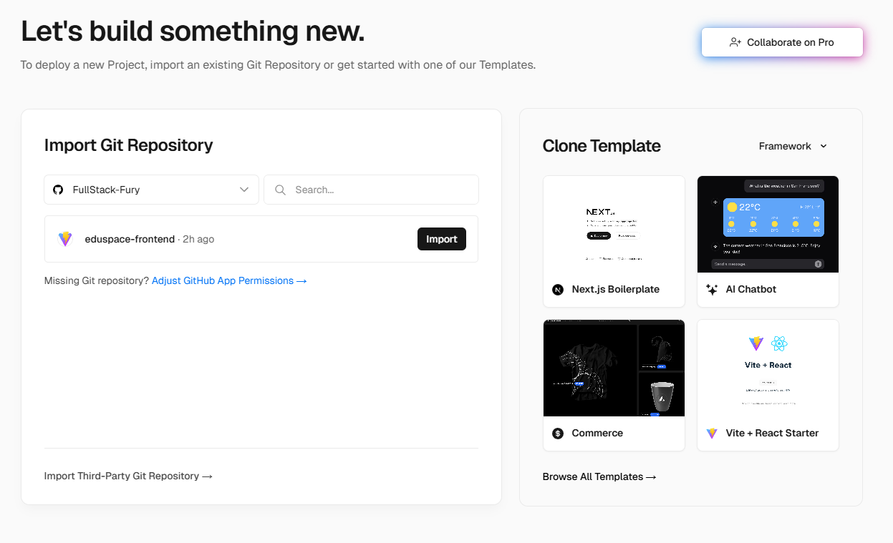

**2-. En la configuración, se creó un nuevo proyecto, seleccionando la rama master, asignando un nombre al proyecto y presionando Deploy para iniciar el proceso de despliegue.**

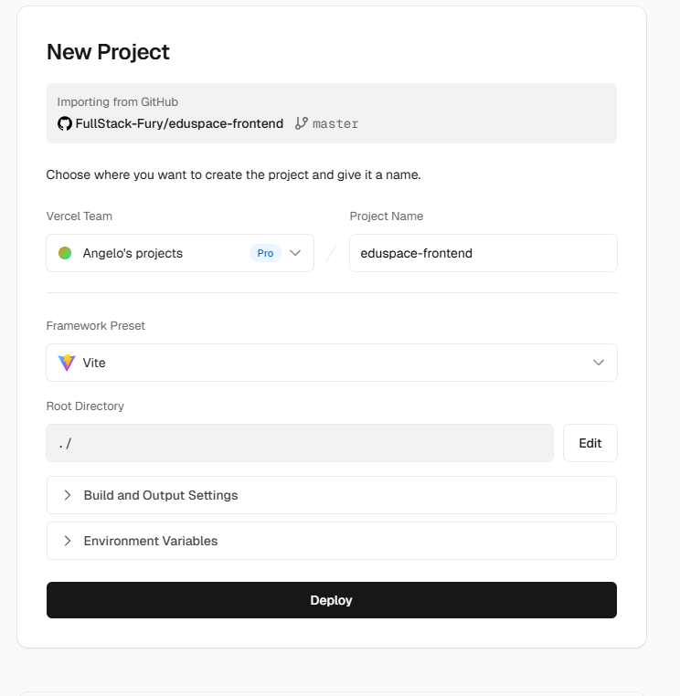

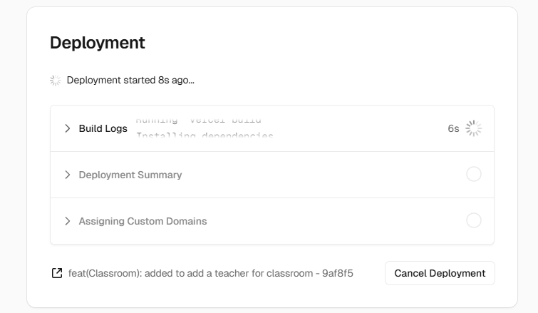

**3.- Al finalizar, apareció el mensaje de Congratulations, indicando que el despliegue fue exitoso.**

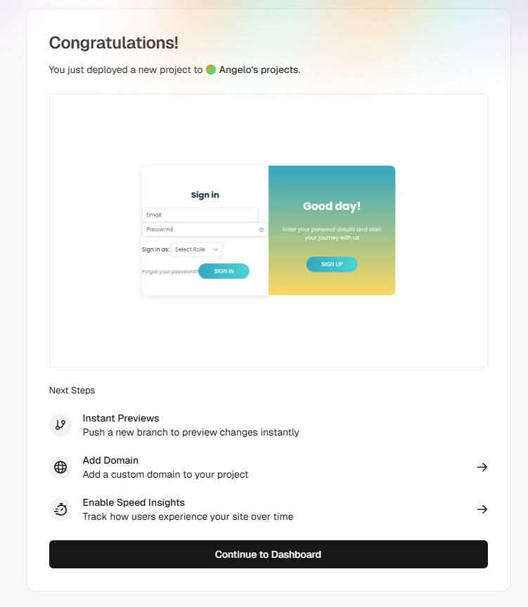

[**Link del frontend desplegado**  ](https://eduspace-frontend-six.vercel.app) : https://eduspace-frontend-six.vercel.app/login

#### Back-end:

Para el despliegue del Back-End, se utilizó la plataforma MonsterASP

**1-. Primero debemos de registrarnos para hacer uso de la plataforma.**

**2-. Una vez ingresados creamos un nuevo website.**

**3-. Luego en el panel de control, nos dirigimos al apartado deploy y en WebDeploy Access lo colocamos en "Enable" y descargarmos el perfil de publicación**

**4-. Para utilizar el perfil debemos primero cargar nuestro proyecto dentro de Visual Studio**

**5-. Una vez cargado el proyecto, le damos click derecho sobre este y luego a "Publicar"**

**6-. Seleccionamos la opción de "Importar Pefil"**

**7-. Seleccionamos el perfil que descargamos en el panel de control de MonsterAsp"**

**8-. Y con esto ya tenemos desplegado nuestro Web Service**

Link del Web Service desplegado: http://eduspace-platform.runasp.net/swagger/index.html

### 5.2.4.8 Team Collaboration Insights during Sprint.

Durante el Sprint 4, el equipo utilizó JetBrains Rider, WebStorm y Git para optimizar el desarrollo. Tras inicializar el repositorio con un commit inicial, los integrantes lo clonaron localmente para trabajar en tareas asignadas de forma independiente. Cada funcionalidad se desarrolló en ramas dedicadas, garantizando una colaboración limpia y evitando conflictos.

## 5.3. Validation Interviews

Dentro de la sección "Validation Interviews" de nuestro proyecto, nos enfocamos en perfeccionar la plataforma EduSpace, diseñada para optimizar la gestión integral de espacios educativos en instituciones con grandes infraestructuras. Esta fase crítica del proyecto se centra en llevar a cabo entrevistas estructuradas y diálogos interactivos con nuestros usuarios clave: administradores de instituciones educativas, docentes y auxiliares. A través de estas entrevistas, buscamos captar sus impresiones, necesidades y sugerencias para garantizar que EduSpace no solo cumpla con los estándares técnicos, sino que también se alinee con las dinámicas operativas y expectativas de cada perfil de usuario.

### 5.3.1. Diseño de Entrevistas

Dentro de esta sección, se detallan los objetivos de usuario específicos que orientan nuestras entrevistas. Estos 'user goals' son cruciales para garantizar que la aplicación EduSpace cumpla con las exigencias reales de los usuarios en el manejo integral de espacios educativos en instituciones con grandes infraestructuras. A continuación, se presentan los user goals mencionados:

#### Administrador:
**User Goal: Iniciar sesión**
User Persona: Administradores.
Explicación del flujo: El administrador accede a la aplicación y visualiza un formulario de inicio de sesión donde ingresa su correo electrónico y contraseña. Si los datos son válidos, es redirigido al dashboard; de lo contrario, se le pide que reingrese sus credenciales.

**User Goal: Navegar por el dashboard**
User Persona: Administradores.
Explicación del flujo: Al iniciar sesión, el administrador es llevado al dashboard donde tiene acceso a opciones como "Environments and Equipment", "Classroom Changes and Meetings", "Personal Data", "Personnel Management" y "Log out".

**User Goal: Gestionar Entornos y Equipamiento**
User Persona: Administradores.
Explicación del flujo: El administrador selecciona "Environments and Equipment", donde puede agregar, editar o eliminar información sobre los entornos educativos y el equipamiento disponible.

**User Goal: Gestionar Cambios de Aula y Reuniones**
User Persona: Administradores.
Explicación del flujo: Desde "Classroom Changes and Meetings", el administrador puede registrar cambios en la asignación de aulas, así como programar y gestionar reuniones, incluyendo la hora y los asistentes.

**User Goal: Actualizar Datos Personales**
User Persona: Administradores.
Explicación del flujo: El administrador puede acceder a "Personal Data" para ver y actualizar su información personal, asegurándose de que esté siempre al día.

**User Goal: Gestionar Personal**
User Persona: Administradores.
Explicación del flujo: Al seleccionar "Personnel Management", el administrador puede agregar, editar o eliminar datos de los empleados, así como gestionar sus roles y responsabilidades.

**User Goal: Cerrar sesión**
User Persona: Administradores.
Explicación del flujo: Desde cualquier sección, el administrador puede seleccionar la opción "Log out" para salir de la aplicación de manera segura.

#### Docente:
**User Goal: Iniciar sesión**
User Persona: Docentes.
Explicación del flujo: El docente accede a la aplicación y visualiza un formulario de inicio de sesión donde ingresa su correo electrónico y contraseña. Si los datos son válidos, es redirigido al dashboard; de lo contrario, se le pide que reingrese sus credenciales.

**User Goal: Navegar por el dashboard**
User Persona: Docentes.
Explicación del flujo: Al iniciar sesión, el docente es llevado al dashboard donde tiene acceso a opciones como "Notifications", "Reservations", "Breakdown Reports", "Wages" y "Space Availability".

**User Goal: Ver notificaciones**
User Persona: Docentes.
Explicación del flujo: Al seleccionar "Notifications", el docente puede ver todas las notificaciones relevantes sobre cambios en horarios, reuniones programadas y cualquier otra información importante relacionada con su trabajo.

***User Goal: Reservar espacios compartidos**
User Persona: Docentes.
Explicación del flujo: El docente accede a "Reservations", donde puede consultar la disponibilidad de los espacios compartidos y realizar reservas para actividades o clases.

**User Goal: Generar informes de averías**
User Persona: Docentes.
Explicación del flujo: Desde "Breakdown Reports", el docente puede generar un reporte si algún recurso de un aula sufre una avería. Esto incluye la selección del recurso afectado, una descripción del problema y la opción de enviar el reporte para que el personal administrativo lo gestione.

**User Goal: Consultar salarios**
User Persona: Docentes.
Explicación del flujo: En "Wages", el docente puede consultar la información sobre sus salarios, incluyendo detalles de pagos y deducciones.

**User Goal: Consultar disponibilidad de espacios**
User Persona: Docentes.
Explicación del flujo: Al acceder a "Space Availability", el docente puede verificar la disponibilidad de aulas y otros espacios educativos para programar actividades o clases.

**User Goal: Cerrar sesión**
User Persona: Docentes.
Explicación del flujo: Desde cualquier sección, el docente puede seleccionar la opción "Log out" para salir de la aplicación de manera segura.

#### Preguntas para las Entrevistas

#### Administrador:
**Sobre la Navegación:**
- ¿Qué tan fácil fue para ti encontrar las opciones que necesitabas en el toolbar? ¿Hubo alguna sección que te resultara particularmente difícil de encontrar? ¿Por qué?
- ¿Qué tan claros consideras que son los nombres de las secciones disponibles en el menú? ¿Hubo algún nombre de sección que te causara confusión o que consideres que podría ser más descriptivo?

**Gestión de Entornos y Equipamiento:** 
- Al gestionar los entornos y el equipo, ¿encontraste que la información presentada es suficiente y fácil de entender? ¿Qué tipo de información adicional te gustaría ver en esta gestión?
- Si pudieras modificar o añadir una funcionalidad en esta sección, ¿cuál sería y por qué?

**Datos Personales:** 
- ¿Qué funcionalidades adicionales te gustaría tener para gestionar tu información personal de manera más eficiente?
- ¿Qué obstáculos has encontrado al intentar actualizar tu información personal?

**Cálculo de Salarios:** 
- ¿Qué información te gustaría que se mostrara de manera más clara en la sección de cálculo de salarios?
- ¿Hay algún aspecto del proceso de cálculo de salarios que consideres confuso o complicado?

**Gestión de Reuniones:**
- ¿Qué tan fácil fue programar y gestionar reuniones a través de la plataforma? ¿Encontraste alguna parte del proceso que podría mejorarse?
- ¿Qué características adicionales te gustaría tener para facilitar la gestión de reuniones, como la programación de recordatorios o la integración con calendarios externos?

**Instalaciones Deportivas:** 
- Al gestionar las instalaciones deportivas, ¿consideras que la información sobre disponibilidad y reservas es clara y accesible?
- ¿Qué tipo de información o funcionalidades adicionales te gustaría ver para mejorar la gestión de las instalaciones deportivas?

**Cierre de Sesión:**
- ¿Has tenido alguna experiencia negativa al cerrar sesión que consideres importante compartir?
- ¿Cómo mejorarías la experiencia de cierre de sesión si tuvieras la oportunidad?

#### Docente:
**Sobre la Navegación:**
- ¿Hay alguna opción que te resultara difícil de acceder? Si es así, ¿por qué?
- ¿Hay algún nombre que no resuene contigo o que piensas que podría mejorarse?

**Reservas de Espacios:** 
- ¿Qué parte del proceso de reserva te resultó más fácil o complicada?
- Si pudieras cambiar algo en el proceso de reservas, ¿qué sería?

**Generación de Informes de Averías:** 
- ¿Has tenido problemas al intentar generar un informe? Si es así, ¿qué aspectos fueron confusos?
- ¿Hay alguna información que crees que falta y que podría hacer el reporte más útil?

**Consulta de Salarios:** 
- ¿Qué parte de la información sobre tu salario te gustaría que se presentara de manera diferente?
- ¿Tienes alguna sugerencia sobre cómo podrías obtener más información sobre tus salarios?

**Disponibilidad de Espacios:**
- ¿Hubo alguna información que te gustaría haber tenido a la mano mientras consultabas la disponibilidad?
- Si pudieras añadir una funcionalidad o filtro, ¿cuál sería y cómo te ayudaría en tu trabajo?

### 5.3.2. Registro de Entrevistas

#### Segmento objetivo Administrador

**Entrevistado: 1**

**Nombre :** Gabriela 

**Apellidos:** Sotelo Checa

**Edad :** 30

**Distrito:** San Borja

**Imagen:** 

| Resumen de la Entrevista  | Timing | URL  |
|-----------------------------|--------|------|
| Para mejorar la experiencia del usuario en la sección de Datos Personales y Gestión de Personal, se recomienda eliminar confusiones y redundancias en la información presentada. En el Dashboard de Inicio, se sugiere incluir recomendaciones claras y accesibles, asegurando que la arquitectura del front end esté bien establecida. Además, es fundamental implementar un sistema de verificación para las funciones de inicio de sesión y eliminación de cuenta, reforzando la seguridad y la privacidad del usuario.|  0:00 - 9:45  |   [Link de la entrevista](https://upcedupe-my.sharepoint.com/:v:/g/personal/u202022387_upc_edu_pe/EQ4vkqg58l5GkUVnUK_ZI2MBUhA5YhdQp0lvafEmcPwzTQ?nav=eyJyZWZlcnJhbEluZm8iOnsicmVmZXJyYWxBcHAiOiJTdHJlYW1XZWJBcHAiLCJyZWZlcnJhbFZpZXciOiJTaGFyZURpYWxvZy1MaW5rIiwicmVmZXJyYWxBcHBQbGF0Zm9ybSI6IldlYiIsInJlZmVycmFsTW9kZSI6InZpZXcifX0%3D&e=wk6Ksq) : https://n9.cl/q5gdgf |

**Entrevistado: 2**

**Nombre :** 

**Apellidos:** 

**Edad :** 

**Distrito:** 

**Imagen:** 

| Resumen de la Entrevista  | Timing | URL  |
|-----------------------------|--------|------|
|  |    |      | 

**Entrevistado: 3**

**Nombre :** 

**Apellidos:** 

**Edad :** 

**Distrito:** 

**Imagen:** 

| Resumen de la Entrevista  | Timing | URL  |
|-----------------------------|--------|------|
|  |    |      | 

#### Segmento objetivo Teacher

**Entrevistado: 1**

**Nombre :** 

**Apellidos:** 

**Edad :** 

**Distrito:** 

**Imagen:** 

| Resumen de la Entrevista  | Timing | URL  |
|-----------------------------|--------|------|
|  |    |      | 

**Entrevistado: 2**

**Nombre :** 

**Apellidos:** 

**Edad :** 

**Distrito:** 

**Imagen:** 

| Resumen de la Entrevista  | Timing | URL  |
|-----------------------------|--------|------|
|  |    |      | 

**Entrevistado: 3**

**Nombre :** 

**Apellidos:** 

**Edad :** 

**Distrito:** 

**Imagen:** 

| Resumen de la Entrevista  | Timing | URL  |
|-----------------------------|--------|------|
|  |    |      | 

### 5.3.3. Evaluaciones según heurísticas

__________________________________________________________________________________________

<strong> 
 UX Heuristics & Principles Evaluation 
 </strong> 

 Usability – Inclusive Design – Information Architecture 

**_CARRERA:_** Ingeniería de Software

**_CURSO:_** Aplicaciones Web

**_SECCIÓN:_** SV51

**_PROFESOR:_** Angel Augusto Velazque Nuñez

**_AUDITOR:_** FullStackFury

**_CLIENTE:_** FullStackFury

__________________________________________________________________________________________

**SITE o APP A EVALUAR:**
EduSpace
---
### TAREAS A EVALUAR:

#### Landing Page
1. Información y descripción de la aplicación y sus funcionalidades
2. Header y footer apropiado para la landing page
3. Interacción del landing page con la aplicación
4. Interacción con el formulario de contacto
5. Navegación en la landing page
6. Responsividad y adaptabilidad

#### Web Application
1. Gestión de usuarios
2. Funcionalidad de notificaciones y recordatorios
3. Navegación intuitiva y estructura de menú
4. Estética general de la interfaz
5. Funcionalidad de internacionalización
   
#### NO INCLUIDAS EN LA EVALUACIÓN:

1. Redes sociales asociadas al startup
2. Política de privacidad y condiciones de uso
3. Integración con sistemas de pago
4. Funcionalidad de Classroom Changes and Meetings
5. Funcionalidad de Personal Management

---

**ESCALA DE SEVERIDAD:**

*Los errores serán puntuados tomando en cuenta la siguiente escala de severidad*

<table>
<thead>
  <tr>
    <th> Nivel </th>
    <th> Descripción </th>
  </tr>
</thead>

<tbody>
  <!--========================================= FILA 1 ======================================-->
  <tr>
    <td> 1 </td>
    <td> 
      Problema superficial: puede ser fácilmente superador por el usuario ó ocurre con muy poco
      frecuencia. No necesita ser arreglado a no ser que exista disponibilidad de tiempo 
    </td>
  </tr>
  <!--========================================= FILA 2 ======================================-->
  <tr>
    <td> 2 </td>
    <td> 
      Problema menor: puede ocurrir un poco más frecuentemente o es un poco más difícil de
      superar para el usuario. Se le debería asignar una prioridad baja resolverlo de cara al siguiente
      reléase
    </td>
  </tr>
  <!--========================================= FILA 3 ======================================-->
  <tr>
    <td> 3 </td>
    <td> 
      Problema mayor: ocurre frecuentemente o los usuarios no son capaces de resolverlos. Es
      importante que sean corregidos y se les debe asignar una prioridad alta.
    </td>
  </tr>
  <!--========================================= FILA 4 ======================================-->
  <tr>
    <td> 4 </td>
    <td> 
      Problema muy grave: un error de gran impacto que impide al usuario continuar con el uso de
      la herramienta. Es imperativo que sea corregido antes del lanzamiento
    </td>
  </tr>
</tbody>
</table>

**TABLA DE RESUMEN - LANDING PAGE:**

<table>
<thead>
 <tr>
  <th> # </th>
  <th> Problema </th>
  <th> Escala de severidad </th>
  <th> Heurística/Principio violada(o) </th>
</tr>
</thead>
<tbody>
<!--========================================= FILA 1 ======================================-->
<tr>
  <td> 1 </td>
  <td> Formulario de contacto sin funcionalidad real de envío </td>
  <td> 2 </td>
  <td> Usability - Fiabilidad y expectativas del usuario </td>
</tr>
  <!--========================================= FILA 2 ======================================-->
 <tr>
  <td> 2 </td>
  <td> Desaparición del botón de internacionalización en pantallas pequeñas </td>
  <td> 3 </td>
  <td> Usability - Visibilidad y accesibilidad </td>
</tr>
<!--========================================= FILA 3 ======================================-->
<tr>
  <td> 3 </td>
  <td> Sección de Herramientas con espacio desaprovechado </td>
  <td> 3 </td>
  <td> Usability - Diseño estético y minimalista </td>
</tr>
<!--========================================= FILA 4 ======================================-->
<tr>
  <td> 4 </td>
  <td> Barra de navegación estática no accesible durante la navegación </td>
  <td> 2 </td>
  <td> Usability - Visibilidad y accesibilidad </td>
</tr>
</tbody>
</table>

**_DESCRIPCIÓN DE PROBLEMAS - LANDING PAGE:_**

**_PROBLEMA #1:_** Formulario de contacto sin funcionalidad real de envío

**_Severidad: 2_** 

Heurística violada: Usability - Fiabilidad y expectativas del usuario

**_Problema:_** 

La sección "Contáctenos" ofrece un mensaje de confirmación tras el envío de un formulario, pero este no envía realmente el mensaje a ningún destino. Esta discrepancia puede generar confusión en los usuarios, que esperan recibir una respuesta. La falta de funcionalidad real reduce la credibilidad de la página, ya que los usuarios pueden cuestionar la efectividad y profesionalismo de la aplicación.

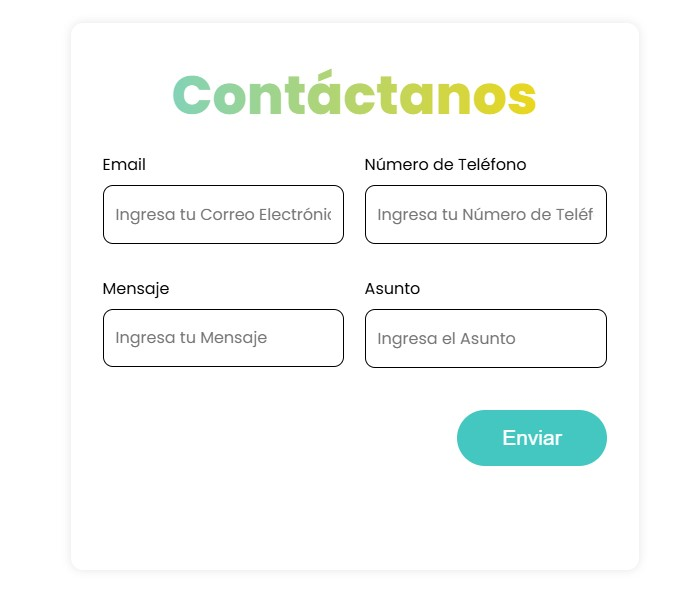

**_Recomendación:_**

Para mejorar la experiencia del usuario, se puede implementar una simulación de backend que almacene los mensajes, permitiendo a los desarrolladores acceder a ellos para futuras interacciones. 

**_PROBLEMA #2:_** Desaparición del botón de internacionalización en pantallas pequeñas

**_Severidad: 3_**

Heurística violada: Usability - Visibilidad y accesibilidad

**_Problema:_**

Cuando se reduce el tamaño de la pantalla, el botón de internacionalización desaparece, impidiendo que los usuarios seleccionen su idioma preferido en dispositivos móviles. Esto limita la accesibilidad y flexibilidad de la página.

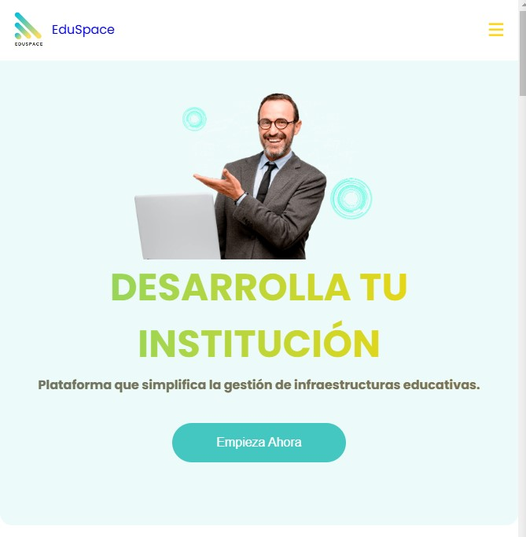

**_Recomendación:_**

Asegurar que el botón de cambio de idioma esté visible y accesible en todas las resoluciones de pantalla mediante ajustes en el diseño responsivo, preferiblemente ubicándolo en un área fija o accesible del menú móvil.

**_PROBLEMA #3:_** Sección de Herramientas con espacio desaprovechado

**_Severidad: 3_**

Heurística violada: Usability - Diseño estético y minimalista

**_Problema:_**

La sección de "Herramientas" presenta solo tres cards en un espacio amplio, lo que crea una apariencia de vacío y puede hacer que los usuarios se sientan desinteresados. Este diseño poco atractivo puede llevar a una disminución en la interacción con las herramientas ofrecidas.

**_Recomendación:_**

Considerar aumentar el número de herramientas presentadas, agregar imágenes o gráficos que complementen el contenido, o incorporar elementos visuales que llenen el espacio vacío. Esto mejorará la estética de la sección y fomentará un mayor interés y participación de los usuarios.

**_PROBLEMA #4:_** Barra de navegación estática no accesible durante la navegación

**_Severidad: 2_**

Heurística violada: Usability - Visibilidad y accesibilidad

**_Problema:_**

La barra de navegación no está disponible de manera continua mientras el usuario navega por la página. Esto dificulta el acceso a otras secciones y puede llevar a una experiencia de usuario frustrante al tener que desplazarse hacia arriba para volver a acceder a ella.

**_Recomendación:_**

Implementar una barra de navegación que permanezca visible durante el desplazamiento, asegurando que los usuarios puedan acceder a diferentes secciones en cualquier momento. Esto mejorará la fluidez de la navegación y facilitará la interacción con el contenido de la página.

**TABLA DE RESUMEN - WEB APPLICATION:**

<table>
<thead>
 <tr>
  <th> # </th>
  <th> Problema </th>
  <th> Escala de severidad </th>
  <th> Heurística/Principio violada(o) </th>
</tr>
</thead>
<tbody>
<!--========================================= FILA 1 ======================================-->
<tr>
  <td> 1 </td>
  <td> Falta de notificación en la sección "Payroll Management" para alertar al usuario sobre la cercanía de su fecha de payroll </td>
  <td> 4 </td>
  <td> Usability – Prevención de errores </td>
</tr>
<!--========================================= FILA 2 ======================================-->
<tr>
  <td> 2 </td>
  <td> Falta de mensaje de advertencia al presionar "Log out" en la interfaz </td>
  <td> 3 </td>
  <td> Usability – Prevención de errores </td>
</tr>
<!--========================================= FILA 3 ======================================-->
<tr>
  <td> 3 </td>
  <td> Duplicación de opciones para eliminar reuniones en la sección "Meetings Management" </td>
  <td> 3 </td>
  <td> Usability – Consistencia y estándares </td>
</tr>
<!--========================================= FILA 4 ======================================-->
<tr>
  <td> 4 </td>
  <td> Falta de implementación de la funcionalidad de internacionalización </td>
  <td> 4 </td>
  <td> Usability – Flexibilidad y eficiencia de uso </td>
</tr>
</tbody>
</table>

**_DESCRIPCIÓN DE PROBLEMAS - WEB APPLICATION:_**

**_PROBLEMA #1:_** Falta de notificación en la sección "Payroll Management" para alertar al usuario sobre la cercanía de su fecha de payroll

**_Severidad: 4_**

Heurística violada: Usability – Prevención de errores

**_Problema:_**

En la sección "Payroll Management", los usuarios no reciben notificaciones que les informen sobre la proximidad de su fecha de payroll. Esta ausencia de alertas impide que los usuarios se preparen adecuadamente para el cierre de su nómina, lo que puede resultar en la falta de cumplimiento con los plazos y generar estrés innecesario. La falta de comunicación efectiva puede llevar a errores en la gestión de sueldos y afectar la satisfacción general del usuario.

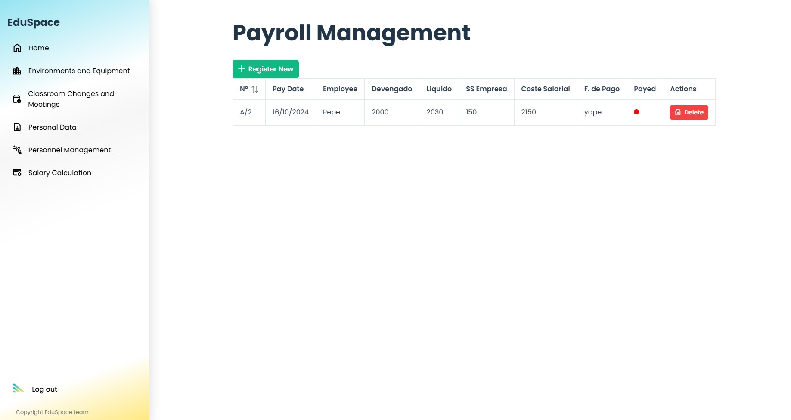

**_Recomendación:_**

Para abordar este problema, se recomienda implementar un sistema de notificaciones que alerte a los usuarios sobre la cercanía de su fecha de payroll. Esto podría incluir recordatorios enviados a través de correo electrónico o notificaciones dentro de la aplicación. Asegúrese de que las notificaciones sean personalizables y se envíen con suficiente antelación para que los usuarios puedan actuar en consecuencia. Además, considere incluir opciones para que los usuarios configuren sus preferencias de notificación según sus necesidades.

**_PROBLEMA #2:_** Falta de mensaje de advertencia al presionar "Log out" en la interfaz

**_Severidad: 3_**

Heurística violada: Usability – Prevención de errores

**_Problema:_**

En la interfaz, al presionar el botón "Log out", el usuario es desconectado inmediatamente sin ningún tipo de advertencia o confirmación. Esto puede llevar a que los usuarios se desconecten accidentalmente, lo que resulta en frustración y la necesidad de volver a iniciar sesión. La falta de una advertencia adecuada no solo afecta la experiencia del usuario, sino que también puede interrumpir su flujo de trabajo, causando incomodidad innecesaria.

**_Recomendación:_**

Para solucionar este problema, se recomienda implementar un mensaje de advertencia que aparezca al presionar "Log out", solicitando la confirmación del usuario antes de proceder con la desconexión. Este mensaje debe informar al usuario que está a punto de cerrar sesión y ofrecer opciones para confirmar o cancelar la acción. Al hacerlo, se mejora la experiencia del usuario y se minimizan los errores accidentales relacionados con la desconexión.

**_PROBLEMA #3:_** Duplicación de opciones para eliminar reuniones en la sección "Meetings Management"

**_Severidad: 3_**

Heurística violada: Usability – Consistencia y estándares

**_Problema:_**

En la sección "Meetings Management", se presentan dos opciones para eliminar una reunión: un botón de "Delete" que no funciona y un ícono de eliminar que sí funciona. Esta duplicación de opciones puede causar confusión entre los usuarios, quienes podrían no estar seguros de cuál opción utilizar. Además, la inoperatividad del botón "Delete" genera frustración, ya que los usuarios pueden intentar usarlo sin éxito, lo que afecta negativamente la experiencia general de uso de la aplicación.

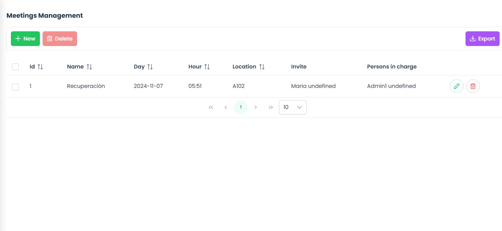

**_Recomendación:_**

Para resolver este problema, se recomienda eliminar la opción de botón "Delete" si no está funcionando correctamente y conservar únicamente el ícono para eliminar, que es funcional. Además, se debería asegurar que la acción de eliminar esté claramente etiquetada y sea intuitiva para el usuario. Considerar también proporcionar una confirmación antes de llevar a cabo la eliminación para prevenir errores. Esto mejorará la consistencia de la interfaz y facilitará la comprensión y uso por parte de los usuarios.

**_PROBLEMA #4:_** Duplicación de opciones para eliminar reuniones en la sección "Meetings Management"

**_Severidad: 4_**

Heurística violada: Usability – Flexibilidad y eficiencia de uso

**_Problema:_**

La aplicación carece de una funcionalidad de internacionalización que permita a los usuarios cambiar el idioma de la interfaz según sus preferencias. Esta omisión limita la accesibilidad y usabilidad de la aplicación, especialmente para usuarios que no dominan el idioma predeterminado. La falta de esta función puede causar frustración y una experiencia de usuario negativa, ya que dificulta la comprensión del contenido y las interacciones con la aplicación.

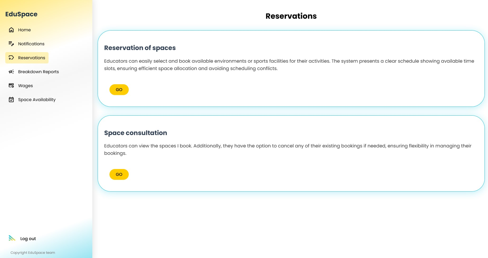

**_Recomendación:_**

Para abordar este problema, se recomienda implementar una función de internacionalización que permita a los usuarios seleccionar su idioma preferido desde un menú accesible. Esto debe incluir la traducción de todos los elementos de la interfaz y del contenido relevante. Es fundamental realizar pruebas con usuarios que hablen diferentes idiomas para asegurar que la implementación sea efectiva y satisfactoria.

## 5.4. Video About-the-Product

A continuación, se presenta el video "About the product," el cual muestra el propósito, los beneficios y las características clave de la aplicación. Además, incluye testimonios de usuarios principales que avalan la calidad del software desarrollado, proporcionando una validación de su valor y efectividad a través de sus experiencias.

Timing: 9:32

enlace para acceder al video del About the product:

**Microsoft Stream**: https://bit.ly/3UPIHE7
**Youtube**: https://youtu.be/j8Mj2Hk4KQk

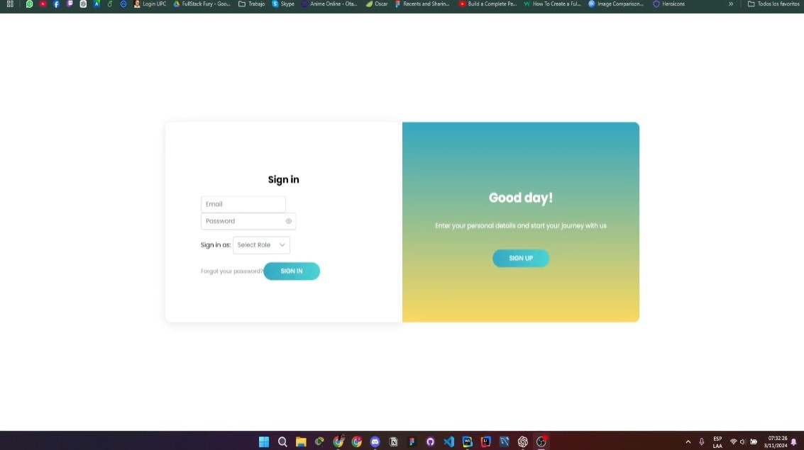

# Conclusiones

- El equipo trabajó de manera efectiva tanto en sesiones presenciales como remotas. La participación activa de todos los miembros en reuniones indica un fuerte compromiso con el proyecto. La delegación clara de responsabilidades y la asignación de tareas específicas, muestran un enfoque organizado que permite que cada miembro aporte su experiencia y habilidades de manera óptima.

- Se establecieron medios de comunicación efectivos, lo que permitió mantener a todos los miembros del equipo informados y alineados. Esto fue fundamental para el trabajo donde la coordinación y la colaboración son clave. Las revisiones continuas de los avances y la retroalimentación constructiva indicaron un ambiente de aprendizaje donde cada miembro tuvo la oportunidad de mejorar y contribuir al desarrollo del trabajo.

- La planificación de tareas desde el principio y el establecimiento de metas claras reflejan un enfoque proactivo. Esto no solo ayuda a mantener el rumbo, sino que también permite hacer ajustes en función del progreso observado. La organización de la documentación principal y la estructura del informe del trabajo demuestran un compromiso con la claridad y la calidad, aspectos importantes para la presentación final del proyecto.

- El desarrollo del backend ha sido fundamental para proporcionar una base sólida para futuras integraciones con el frontend. Las nuevas funcionalidades y la estructura del backend permitirán una gestión más eficiente de los procesos, una vez que se establezca la conexión entre ambos.

- El diseño y desarrollo de entrevistas proporciona la comprensión, comunicación y validación de requisitos y expectativas de los stakeholders. Gracias a ello, se identifican las frustraciones, objetivos, pensamientos y percepciones relacionados aldilema a atender por la propuesta de solución y, así, alcanzar la satisfacción adecuada de sus necesidades.
  
- Los repositorios y funcionalidades de la herramienta GitHub aumentaron la eficiencia, calidad y colaboración del equipo en el desarrollo de software. Aseguraron la gestión de activos y versiones con un control riguroso de código fuente y documentación. Es así que, se lograron cumplir las demandas del segmento objetivo.
  

# Bibliografia
- Conne, M(2024). The Markdown Guide. MarkdownGuide. Recuperado de: https://www.markdownguide.org/
- Facilio. (2024). Facilio: Platform for facilities management. Recuperado de https://facilio.com/
- FMX. (2024). Facilities Management eXpress: Software para la gestión de instalaciones. Recuperado de https://www.gofmx.com/
- Archibus. (2024). Archibus: Complete facilities management platform. Recuperado de https://archibus.com/

# Anexos

## Videos de Exposiciones

### Exposición TB2:

**Título del Proyecto**: EduSpace

**Participantes**:

**Link a la Exposición en Microsoft Stream**:

### About The Team

[**Microsoft Stream**:](https://bit.ly/3ULw8tq) https://bit.ly/3ULw8tq

[**Youtube**:](https://youtu.be/7C6oQpjYr9Q) https://youtu.be/7C6oQpjYr9Q

