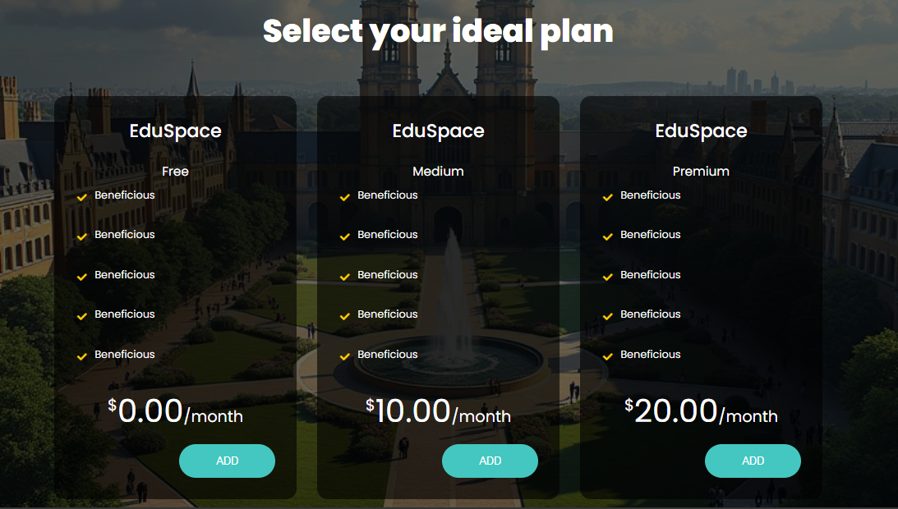

# Capítulo V: Product Implementation, Validation & Deployment
## 5.1 Software Configuration Management
A continuación, presentaremos el proceso por el cual organizamos, gestionamos y controlamos los cambios en el desarrollo de este proyecto.
### 5.1.1. Software Development Environment Configuration.
Requirements Management
1. Trello: Es una herramienta utilizada para gestionar el flujo de trabajo de proyectos principalmente basados en marcos de
   trabajos ágiles. Será empleado para visualizar y actualizar el estado actual de las tareas e historias de usuario
   pertenecientes al sprint a desarrollar.  
   Ruta de referencia: https://trello.com/es

Product UX/UI Design

1. Figma: Plataforma de elaboración de prototipos y edición gráfica, principalmente utilizado para el diseño digital. En el
   caso del proyecto, será utilizado para el prototipado de la aplicación y sus versiones de Desktop y Mobile Web Browser.

   Ruta de referencia: https://www.figma.com/login
2. Lucidchart: Aplicación para diagramar flujos. Será empleado para el diseño de wireflows, user-flows y el diagrama de
   clases asociado a la aplicación.

   Ruta de referencia: https://www.lucidchart.com/

Software Development
1. WebStorm: Entorno de desarrollo integrado elegido por su soporte completo para tecnologías web como JavaScript, HTML, CSS y frameworks como React y Angular. Ofrece refactorización avanzada, depuración, integración con Git y la posibilidad de agregar plugins. Es compatible con varios sistemas operativos, facilitando la colaboración en equipo.

   Ruta de referencia: https://www.jetbrains.com/webstorm/
    
2. HTML5: HyperText Markup Language, o por sus siglas HTML, es un lenguaje de etiquetado para páginas web. Será
   empleado en el desarrollo del proyecto para la presentación del contenido en la aplicación.

   Ruta de referencia: https://www.w3schools.com/html/html5_syntax.asp   
    
3. CSS: Cascading Style Sheets es un lenguaje que maneja el diseño y presentación de las páginas web, el cual va de la mano
   con HTML.

   Ruta de referencia: https://google.github.io/styleguide/htmlcssguide.html
    
    
4. JavaScript: Es un lenguaje de programación interpretado y orientado a objetos. Se utilizará para elaborar la interfaz de
   usuario dentro de la aplicación.

   Ruta de referencia: https://developer.mozilla.org/es/docs/Web/JavaScript

  

5. Git: Una herramienta de control de versiones que facilita el registro y la gestión de las distintas versiones del programa. Su propósito es mantener un historial de cambios y simplificar la corrección de errores. Los integrantes del equipo
   accederán a través de la línea de comandos en sus sistemas locales.

Ruta de referencia: https://git-scm.com/
 
 
Software Documentation and Project Management
6. Github: Una plataforma en la nube que hospedará los repositorios de código del proyecto. Permitirá la colaboración en
   tiempo real y la revisión de contribuciones de cada miembro del equipo. Los integrantes del equipo podrán acceder a través de sus navegadores web.

   Ruta de referencia: https://github.com/

 

Software Deployment

1. Github Pages: GitHub Pages es un servicio de alojamiento web que permite a los usuarios crear y publicar sitios web estáticos directamente desde sus repositorios de GitHub. Es especialmente útil para proyectos personales, portafolios, documentación de proyectos o blogs.

Ruta de referencia: https://pages.github.com/

2. Vercel: es una plataforma que optimiza el proceso de desarrollo y despliegue de aplicaciones web, especialmente con frameworks como Next.js y React. Proporciona un entorno colaborativo que agiliza los despliegues rápidos y genera previsualizaciones automáticas con cada commit, lo que facilita la revisión de modificaciones antes de su publicación.

Ruta de referencia: https://vercel.com/

### 5.1.2. Source Code Management.
El proyecto seguirá las convenciones del flujo de trabajo establecido por el modelo GitFlow para el control de versiones, empleando GitHub como plataforma y sistema de control de versiones. A continuación, se describirá la implementación de GitFlow como un flujo de trabajo para el control de versiones, junto con el enlace del Landing Page.

Repositorio de GitHub:
- Enlace para acceder a la organización en GitHub: https://github.com/pro-devs-SI730
- Enlace para acceder al repositorio de la landing Page: https://github.com/pro-devs-SI730/landing-page
- Enlace para acceder al repositorio del reporte final: https://github.com/pro-devs-SI730/final-report
- Enlace para acceder al repositorio del front end: https://github.com/pro-devs-SI730/eduspace-frontend

Flujo de trabajo GitFlow

El flujo de trabajo a ser implementado para el desarrollo del proyecto se basará en el modelo propuesto por Vincent Driessen en "A successful Git branching model".

Estructura de branches (Ramas):
1. Master branch (Rama principal): Esta rama servirá como la principal para la aplicación, alojando versiones estables y finales del desarrollo. Únicamente se aceptarán cambios que hayan sido previamente probados y verificados en los features y de ahí en Developer.
2. Develop branch (Rama de desarrollo): El propósito de esta rama es facilitar los avances del proyecto en equipo y mantener los archivos centrales del desarrollo continuo.
3. Feature branch(Ramas de funcionalidad): Cada capitulo desarrollado por el equipo, o separada del enfoque actual del desarrollo, tendrá su propia rama. Una vez que una funcionalidad esté completamente trabajada, se fusionará con la rama de desarrollo del proyecto. Las convenciones para nombrar las ramas de funcionalidad seguirán un patrón descriptivo y único, por ejemplo, "feature/chapter-#".
### 5.1.3. Source Code Style Guide & Conventions.
HTML: Algunas de las prácticas que deben de seguirse para alcanzar un código coherente, sostenible y ordenado son las
siguientes:
1. Cerrar todos los elementos HTML: Por ejemplo, 
Esto es un párrafo.

2. Siempre declarar el tipo de documento en la primera línea del documento, para
   HTML es "<!DOCTYPE html>”.
3. Escribir en una línea los comentarios cortos.
4. Utilizar comillas en caso de que los atributos contengan espacios entre sí.
5. Procurar especificar el texto alt y las dimensiones width y height de las imágenes, ya que de esta manera se facilitará la
   disponibilidad del contenido. Por ejemplo:   
6. Se nos recomienda no usar el espacio al momento de utilizar los signos porque
   es más fácil de leerlo de esta forma.  
    
   HTML: (https://www.w3schools.com/html/html5_syntax.asp)

CSS: Entre las prácticas empleadas se menciona:

1. Se nos recomienda tener una sangría por 2 espacios a la vez, no debemos
   utilizar tabulaciones ni mezclarlas tabulaciones con espacios para la sangría.
2. Todo el código debe estar en minúscula.
3. Eliminar los espacios en blanco.
4. Usar comentarios para explicar el código.
5. Utilizar nombres de clase significativos o genéricos, nombres que reflejen el
   propósito de su elemento.  
    

   CSS: (https://google.github.io/styleguide/htmlcssguide.html)

JavaScrip: Algunas de las mejores prácticas para programar incluyen:

1. Utilizar nombres de variables claros: Es importante que los nombres reflejen el propósito de la variable.
2. Ser consistente con las comillas: Elegir entre comillas simples o dobles y mantener esa elección a lo largo del código.
3. Incluir comentarios explicativos: Usar comentarios para aclarar bloques de código, especialmente en secciones complejas, facilita la comprensión.
4. Minimizar el uso de variables globales: Limitar el ámbito de las variables para evitar conflictos y mejorar la mantenibilidad del código.
5. Encapsular lógica en funciones: Mantener el código modular y reutilizable mediante el uso de funciones.
6. Seguir un estilo de codificación uniforme: Mantener un formato consistente mejora la legibilidad del código.

   JS: (https://www.w3schools.com/js/DEFAULT.asp)

Vue.js: Para asegurar que el código en Vue.js sea claro y eficiente, se recomiendan las siguientes prácticas:

1. Estructura de carpetas organizada: Mantener una estructura clara para components, pages, model y services.
2. Crear componentes reutilizables: Diseñar componentes que puedan ser utilizados en diversas partes de la aplicación.
3. Separar lógica de negocio de la vista: Utilizar métodos y propiedades computadas para mantener la lógica separada de la presentación.
4. Emplear Vue Router para la navegación: Usar Vue Router para gestionar eficazmente la navegación entre vistas.
5. Documentar componentes: Incluir comentarios y documentación sobre props, eventos y métodos dentro de los componentes.

Vue: (https://vuejs.org/guide/introduction)

### 5.1.4. Software Deployment Configuration.
### Landing page deployment:

Para el despliegue de nuestra Landing Page, empleamos GitHub Pages como herramienta de deployment. Creamos un repositorio en GitHub llamado "landing-page" donde alojamos todo el código de la página, realizando el despliegue directamente desde la rama "main". Esta integración permitió un proceso ágil y automatizado, asegurando que cualquier actualización en el código de la rama principal se reflejara inmediatamente en la página en producción.

## GithubPages

Después de crear el repositorio, accedemos a la configuración y seleccionamos la sección de Pages. Allí, ingresamos los datos requeridos, como la fuente del branch que se utilizará para el deployment. Finalmente, GitHub Pages nos proporciona un enlace y publica nuestra Landing Page en la web. Enlace del Landing Page: https://pro-devs-si730.github.io/landing-page/

### Web App deployment:
Para el despliegue de nuestra web app, utilizamos Vercel como plataforma de hosting y deployment. 
Esta herramienta nos permitió desplegar la aplicación de manera rápida y eficiente, integrándose de
forma sencilla con nuestro repositorio de GitHub.

Primero, creamos un repositorio llamado "eduspace-frontend" en GitHub donde alojamos todo el código de nuestra
aplicación. Luego, vinculamos este repositorio con Vercel, lo que automatiza el proceso de despliegue.
Cada vez que realizamos un push en la rama principal del repositorio, Vercel ejecuta automáticamente el build 
y despliega la nueva versión de la aplicación.

Después de conectar el repositorio, configuramos
los ajustes de deployment en el panel de Vercel. Especificamos 
la rama "master" como fuente del build. Una vez completado el proceso de deployment, la plataforma
nos proporciona una URL pública donde nuestra web app es accesible 
al público. El enlace para acceder a la web app es:
https://eduspace-frontend-omega.vercel.app

### 5.2. Landing Page, Services & Applications Implementation.

## 5.2. Landing Page, Services & Applications Implementation
En esta sección se explicará y evidenciará el proceso de implementación, pruebas,
documentación y despliegue del Landing Page.

### 5.2.1. Sprint 1

### 5.2.1.1. Sprint Planning 1

Para este primer sprint nos enfocaremos en los tasks para la
elaboración de la Landing Page. Nos dividiremos entre nosotros cada
una de las tareas identificadas para el sprint.

| Sprint #                        | Sprint 1                                                                                                                                                         |
|---------------------------------|------------------------------------------------------------------------------------------------------------------------------------------------------------------|
| Sprint Planning Background      |                                                                                                                                                                  |
| Date                            | 30/08/2024                                                                                                                                                       |
| Time                            | 06:00 PM                                                                                                                                                         |
| Location                        | Servidor de Discord del Equipo                                                                                                                                   |
| Prepared By                     | Franz Escalante                                                                                                                                                  |
| Attendees (to planning meeting) | Franz Escalante/ Randel Ventura / Gustavo Huanca / Camila Espinoza / Alheli Huapaya                                                                              |
| Sprint 1 Review Summary         | En esta primera seccion se planteo el desarrollo de la Landing Page para el proyecto                                                                             |
| Sprint 1 Retrospective Summary  | En esta seccion todos los integrantes mencionaron tener aciertos en partes del codigo y en otras partes poder mejorar sus habilidades realizando la Landing Page |
| Sprint Goal & User Stories      |
| Sprint 1 Goal                   | Desarrollar, desplegar y hacer visible la landing page con todos sus componentes y similar a los mockup de la aplicación.                                        |
| Sprint 1 Velocity               | 4 Velocity                                                                                                                                                       |
| Sum of Story Points             | 6 Story Points.                                                                                                                                                  |

### 5.2.1.2. Sprint Backlog 1

| User Story Id | User Story Title                                  | Work-Item/Task Id | Work-Item/Task Title                                    | Description                                                                                                  | Estimation | Assigned To | Status |
|---------------|---------------------------------------------------|-------------------|---------------------------------------------------------|--------------------------------------------------------------------------------------------------------------|------------|-------------|--------|
| US02          | Encontrar información del propósito de la aplicación | UT01              | Barra de tareas con principales propósitos               | Añadir una barra de tareas sencilla y que dirija a las secciones importantes del Landing page                 | 1          | Franz       | Done   |
| US03          | Visualización de imágenes y gráficos relevantes    | UT02              | Añadir header con su imagen                              | Añadir el header con su imagen.                                                                               | 1          | Franz       | Done   |
| US03          | Visualización de imágenes y gráficos relevantes    | UT03              | Añadir sección de características de la aplicación       | Añadir el dashboard de características de la aplicación de administrador y docente                            | 2          | Gustavo     | Done   |
| US04          | Tipografía cómoda y agradable estéticamente        | UT04              | Añadir tipografía con colores verdes y amarillos         | Añadir tipografía que cumpla con lo mostrado en el prototipado                                                | 1          | Franz       | Done   |
| US02          | Encontrar información del propósito de la aplicación | UT05              | Añadir las etiquetas tools                               | Añadir la información sobre las herramientas que proporciona nuestra aplicación.                              | 1          | Ariana      | Done   |
| US01          | Accesibilidad de la aplicación en diferentes dispositivos | UT06              | Crear el diseño del responsive                           | Crear el responsive que garantice una visualización óptima en distintos dispositivos y tamaños de pantalla     | 1          | Camila      | Done   |
| US03          | Visualización de imágenes y gráficos relevantes    | UT07              | Añadir la sección de planes                              | Crear una sección dedicada a dar información sobre los planes de servicio                                     | 1          | Camila      | Done   |
| US02          | Encontrar información del propósito de la aplicación | UT08              | Añadir formulario                                        | Crear una sección dedicada para el Contact Us de la landing page                                              | 1          | Randel      | Done   |

### 5.2.1.3. Development Evidence for Sprint Review

En esta sección se presentan los avances de implementación con relación a los productos desarrollados en el presente Sprint. La implementación que se desarrolló fue la primera version del Landing Page, se implementaron las distintas secciones para conocer más sobre nuestra plataforma. Con ello completamos el primer sprint de implementación.

| Repository | Branch | Commit Id | Commit Message | Commit message body | Committed on |
|------------|--------|-----------|----------------|---------------------|--------------|
| pro-devs-SI730/landing-page | main | 41170e | fix(html): header picture name modified | - | Sep 8, 2024  |
| pro-devs-SI730/landing-page | main | 14c9fbc | feat: button for language added | - | Sep 8, 2024  |
| pro-devs-SI730/landing-page | main | 7b28f6d | feat: spanish html added | - | Sep 8, 2024  |
| pro-devs-SI730/landing-page | main | 4217571 | feat: button for i18n and styles added | - | Sep 8, 2024  |
| pro-devs-SI730/landing-page | main | 4bd2f5a | Merge remote-tracking branch 'origin/develop' into ariana | - | Sep 8, 2024  |
| pro-devs-SI730/landing-page | main | 47ee00e | fix(html): cards position fixed | - | Sep 8, 2024  |
| pro-devs-SI730/landing-page | main | e591222 | fix(landing-page): tools | - | Sep 8, 2024  |
| pro-devs-SI730/landing-page | main | 832490d | feat(dashboard): dashboards added. | - | Sep 8, 2024  |
| pro-devs-SI730/landing-page | main | 870ef91 | feat(landing-page): tools | - | Sep 8, 2024  |
| pro-devs-SI730/landing-page | main | ac9421c | fix(html): camila's section modified | - | Sep 7, 2024  |
| pro-devs-SI730/landing-page | main | 6891dca | Merge remote-tracking branch 'origin/randel' into develop | - | Sep 7, 2024  |
| pro-devs-SI730/landing-page | main | 8a62faa | feat(footer): added footer section. | - | Sep 7, 2024  |
| pro-devs-SI730/landing-page | main | 14ae088 | feat(contact-us): added contact-us form section. | - | Sep 7, 2024  |
| pro-devs-SI730/landing-page | main | 2f1f09e | feat(membership/customers): advance customers section in index.html, styles.css and main.js | - | Sep 7, 2024  |
| pro-devs-SI730/landing-page | main | bf43c8b | feat(css): About us styles | - | Sep 7, 2024  |
| pro-devs-SI730/landing-page | main | 9cad35c | feat(css): about section finished | - | Sep 7, 2024  |
| pro-devs-SI730/landing-page | main | ea8503f | feat(css): all css | - | Sep 7, 2024  |
| pro-devs-SI730/landing-page | main | 5f8a664 | fix(html): title of hero fixed | - | Sep 7, 2024  |
| pro-devs-SI730/landing-page | main | 70e2564 | feat(html): footer, contactus and plan section added | - | Sep 7, 2024  |
| pro-devs-SI730/landing-page | main | 71c8e7e | feat(html): abut section added | - | Sep 7, 2024  |
| pro-devs-SI730/landing-page | main | 7592218 | feat(html): hero added | - | Sep 7, 2024  |
| pro-devs-SI730/landing-page | main | 6b8c528 | feat(html): navbar styles added | - | Sep 7, 2024  |
| pro-devs-SI730/landing-page | main | 1d8c5db | feat(html): navbar added | - | Sep 7, 2024  |
| pro-devs-SI730/landing-page | main | bea1a65 | chore: first commit | - | Sep 7, 2024  |

### 5.2.1.4. Testing Suite Evidence for Sprint Review

Para la entrega de este primer Sprint no se realizo testeo de la landing page.

### 5.2.1.5. Execution Evidence for Sprint Review

Para este primer entregable, hemos elaborado la Landing Page del proyecto de "EduSpace". De tal modo, se podrá visualizar la información relevante sobre nuestra plataforma. En el siguiente enlace se tendra el video que ilustre y explique la visualización y navegación logrados en este Sprint: https://upcedupe-my.sharepoint.com/:v:/g/personal/u202214572_upc_edu_pe/EWCZa2Zz0h9EskkkItqhT_oBbx0Z7EluzJkLUkluMIJ2zA?nav=eyJyZWZlcnJhbEluZm8iOnsicmVmZXJyYWxBcHAiOiJPbmVEcml2ZUZvckJ1c2luZXNzIiwicmVmZXJyYWxBcHBQbGF0Zm9ybSI6IldlYiIsInJlZmVycmFsTW9kZSI6InZpZXciLCJyZWZlcnJhbFZpZXciOiJNeUZpbGVzTGlua0NvcHkifX0&e=xMGbtN

US02-Encontrar información del propósito de la aplicación

US02-Encontrar información del propósito de la aplicación

US04-Tipografía cómoda y agradable estéticamente

US03-Visualización de imágenes y gráficos relevantes

US01-Accesibilidad de la aplicación en diferentes dispositivos

US03-Visualización de imágenes y gráficos relevantes

US02-Encontrar información del propósito de la aplicación

### 5.2.1.6. Services Documentation Evidence for Sprint Review

En el presente sprint solo se desarrollo la Landing Page.

### 5.2.1.7. Software Deployment Evidence for Sprint Review

 Utilizamos Github Pages para el despligue de la <a href="https://fullstack-fury.github.io/landing-page/">Landing Page de la Aplicación.</a>

 Link URL de la Landing Page : <a href="https://fullstack-fury.github.io/landing-page/">https://fullstack-fury.github.io/landing-page/</a>

### 5.2.1.8. Team Collaboration Insights during Sprint

Para el desarrollo de este primer sprint, todos los miembros del equipo desarrollaron y colaboraron de manera activa y continua. De tal modo, se muestra como evidencia los insights de cada miembro del equipo.

Colaboraciones de cada miembro del equipo:

<table>
   <tr>
      <th><strong>Alumno</th>
      <th><strong>Actividad</th>
   </tr>
   <tr>
      <td>Janiel Franz Escalante Baygorrea</td>
      <td>Implementación del encabezado y vista Brief Introduction y About Us</td>
   </tr>
   <tr>
      <td>Huapaya Buitron, Ariana Alheli</td>
      <td>Implementación de la sección tools y vista de Planes</td>
   </tr>
   <tr>
      <td>Huanca Navarro Gustavo Esau</td>
      <td>Imlementación de la vista Dashboard Admin y Education</td>
   </tr>
   <tr>
      <td>Camila Leonor, Espinoza Vivas</td>
      <td>Imlpementación de la vista Valoraciones y Vista de Planes</td>
   </tr>
   <tr>
      <td>Randel Russell Ventura Allasi</td>
      <td>Implementación de la sección Contact Us y Footer</td>
   </tr>   
</table>

Commits:

Analiticas de Colaboración:

### 5.2.2. Sprint 2

### 5.2.2.1. Sprint Planning 2

Para este segundo sprint

| Sprint #                        | Sprint 2                                                                                                        |
|---------------------------------|-----------------------------------------------------------------------------------------------------------------|
| Sprint Planning Background      |                                                                                                                 |
| Date                            | 22/09/2024                                                                                                      |
| Time                            | 06:00 PM                                                                                                        |
| Location                        | Servidor de Discord del Equipo                                                                                  |
| Prepared By                     | Franz Escalante                                                                                                 |
| Attendees (to planning meeting) | Franz Escalante/ R andel Ventura / Gustavo Huanca / Camila Espinoza / Alheli Huapaya                            |
| Sprint 1 Review Summary         |                                                                                                                 |
| Sprint 1 Retrospective Summary  |                                                                                                                 |
| Sprint Goal & User Stories      |
| Sprint 1 Goal                   | La meta principal es que la aplicación pueda ser usada con todas las funciones descritas en los bounded context |
| Sprint 1 Velocity               | 4 Velocity                                                                                                      |
| Sum of Story Points             | 28 Story Points.                                                                                                |

### 5.2.2.2. Sprint Backlog 2

<table>
  <tr>
    <th colspan="3">Sprint #</th>
    <th colspan="10">Sprint 2</th>
  </tr>
  <tr>
    <td colspan="3">User Story</td>
    <td colspan="10">Work-Item/Task</td>
  </tr>
  <tr>
    <td colspan="1">Id</td>
    <td colspan="2">Title</td>
    <td colspan="1">Id</td>
    <td colspan="2">Title</td>
    <td colspan="3">Description</td>
    <td colspan="1">Estimation</td>
    <td colspan="2">Assigned To</td>
    <td colspan="1">Status (To-do /InProcess /To-Review /Done)</td>
  </tr>
  <tr>
    <td colspan="1">US08</td>
    <td colspan="2">Registro de información personal del docente</td>
    <td colspan="1">TSK001</td>
    <td colspan="2">Formulario de registro</td>
    <td colspan="3">Desarrollar un formulario que permita a los docentes ingresar su información personal, incluyendo nombre, apellidos, etc.</td>
    <td colspan="1"></td>
    <td colspan="2"></td>
    <td colspan="1"></td>
  </tr>
  <tr>
    <td colspan="1">US09</td>
    <td colspan="2">Registro de información de acceso del docente</td>
    <td colspan="1">TSK002</td>
    <td colspan="2">Gestión de credenciales</td>
    <td colspan="3">Implementar un sistema para que los administradores creen y gestionen los credenciales de acceso al sistema para los docentes.</td>
    <td colspan="1"></td>
    <td colspan="2"></td>
    <td colspan="1"></td>
  </tr>
  <tr>
    <td colspan="1">US10</td>
    <td colspan="2">Registro de salones</td>
    <td colspan="1">TSK003</td>
    <td colspan="2">Registro de aulas</td>
    <td colspan="3">Crear un módulo para registrar y gestionar información sobre las aulas disponibles, incluyendo capacidad y equipamiento.</td>
    <td colspan="1"></td>
    <td colspan="2"></td>
    <td colspan="1"></td>
  </tr>
   <tr>
    <td colspan="1">US11</td>
    <td colspan="2">Registro de espacios compartidos</td>
    <td colspan="1">TSK004</td>
    <td colspan="2">Módulo de espacios</td>
    <td colspan="3">Desarrollar un módulo que permita el registro de espacios compartidos y su disponibilidad.</td>
    <td colspan="1"></td>
    <td colspan="2"></td>
    <td colspan="1"></td>
  </tr>
   <tr>
    <td colspan="1">US12</td>
    <td colspan="2">Registro de horarios de espacios compartidos</td>
    <td colspan="1">TSK005</td>
    <td colspan="2">Gestión de horarios</td>
    <td colspan="3">Implementar un sistema para registrar los horarios de uso de los espacios compartidos y su disponibilidad.</td>
    <td colspan="1"></td>
    <td colspan="2"></td>
    <td colspan="1"></td>
  </tr>
   <tr>
    <td colspan="1">US13</td>
    <td colspan="2">Registro de la hora y lugar de la reunión</td>
    <td colspan="1">TSK006</td>
    <td colspan="2">Registro de reuniones</td>
    <td colspan="3">Desarrollar un formulario para que los administradores registren la hora y lugar de las reuniones que organizan.</td>
    <td colspan="1">5</td>
    <td colspan="2">Camila Espinoza</td>
    <td colspan="1">Done</td>
  </tr>
   <tr>
    <td colspan="1">US14</td>
    <td colspan="2">Registro de invitados de la reunión</td>
    <td colspan="1">TSK007</td>
    <td colspan="2">Módulo de invitados</td>
    <td colspan="3">Implementar un sistema para que los administradores registren los invitados a las reuniones, con sus datos de nombre.</td>
    <td colspan="1">2</td>
    <td colspan="2">Camila Espinoza</td>
    <td colspan="1">Done</td>
  </tr>
   <tr>
    <td colspan="1">US24</td>
    <td colspan="2">Visualización de espacios compartidos</td>
    <td colspan="1">TSK008</td>
    <td colspan="2">Vista de espacios</td>
    <td colspan="3">Desarrollar una vista que permita a los docentes visualizar los espacios compartidos disponibles y su estado.</td>
    <td colspan="1">4</td>
    <td colspan="2">Janiel Franz</td>
    <td colspan="1">Done</td>
  </tr>
   <tr>
    <td colspan="1">US25</td>
    <td colspan="2">Registro de salones</td>
    <td colspan="1">TSK009</td>
    <td colspan="2">Sistema de registro de salones</td>
    <td colspan="3">Crear un sistema que permita a los administradores registrar salones</td>
    <td colspan="1"></td>
    <td colspan="2"></td>
    <td colspan="1"></td>
  </tr>
   <tr>
    <td colspan="1">US25</td>
    <td colspan="2">Reserva de espacios compartidos</td>
    <td colspan="1">TSK010</td>
    <td colspan="2">Sistema de reservas</td>
    <td colspan="3">Crear un sistema que permita a los docentes reservar espacios compartidos de forma sencilla y eficiente.</td>
    <td colspan="1">4</td>
    <td colspan="2">Janiel Franz Escalante Baygorrea</td>
    <td colspan="1">Done</td>
  </tr>
   <tr>
    <td colspan="1">US19</td>
    <td colspan="2">Ingreso de salarios del docente</td>
    <td colspan="1">TSK011</td>
    <td colspan="2">Registro de salarios</td>
    <td colspan="3">Desarrollar un módulo que permita el ingreso y actualización de los salarios de los docentes.</td>
    <td colspan="1"></td>
    <td colspan="2"></td>
    <td colspan="1"></td>
  </tr>
    <tr>
    <td colspan="1">US20</td>
    <td colspan="2">Envío de salarios a docentes</td>
    <td colspan="1">TSK012</td>
    <td colspan="2">Sistema de envío de salarios</td>
    <td colspan="3">Crear un sistema que facilite el envío de salarios a los docentes de manera automatizada.</td>
    <td colspan="1"></td>
    <td colspan="2"></td>
    <td colspan="1"></td>
  </tr>
</table>

### 5.2.2.3. Development Evidence for Sprint Review

En esta sección se presentan los avances de implementación con relación a los productos desarrollados en el presente Sprint.

| Repository        | Branch | Commit Id | Commit Message                                                                           | Commit Message Body | Committed on |
|-------------------|--------|-----------|------------------------------------------------------------------------------------------|---------------------|--------------|
| eduspace-frontend | master | be30aac   | refactor(reservation-scheduling): change structure of the calendar for reactivity        |                     | 27/09/2024   |
| eduspace-frontend | master | 918ac1b   | refactor(reservation-scheduling): changed reservations for events                        |                     | 27/09/2024   |
| eduspace-frontend | master | 7e28dbe   | refactor(reservation-scheduling): attributes of the model reservation changed and the db |                     | 27/09/2024   |
| eduspace-frontend | master | fa587dd   | feat(reservation-scheduling): receiving the reservations from the service                |                     | 27/09/2024   |
| eduspace-frontend | master | 93ac1ab   | feat(reservation-scheduling): calendar component added                                   |                     | 27/09/2024   |
| eduspace-frontend | master | 9e5d59d   | feat(reservation-scheduling): reservation management page added                          |                     | 27/09/2024   |
| eduspace-frontend | master | 0e1ce7b   | feat(reservation-scheduling): toolbar added                                              |                     | 27/09/2024   |
| eduspace-frontend | master | b60d840   | fix(.env deleted): deleted .env variables.                                               |                     | 27/09/2024   |
| eduspace-frontend | master | 1a9a9ff   | feat(payroll-management): added view-component for payroll management of the teacher.    |                     | 27/09/2024   |
| eduspace-frontend | master | 32ddad0   | feat(services): common http added                                                        |                     | 27/09/2024   |
| eduspace-frontend | master | 757a4b6   | feat: router added                                                                       |                     | 27/09/2024   |
| eduspace-frontend | master | f3cb11a   | feat: prime vue added                                                                    |                     | 27/09/2024   |
| eduspace-frontend | master | 1ad463c   | feat: .env.example added                                                                 |                     | 27/09/2024   |
| eduspace-frontend | master | dca7d4a   | refactor: i18n added                                                                     |                     | 27/09/2024   |
| eduspace-frontend | master | 1a5269d   | feat(services): fixed.                                                                   |                     | 27/09/2024   |
| eduspace-frontend | master | 7cb1c44   | feat(services): fixed.                                                                   |                     | 27/09/2024   |
| eduspace-frontend | master | 8f54978   | feat(teacher): fixed.                                                                    |                     | 27/09/2024   |
| eduspace-frontend | master | c8cc404   | feat(teacher): routes fixed.                                                             |                     | 27/09/2024   |
| eduspace-frontend | master | 64c5cd3   | Merge branch 'payroll-management' into Teacher-Management                                |                     | 27/09/2024   |
| eduspace-frontend | master | 26bc595   | feat(teacher): routes fixed.                                                             |                     | 27/09/2024   |
| eduspace-frontend | master | 1ab5f08   | feat(meet): added "Invite" column to the table                                           |                     | 27/09/2024   |
| eduspace-frontend | master | c8660f3   | feat(services): common http added                                                        |                     | 27/09/2024   |
| eduspace-frontend | master | 379ebcf   | Update http-common.js                                                                    |                     | 27/09/2024   |
| eduspace-frontend | master | ee5271c   | feat(http-common): added fake api                                                        |                     | 27/09/2024   |
| eduspace-frontend | master | 55456a5   | feat(env): deleted file                                                                  |                     | 27/09/2024   |
| eduspace-frontend | master | a2f6340   | feat(meet): fixed getting time and day correctly                                         |                     | 27/09/2024   |
| eduspace-frontend | master | 72f4e32   | feat(meet): fixed getting time and day correctly                                         |                     | 27/09/2024   |

### 5.2.2.4. Testing Suite Evidence for Sprint Review

Para la entrega de este primer Sprint no se realizo testeo de la landing page.

### 5.2.2.5. Execution Evidence for Sprint Review

Para este segundo entregable, hemos elaborado el front-end del proyecto de "EduSpace".

### 5.2.2.6. Services Documentation Evidence for Sprint Review

En el presente sprint solo se desarrollo la Landing Page.

### 5.2.1.7. Software Deployment Evidence for Sprint Review

### 5.2.2.8. Team Collaboration Insights during Sprint

Para el desarrollo de este segundo sprint, todos los miembros del equipo desarrollaron y colaboraron de manera activa y continua. De tal modo, se muestra como evidencia los insights de cada miembro del equipo.

Commits:

Analiticas de Colaboración:

### 5.2.3 Sprint 3

### 5.2.3.1.Spring Planning 3

| Sprint #                        | Sprint 3                                                                                                        |
|---------------------------------|-----------------------------------------------------------------------------------------------------------------|
| Sprint Planning Background      |                                                                                                                 |
| Date                            | 19/10/2024                                                                                                      |
| Time                            | 06:00 PM                                                                                                        |
| Location                        | Servidor de Discord del Equipo                                                                                  |
| Prepared By                     | Franz Escalante                                                                                                 |
| Attendees (to planning meeting) | Franz Escalante/ Camila Espinoza / Oscar Antayhua / Andres Torres / Angelo Curi                                 |
| Sprint 3 Review Summary         |   Se alcanzaron los objetivos: Funcionamiento y despliegue de nuestra Web API.                                  |
| Sprint 3 Retrospective Summary  |   Este sprint ha sido el más desafiante en comparación con los anteriores, ya que, requería que tanto el informe y el Front End esten completos para así realizar la implementación del Backend.                                                                                                                                            |
| Sprint Goal & User Stories      ||
| Sprint 3 Goal                   |Nuestro enfoque está en mejorar la accesibilidad del sitio web, implementar nuevas funcionalidades clave para la gestión de aulas y nóminas, y habilitar la interacción del frontendmediante una API robusta.   Creemos que esto proporcionará una mejor experiencia de usuario en todos los dispositivos, permitirá una gestión más eficiente de las aulas y nóminas, y facilitará el desarrollo de nuevas integraciones en la plataforma.   Esto se confirmará cuando el sitio sea totalmente responsive, las nuevas funcionalidades de Classroom y Payroll Management estén operativas, y los desarrolladores utilicen la API para gestionar el frontend.                                                                                                                     |
| Sprint 3 Velocity               | 28                                                                                                              |
| Sum of Story Points             |                                                                                                                 |

### 5.2.3.2. Sprint Backlog 3

|Sprint#|Sprint 3|||||||
| :- | :- | :- | :- | :- | :- | :- | :- |
|User Story|Work-Item/Task|||||||
|Id|Title|Id|Title|Description|Estimation|Asigned To|Status (To-do/InProcess/To-Review/Done)|
|TS19|Añadir información del salario del docente través de un RESTful API	|TSK001|Desarrollar la capa  “domain”|Desarrollar la capa de dominio para encapsular la lógica del cálculo de salario usando OOP.|3h|Oscar|To-do|
|TS19|Añadir información del salario del docente través de un RESTful API	|TSK002|Desarrollar la capa “application”|Desarrollar la capa de aplicación para implementar los servicios de la capa de dominio para el cálculo del salario.	|3h|Oscar|To-do|
|TS19|Añadir información del salario del docente través de un RESTful API|TSK003|Desarrollar la capa “infrastructure”|Desarrollar la capa de infraestructura para mapear los objetos de datos en la base de datos para almacenar la información del salario.	|2h	|Oscar|To-do|
|TS19|Añadir información del salario del docente través de un RESTful API	|TSK004|Desarrollar la capa “interface”	|Desarrollar la capa de interfaz que comunique el API con el exterior, implementando el endpoint REST para añadir salarios.	|3h|Oscar|To-do|
|TS26|Añadir información del reporte de avería a través de un RESTful API|TSK005|Desarrollar la capa “domain”|Desarrollar la capa de dominio para encapsular la lógica de negocio utilizando OOP.|3h|Angelo|To-do|
|TS26|Añadir información del reporte de avería a través de un RESTful API|TSK006|Desarrollar la capa “application”|Desarrollar la capa de aplicación para implementar los servicios que utilicen la lógica de la capa de dominio.|3h|Angelo|To-do|
|TS26|Añadir información del reporte de avería a través de un RESTful API|TSK007|Desarrollar la capa “infrastructure”|Desarrollar la capa de infraestructura para conectar las entidades del dominio con la base de datos.|3h|Angelo|To-do|
|TS26|Añadir información del reporte de avería a través de un RESTful API|TSK008|Desarrollar la capa “interface”|Desarrollar la capa de interfaz para permitir la comunicación entre el API REST con el exterior.|2h|Angelo|To-do|
|TS08 |Añadir información de salones a través de un RESTful API|TSK009|Desarrollar la capa “domain”|Desarrollar la capa de dominio para encapsular la lógica de negocio usando OOP. |3h|Andres|To-do|
|TS08 |Añadir información de salones a través de un RESTful API|TSK010|Desarrollar la capa “application”|Desarrollar la capa de aplicación para implementar los servicios de la capa de dominio.|3h|Andres|To-do|
|TS08 |Añadir información de salones a través de un RESTful API|TSK011|Desarrollar la capa “infrastructure”|Desarrollar la capa de infrastructure para mapear los objetos en la base de datos.|3h|Andres|To-do|
|TS08 |Añadir información de salones a través de un RESTful API|TSK012|Desarrollar la capa “interface”|Desarrollar la capa de interface para comunicar el endpoint con el exterior usando REST|3h|Andres|To-do|
|TS09|Añadir información de espacios compartidos través de un RESTful API|TSK013|Desarrollar la capa “domain”|Desarrollar la capa de dominio para encapsular la lógica de negocio usando OOP. |3h|Andres|To-do|
|TS09|Añadir información de espacios compartidos través de un RESTful API|TSK014|Desarrollar la capa “application”|Desarrollar la capa de aplicación para implementar los servicios de la capa de dominio.|3h|Andres|To-do|
|TS09|Añadir información de espacios compartidos través de un RESTful API|TSK015|Desarrollar la capa “infrastructure”|Desarrollar la capa de infrastructure para mapear los objetos en la base de datos.|3h|Andres|To-do|
|TS09|Añadir información de espacios compartidos través de un RESTful API|TSK016|Desarrollar la capa “interface”|Desarrollar la capa de interface para comunicar el endpoint con el exterior usando REST|3h|Andres|To-do|
|TS12|Añadir información de hora y lugar de una reunión a través de un RESTful API|TSK017|Desarrollar la capa “domain”|Desarrollar la capa de dominio para encapsular la lógica de negocio usando OOP para gestionar reuniones.|3h|Camila|To-do|
|TS12|Añadir información de hora y lugar de una reunión a través de un RESTful API|TSK018|Desarrollar la capa “application”|Desarrollar la capa de aplicación para implementar los servicios de la capa de dominio para las reuniones.|3h|Camila|To-do|
|TS12|Añadir información de hora y lugar de una reunión a través de un RESTful API|TSK019|Desarrollar la capa “infrastructure”|Desarrollar la capa de infraestructura para mapear los objetos de datos en la base de datos para las reuniones.|3h|Camila|To-do|
|TS12|Añadir información de hora y lugar de una reunión a través de un RESTful API|TSK020|Desarrollar la capa “interface”|Desarrollar la capa de interfaz para implementar el endpoint REST para añadir la información de reuniones.|3h|Camila|To-do|
|TS13|Añadir información de los invitados de una reunión a través de un RESTful API|TSK021|Desarrollar la capa “domain”|Desarrollar la capa de dominio para encapsular la lógica de negocio sobre la gestión de invitados a reuniones.|3h|Camila|To-do|
|TS13|Añadir información de los invitados de una reunión a través de un RESTful API|TSK022|Desarrollar la capa “application”|Desarrollar la capa de aplicación para implementar los servicios de la capa de dominio para los invitados|3h|Camila|To-do|
|TS13|Añadir información de los invitados de una reunión a través de un RESTful API|TSK023|Desarrollar la capa “infrastructure”|Desarrollar la capa de infraestructura para mapear los datos de invitados en la base de datos.|3h|Camila|To-do|
|TS13|Añadir información de los invitados de una reunión a través de un RESTful API|TSK024|Desarrollar la capa “interface”|Desarrollar la capa de interfaz para implementar el endpoint REST para añadir la información de invitados.|3h|Camila|To-do|
|TS24|Añadir reserva a un espacios compartido a través de un RESTful API|TSK025|Desarrollar la capa “domain”|Desarrollar la capa de dominio para encapsular la lógica de negocio usando OOP. |3h|Franz|To-do|
|TS24|Añadir reserva a un espacios compartido a través de un RESTful API|TSK026|Desarrollar la capa “application”|Desarrollar la capa de aplicación para implementar los servicios de la capa de dominio.|2h|Franz|To-do|
|TS24|Añadir reserva a un espacios compartido a través de un RESTful API|TSK027|Desarrollar la capa “infrastructure”|Desarrollar la capa de infrastructure para mapear los objetos en la base de datos.|1h|Franz|To-do|
|TS24|Añadir reserva a un espacios compartido a través de un RESTful API|TSK028|Desarrollar la capa “interface”|Desarrollar la capa de interface para comunicar el endpoint con el exterior usando REST|3h|Franz|To-do|
|TS25|Eliminar reserva a un espacios compartido a través de un RESTful API|TSK029|Agregar los comandos a la capa de dominio y usarlos en la de aplicación|Agregar commands e implementarlos en la capa de aplicación|1h|Franz|To-do|
|TS23|Obtener información de la disponibilidad de espacios compartidos a través de un RESTful API|TSK030|Agregar queries |Agregar queries en la capa de domain y agregar la función para obtener recursos en la capa de interface|1h|Franz|To-do|

### 5.2.3.3. Development Evidence for Sprint Review

### 5.2.3.4. Testing Suite Evidence for Sprint Review

### 5.2.3.5. Execution Evidence for Sprint Review

### 5.2.3.6. Services Documentation Evidence for Sprint Review

### 5.2.3.7. Software Deployment Evidence for Sprint Review

### 5.2.3.8. Team Collaboration Insights during Sprint

## 5.3. Validation Interviews

Dentro de la sección "Validation Interviews" de nuestro proyecto, nos enfocamos en perfeccionar la plataforma EduSpace, diseñada para optimizar la gestión integral de espacios educativos en instituciones con grandes infraestructuras. Esta fase crítica del proyecto se centra en llevar a cabo entrevistas estructuradas y diálogos interactivos con nuestros usuarios clave: administradores de instituciones educativas, docentes y auxiliares. A través de estas entrevistas, buscamos captar sus impresiones, necesidades y sugerencias para garantizar que EduSpace no solo cumpla con los estándares técnicos, sino que también se alinee con las dinámicas operativas y expectativas de cada perfil de usuario.

### 5.3.1. Diseño de Entrevistas

Dentro de esta sección, se detallan los objetivos de usuario específicos que orientan nuestras entrevistas. Estos 'user goals' son cruciales para garantizar que la aplicación EduSpace cumpla con las exigencias reales de los usuarios en el manejo integral de espacios educativos en instituciones con grandes infraestructuras. A continuación, se presentan los user goals mencionados:

#### Administrador:
**User Goal: Iniciar sesión**
User Persona: Administradores.
Explicación del flujo: El administrador accede a la aplicación y visualiza un formulario de inicio de sesión donde ingresa su correo electrónico y contraseña. Si los datos son válidos, es redirigido al dashboard; de lo contrario, se le pide que reingrese sus credenciales.

**User Goal: Navegar por el dashboard**
User Persona: Administradores.
Explicación del flujo: Al iniciar sesión, el administrador es llevado al dashboard donde tiene acceso a opciones como "Environments and Equipment", "Classroom Changes and Meetings", "Personal Data", "Personnel Management" y "Log out".

**User Goal: Gestionar Entornos y Equipamiento**
User Persona: Administradores.
Explicación del flujo: El administrador selecciona "Environments and Equipment", donde puede agregar, editar o eliminar información sobre los entornos educativos y el equipamiento disponible.

**User Goal: Gestionar Cambios de Aula y Reuniones**
User Persona: Administradores.
Explicación del flujo: Desde "Classroom Changes and Meetings", el administrador puede registrar cambios en la asignación de aulas, así como programar y gestionar reuniones, incluyendo la hora y los asistentes.

**User Goal: Actualizar Datos Personales**
User Persona: Administradores.
Explicación del flujo: El administrador puede acceder a "Personal Data" para ver y actualizar su información personal, asegurándose de que esté siempre al día.

**User Goal: Gestionar Personal**
User Persona: Administradores.
Explicación del flujo: Al seleccionar "Personnel Management", el administrador puede agregar, editar o eliminar datos de los empleados, así como gestionar sus roles y responsabilidades.

**User Goal: Cerrar sesión**
User Persona: Administradores.
Explicación del flujo: Desde cualquier sección, el administrador puede seleccionar la opción "Log out" para salir de la aplicación de manera segura.

#### Docente:
**User Goal: Iniciar sesión**
User Persona: Docentes.
Explicación del flujo: El docente accede a la aplicación y visualiza un formulario de inicio de sesión donde ingresa su correo electrónico y contraseña. Si los datos son válidos, es redirigido al dashboard; de lo contrario, se le pide que reingrese sus credenciales.

**User Goal: Navegar por el dashboard**
User Persona: Docentes.
Explicación del flujo: Al iniciar sesión, el docente es llevado al dashboard donde tiene acceso a opciones como "Notifications", "Reservations", "Breakdown Reports", "Wages" y "Space Availability".

**User Goal: Ver notificaciones**
User Persona: Docentes.
Explicación del flujo: Al seleccionar "Notifications", el docente puede ver todas las notificaciones relevantes sobre cambios en horarios, reuniones programadas y cualquier otra información importante relacionada con su trabajo.

***User Goal: Reservar espacios compartidos**
User Persona: Docentes.
Explicación del flujo: El docente accede a "Reservations", donde puede consultar la disponibilidad de los espacios compartidos y realizar reservas para actividades o clases.

**User Goal: Generar informes de averías**
User Persona: Docentes.
Explicación del flujo: Desde "Breakdown Reports", el docente puede generar un reporte si algún recurso de un aula sufre una avería. Esto incluye la selección del recurso afectado, una descripción del problema y la opción de enviar el reporte para que el personal administrativo lo gestione.

**User Goal: Consultar salarios**
User Persona: Docentes.
Explicación del flujo: En "Wages", el docente puede consultar la información sobre sus salarios, incluyendo detalles de pagos y deducciones.

**User Goal: Consultar disponibilidad de espacios**
User Persona: Docentes.
Explicación del flujo: Al acceder a "Space Availability", el docente puede verificar la disponibilidad de aulas y otros espacios educativos para programar actividades o clases.

**User Goal: Cerrar sesión**
User Persona: Docentes.
Explicación del flujo: Desde cualquier sección, el docente puede seleccionar la opción "Log out" para salir de la aplicación de manera segura.

#### Preguntas para las Entrevistas

#### Administrador:
**Sobre la Navegación:**
- ¿Qué tan fácil fue para ti encontrar las opciones que necesitabas en el toolbar? ¿Hubo alguna sección que te resultara particularmente difícil de encontrar? ¿Por qué?
- ¿Qué tan claros consideras que son los nombres de las secciones disponibles en el menú? ¿Hubo algún nombre de sección que te causara confusión o que consideres que podría ser más descriptivo?

**Gestión de Entornos y Equipamiento:** 
- Al gestionar los entornos y el equipo, ¿encontraste que la información presentada es suficiente y fácil de entender? ¿Qué tipo de información adicional te gustaría ver en esta gestión?
- Si pudieras modificar o añadir una funcionalidad en esta sección, ¿cuál sería y por qué?

**Cambios en Aulas y Reuniones:** 
- ¿Puedes describir el proceso que seguiste para registrar cambios de aula? ¿Qué parte te resultó más fácil o complicada?
- Si tuvieras que priorizar una mejora en esta área, ¿cuál sería y por qué crees que es importante?

**Datos Personales:** 
- ¿Qué funcionalidades adicionales te gustaría tener para gestionar tu información personal de manera más eficiente?
- ¿Qué obstáculos has encontrado al intentar actualizar tu información personal?

**Gestión del Personal:** 
- ¿Hay alguna herramienta o recurso que crees que podría mejorar la gestión del personal?
- ¿Hay alguna situación específica que hayas enfrentado que resalte una limitación en la gestión del personal?

**Cálculo de Salarios:** 
- ¿Qué información te gustaría que se mostrara de manera más clara en la sección de cálculo de salarios?
- ¿Hay algún aspecto del proceso de cálculo de salarios que consideres confuso o complicado?

**Cierre de Sesión:**
- ¿Has tenido alguna experiencia negativa al cerrar sesión que consideres importante compartir?
- ¿Cómo mejorarías la experiencia de cierre de sesión si tuvieras la oportunidad?

#### Docente:
**Sobre la Navegación:**

- ¿Hay alguna opción que te resultara difícil de acceder? Si es así, ¿por qué?
- ¿Hay algún nombre que no resuene contigo o que piensas que podría mejorarse?

**Notificaciones:** 
- ¿Podrías dar un ejemplo de una notificación que consideres especialmente útil o, por el contrario, innecesaria?
- ¿Qué haría que revisaras las notificaciones con más frecuencia?

**Reservas de Espacios:** 
- ¿Qué parte del proceso de reserva te resultó más fácil o complicada?
- Si pudieras cambiar algo en el proceso de reservas, ¿qué sería?

**Generación de Informes de Averías:** 
- ¿Has tenido problemas al intentar generar un informe? Si es así, ¿qué aspectos fueron confusos?
- ¿Hay alguna información que crees que falta y que podría hacer el reporte más útil?

**Consulta de Salarios:** 
- ¿Qué parte de la información sobre tu salario te gustaría que se presentara de manera diferente?
- ¿Tienes alguna sugerencia sobre cómo podrías obtener más información sobre tus salarios?

**Disponibilidad de Espacios:**
- ¿Hubo alguna información que te gustaría haber tenido a la mano mientras consultabas la disponibilidad?
- Si pudieras añadir una funcionalidad o filtro, ¿cuál sería y cómo te ayudaría en tu trabajo?

### 5.3.2. Registro de Entrevistas

#### Segmento objetivo Administrador

**Entrevistado: 1**

**Nombre :** 

**Apellidos:** 

**Edad :** 

**Distrito:** 

**Imagen:** 

| Resumen de la Entrevista  | Timing | URL  |
|-----------------------------|--------|------|
|  |    |      | 

**Entrevistado: 2**

**Nombre :** 

**Apellidos:** 

**Edad :** 

**Distrito:** 

**Imagen:** 

| Resumen de la Entrevista  | Timing | URL  |
|-----------------------------|--------|------|
|  |    |      | 

**Entrevistado: 3**

**Nombre :** 

**Apellidos:** 

**Edad :** 

**Distrito:** 

**Imagen:** 

| Resumen de la Entrevista  | Timing | URL  |
|-----------------------------|--------|------|
|  |    |      | 

#### Segmento objetivo Teacher

**Entrevistado: 1**

**Nombre :** 

**Apellidos:** 

**Edad :** 

**Distrito:** 

**Imagen:** 

| Resumen de la Entrevista  | Timing | URL  |
|-----------------------------|--------|------|
|  |    |      | 

**Entrevistado: 2**

**Nombre :** 

**Apellidos:** 

**Edad :** 

**Distrito:** 

**Imagen:** 

| Resumen de la Entrevista  | Timing | URL  |
|-----------------------------|--------|------|
|  |    |      | 

**Entrevistado: 3**

**Nombre :** 

**Apellidos:** 

**Edad :** 

**Distrito:** 

**Imagen:** 

| Resumen de la Entrevista  | Timing | URL  |
|-----------------------------|--------|------|
|  |    |      | 

### 5.3.3. Evaluaciones según heurísticas

__________________________________________________________________________________________

<strong> 
 UX Heuristics & Principles Evaluation 
 </strong> 

 Usability – Inclusive Design – Information Architecture 

**_CARRERA:_** Ingeniería de Software

**_CURSO:_** Aplicaciones Web

**_SECCIÓN:_** SV51

**_PROFESOR:_** Angel Augusto Velazque Nuñez

**_AUDITOR:_** FullStackFury

**_CLIENTE:_** FullStackFury

__________________________________________________________________________________________

**SITE o APP A EVALUAR:**
EduSpace
---
### TAREAS A EVALUAR:

#### Landing Page
1. Información y descripción de la aplicación y sus funcionalidades
2. Header y footer apropiado para la landing page
3. Interacción del landing page con la aplicación
4. Interacción con el formulario de contacto
5. Navegación en la landing page

#### Web Application
1. 
2. 
3. 
4. 
5. 
#### NO INCLUIDAS EN LA EVALUACIÓN:

1. Redes sociales asociadas al startup
2. Política de privacidad y condiciones de uso
3. Integración con sistemas de pago
4. 
5. 

---

**ESCALA DE SEVERIDAD:**

*Los errores serán puntuados tomando en cuenta la siguiente escala de severidad*

<table>
<thead>
  <tr>
    <th> Nivel </th>
    <th> Descripción </th>
  </tr>
</thead>

<tbody>
  <!--========================================= FILA 1 ======================================-->
  <tr>
    <td> 1 </td>
    <td> 
      Problema superficial: puede ser fácilmente superador por el usuario ó ocurre con muy poco
      frecuencia. No necesita ser arreglado a no ser que exista disponibilidad de tiempo 
    </td>
  </tr>
  <!--========================================= FILA 2 ======================================-->
  <tr>
    <td> 2 </td>
    <td> 
      Problema menor: puede ocurrir un poco más frecuentemente o es un poco más difícil de
      superar para el usuario. Se le debería asignar una prioridad baja resolverlo de cara al siguiente
      reléase
    </td>
  </tr>
  <!--========================================= FILA 3 ======================================-->
  <tr>
    <td> 3 </td>
    <td> 
      Problema mayor: ocurre frecuentemente o los usuarios no son capaces de resolverlos. Es
      importante que sean corregidos y se les debe asignar una prioridad alta.
    </td>
  </tr>
  <!--========================================= FILA 4 ======================================-->
  <tr>
    <td> 4 </td>
    <td> 
      Problema muy grave: un error de gran impacto que impide al usuario continuar con el uso de
      la herramienta. Es imperativo que sea corregido antes del lanzamiento
    </td>
  </tr>
</tbody>
</table>

**TABLA DE RESUMEN - LANDING PAGE:**

<table>
<thead>
 <tr>
  <th> # </th>
  <th> Problema </th>
  <th> Escala de severidad </th>
  <th> Heurística/Principio violada(o) </th>
</tr>
</thead>
<tbody>
<!--========================================= FILA 1 ======================================-->
<tr>
  <td> 1 </td>
  <td> Formulario de contacto sin funcionalidad real de envío </td>
  <td> 2 </td>
  <td> Usability - Fiabilidad y expectativas del usuario </td>
</tr>
  <!--========================================= FILA 2 ======================================-->
 <tr>
  <td> 2 </td>
  <td> Desaparición del botón de internacionalización en pantallas pequeñas </td>
  <td> 3 </td>
  <td> Usability - Visibilidad y accesibilidad </td>
</tr>
<!--========================================= FILA 3 ======================================-->
<tr>
  <td> 3 </td>
  <td> Sección de Herramientas con espacio desaprovechado </td>
  <td> 3 </td>
  <td> Usability - Diseño estético y minimalista </td>
</tr>
<!--========================================= FILA 4 ======================================-->
<tr>
  <td> 4 </td>
  <td> Barra de navegación estática no accesible durante la navegación </td>
  <td> 2 </td>
  <td> Usability - Visibilidad y accesibilidad </td>
</tr>
<!--========================================= FILA 5 ======================================-->
<tr>
  <td> 5 </td>
  <td> Contenido del Problema </td>
  <td> Contenido de la Escala de severidad </td>
  <td> Contenido de Heurística/Principio violada(o) </td>
</tr>
</tbody>
</table>

**_DESCRIPCIÓN DE PROBLEMAS - LANDING PAGE:_**

**_PROBLEMA #1:_** Formulario de contacto sin funcionalidad real de envío

**_Severidad: 2_** 

Heurística violada: Usability - Fiabilidad y expectativas del usuario

**_Problema:_** 

La sección "Contáctenos" ofrece un mensaje de confirmación tras el envío de un formulario, pero este no envía realmente el mensaje a ningún destino. Esta discrepancia puede generar confusión en los usuarios, que esperan recibir una respuesta. La falta de funcionalidad real reduce la credibilidad de la página, ya que los usuarios pueden cuestionar la efectividad y profesionalismo de la aplicación.

**_Recomendación:_**

Para mejorar la experiencia del usuario, se puede implementar una simulación de backend que almacene los mensajes, permitiendo a los desarrolladores acceder a ellos para futuras interacciones. 

**_PROBLEMA #2:_** Desaparición del botón de internacionalización en pantallas pequeñas

**_Severidad: 3_**

Heurística violada: Usability - Visibilidad y accesibilidad

**_Problema:_**

Cuando se reduce el tamaño de la pantalla, el botón de internacionalización desaparece, impidiendo que los usuarios seleccionen su idioma preferido en dispositivos móviles. Esto limita la accesibilidad y flexibilidad de la página.

**_Recomendación:_**

Asegurar que el botón de cambio de idioma esté visible y accesible en todas las resoluciones de pantalla mediante ajustes en el diseño responsivo, preferiblemente ubicándolo en un área fija o accesible del menú móvil.

**_PROBLEMA #3:_** Sección de Herramientas con espacio desaprovechado

**_Severidad: 3_**

Heurística violada: Usability - Diseño estético y minimalista

**_Problema:_**

La sección de "Herramientas" presenta solo tres cards en un espacio amplio, lo que crea una apariencia de vacío y puede hacer que los usuarios se sientan desinteresados. Este diseño poco atractivo puede llevar a una disminución en la interacción con las herramientas ofrecidas.

**_Recomendación:_**

Considerar aumentar el número de herramientas presentadas, agregar imágenes o gráficos que complementen el contenido, o incorporar elementos visuales que llenen el espacio vacío. Esto mejorará la estética de la sección y fomentará un mayor interés y participación de los usuarios.

**_PROBLEMA #4:_** Barra de navegación estática no accesible durante la navegación

**_Severidad: 2_**

Heurística violada: Usability - Visibilidad y accesibilidad

**_Problema:_**

La barra de navegación no está disponible de manera continua mientras el usuario navega por la página. Esto dificulta el acceso a otras secciones y puede llevar a una experiencia de usuario frustrante al tener que desplazarse hacia arriba para volver a acceder a ella.

**_Recomendación:_**

Implementar una barra de navegación que permanezca visible durante el desplazamiento, asegurando que los usuarios puedan acceder a diferentes secciones en cualquier momento. Esto mejorará la fluidez de la navegación y facilitará la interacción con el contenido de la página.

**TABLA DE RESUMEN - WEB APPLICATION:**

<table>
<thead>
 <tr>
  <th> # </th>
  <th> Problema </th>
  <th> Escala de severidad </th>
  <th> Heurística/Principio violada(o) </th>
</tr>
</thead>
<tbody>
<!--========================================= FILA 1 ======================================-->
<tr>
  <td> 1 </td>
  <td> Contenido del Problema </td>
  <td> Contenido de la Escala de severidad </td>
  <td> Contenido de Heurística/Principio violada(o) </td>
</tr>
<!--========================================= FILA 2 ======================================-->
<tr>
  <td> 2 </td>
  <td> Contenido del Problema </td>
  <td> Contenido de la Escala de severidad </td>
  <td> Contenido de Heurística/Principio violada(o) </td>
</tr>
<!--========================================= FILA 3 ======================================-->
<tr>
  <td> 3 </td>
  <td> Contenido del Problema </td>
  <td> Contenido de la Escala de severidad </td>
  <td> Contenido de Heurística/Principio violada(o) </td>
</tr>
<!--========================================= FILA 4 ======================================-->
<tr>
  <td> 4 </td>
  <td> Contenido del Problema </td>
  <td> Contenido de la Escala de severidad </td>
  <td> Contenido de Heurística/Principio violada(o) </td>
</tr>
<!--========================================= FILA 5 ======================================-->
<tr>
  <td> 5 </td>
  <td> Contenido del Problema </td>
  <td> Contenido de la Escala de severidad </td>
  <td> Contenido de Heurística/Principio violada(o) </td>
</tr>
</tbody>
</table>

**_DESCRIPCIÓN DE PROBLEMAS - WEB APPLICATION:_**

**_PROBLEMA #1:_**

**_Severidad: #_**

Heurística violada:

**_Problema:_**

**_Recomendación:_**

**_PROBLEMA #2:_**

**_Severidad: #_**

Heurística violada:

**_Problema:_**

**_Recomendación:_**

**_PROBLEMA #3:_**

**_Severidad: #_**

Heurística violada:

**_Problema:_**

**_Recomendación:_**

## 5.4. Video About-the-Product

A continuación, se presenta el video "About the product," el cual muestra el propósito, los beneficios y las características clave de la aplicación. Además, incluye testimonios de usuarios principales que avalan la calidad del software desarrollado, proporcionando una validación de su valor y efectividad a través de sus experiencias.

Timing:

enlace para acceder al video del About the product:

Microsoft Stream:

Youtube:

# Conclusiones

- El equipo trabajó de manera efectiva tanto en sesiones presenciales como remotas. La participación activa de todos los miembros en reuniones indica un fuerte compromiso con el proyecto. La delegación clara de responsabilidades y la asignación de tareas específicas, muestran un enfoque organizado que permite que cada miembro aporte su experiencia y habilidades de manera óptima.

- Se establecieron medios de comunicación efectivos, lo que permitió mantener a todos los miembros del equipo informados y alineados. Esto fue fundamental para el trabajo donde la coordinación y la colaboración son clave. Las revisiones continuas de los avances y la retroalimentación constructiva indicaron un ambiente de aprendizaje donde cada miembro tuvo la oportunidad de mejorar y contribuir al desarrollo del trabajo.

- La planificación de tareas desde el principio y el establecimiento de metas claras reflejan un enfoque proactivo. Esto no solo ayuda a mantener el rumbo, sino que también permite hacer ajustes en función del progreso observado. La organización de la documentación principal y la estructura del informe del trabajo demuestran un compromiso con la claridad y la calidad, aspectos importantes para la presentación final del proyecto.

- El desarrollo del backend ha sido fundamental para proporcionar una base sólida para futuras integraciones con el frontend. Las nuevas funcionalidades y la estructura del backend permitirán una gestión más eficiente de los procesos, una vez que se establezca la conexión entre ambos.

- El diseño y desarrollo de entrevistas proporciona la comprensión, comunicación y validación de requisitos y expectativas de los stakeholders. Gracias a ello, se identifican las frustraciones, objetivos, pensamientos y percepciones relacionados aldilema a atender por la propuesta de solución y, así, alcanzar la satisfacción adecuada de sus necesidades.
  
- Los repositorios y funcionalidades de la herramienta GitHub aumentaron la eficiencia, calidad y colaboración del equipo en el desarrollo de software. Aseguraron la gestión de activos y versiones con un control riguroso de código fuente y documentación. Es así que, se lograron cumplir las demandas del segmento objetivo.
  

# Bibliografia
- Conne, M(2024). The Markdown Guide. MarkdownGuide. Recuperado de: https://www.markdownguide.org/
- Facilio. (2024). Facilio: Platform for facilities management. Recuperado de https://facilio.com/
- FMX. (2024). Facilities Management eXpress: Software para la gestión de instalaciones. Recuperado de https://www.gofmx.com/
- Archibus. (2024). Archibus: Complete facilities management platform. Recuperado de https://archibus.com/

# Anexos

## Videos de Exposiciones

### Exposición TB1:

**Título del Proyecto**: EduSpace

**Participantes**:

**Link a la Exposición en Microsoft Stream**:

### Exposición TP:

**Título del Proyecto**: EduSpace

**Participantes**:

**Link a la Exposición en Microsoft Stream**:

### Exposición TB2:

**Título del Proyecto**: EduSpace

**Participantes**:

**Link a la Exposición en Microsoft Stream**:

### About The Team

Enlace para acceder al video About The Team subido a Microsoft Stream:
